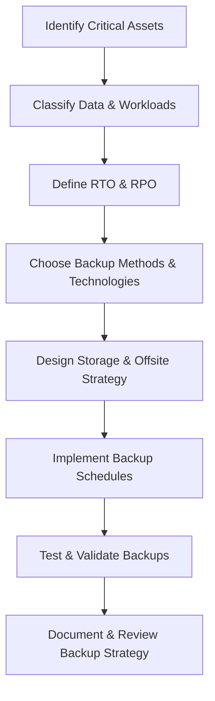

# Enterprise Disaster Recovery Knowledge Base  
## 01 — Backup Strategy and Planning

---

## Overview

A robust backup strategy is the foundation of all disaster recovery and business continuity operations. Windows Server environments require a structured, policy‑driven, and risk‑aligned backup plan that ensures data protection, rapid recovery, and compliance with regulatory requirements.

This document covers:
- Backup strategy fundamentals  
- Risk assessment  
- Backup tiers  
- Backup frequency planning  
- Data classification  
- Backup storage architecture  
- Encryption & security  
- Backup testing  
- Documentation requirements  
- Best practices  

---

## 🧩 Workflow Diagram — Backup Strategy Lifecycle



---

# 1. Backup Strategy Fundamentals

A backup strategy must ensure:
- **Data protection**  
- **Rapid recovery**  
- **Minimal data loss**  
- **Regulatory compliance**  
- **Operational continuity**

Key components:
- Backup frequency  
- Backup type  
- Storage location  
- Retention policy  
- Encryption  
- Verification  

---

# 2. Risk Assessment

Identify risks that impact backup requirements:
- Hardware failure  
- Ransomware  
- Human error  
- Natural disasters  
- Data corruption  
- Insider threats  

Perform:
- Asset inventory  
- Criticality analysis  
- Impact assessment  
- Risk prioritization  

---

# 3. Data Classification

Classify data to determine backup priority:

| Classification | Description | Backup Priority |
|----------------|-------------|-----------------|
| Tier 1 | Mission‑critical (AD, DB, ERP) | Highest |
| Tier 2 | Important (file shares, apps) | High |
| Tier 3 | Non‑critical (logs, temp data) | Medium |
| Tier 4 | Disposable | None |

---

# 4. Backup Types

### Full Backup
- Entire dataset  
- Slowest  
- Most reliable  

### Incremental Backup
- Changes since last backup  
- Fast  
- Requires full + chain  

### Differential Backup
- Changes since last full backup  
- Faster restore than incremental  

### Application‑Aware Backup
- VSS‑integrated  
- Required for SQL, Exchange, Hyper‑V  

### Image‑Based Backup
- Bare‑metal recovery  
- Ideal for servers  

---

# 5. Backup Frequency Planning

Recommended enterprise schedule:

| Workload | Frequency |
|----------|-----------|
| Domain Controllers | Daily system state |
| SQL Databases | Full daily + log every 15–60 min |
| File Servers | Daily full + hourly shadow copies |
| Hyper‑V VMs | Daily full + incremental |
| Application Servers | Daily full |
| Workstations | Weekly full |

---

# 6. Backup Storage Architecture

### Onsite Storage
- Fast recovery  
- Vulnerable to physical disasters  

### Offsite Storage
- Secondary datacenter  
- Tape vaulting  
- Cloud storage  

### Cloud Storage
- Azure Backup  
- AWS Backup  
- Immutable storage options  

### Recommended Architecture

```
Primary Datacenter
 ├── Onsite Backup Storage (Tier 1)
 ├── Offsite Backup Storage (Tier 2)
 └── Cloud Backup Storage (Tier 3 - Immutable)
```

---

# 7. Encryption & Security

### Encrypt backups at rest

- BitLocker  
- Storage encryption  
- Cloud encryption  

### Encrypt backups in transit

- TLS  
- VPN tunnels  
- Secure copy protocols  

### Protect backup servers

- MFA  
- Network segmentation  
- Privileged Access Workstations (PAWs)  

---

# 8. Backup Testing & Validation

### Test backup integrity

```powershell
wbadmin get versions
```

### Perform restore tests
- Quarterly recommended  
- Validate RTO/RPO  
- Test full and granular restores  

### Validate application consistency
- SQL DBCC checks  
- AD authoritative/non‑authoritative restore tests  

---

# 9. Documentation Requirements

Backup documentation must include:
- Backup schedule  
- Backup locations  
- Retention policy  
- Encryption methods  
- Recovery procedures  
- Contact & escalation list  
- DR dependencies  
- Testing logs  

---

# 10. Troubleshooting

| Issue | Cause | Fix |
|-------|-------|-----|
| Backup fails | VSS errors | Restart VSS |
| Slow backup | Network bottleneck | Use dedicated NIC |
| Corrupt backup | Storage issues | Validate disks |
| Cloud backup fails | Authentication | Re‑authorize agent |
| Large backup window | Wrong schedule | Use incremental |

---

# 11. Best Practices

- Use 3‑2‑1 backup rule  
- Use immutable cloud storage  
- Use application‑aware backups  
- Encrypt all backups  
- Test backups quarterly  
- Document backup strategy  
- Monitor backup jobs daily  
- Perform annual backup strategy review  

---

# References

- Microsoft Learn — Backup and Restore  
- NIST SP 800‑34 — Contingency Planning  
- ISO 27001 — Backup Requirements  
```
