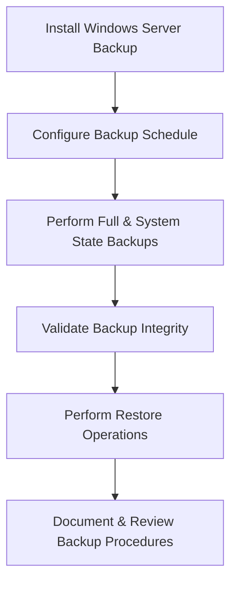

# Enterprise Disaster Recovery Knowledge Base  
## 02 — Windows Server Backup and Restore

---

## Overview

Windows Server Backup (WSB) is a built‑in feature that provides full server backups, system state backups, bare‑metal recovery, and granular file/application restores. A well‑designed backup and restore strategy ensures rapid recovery from failures, corruption, ransomware, or operational mistakes.

This document covers:
- Windows Server Backup architecture  
- Backup types  
- Installation & configuration  
- Full server backup  
- System state backup  
- Hyper‑V VM backup  
- Application‑aware backup  
- Restore operations  
- Command‑line automation  
- Troubleshooting  
- Best practices  

---

## 🧩 Workflow Diagram — Windows Server Backup Lifecycle



---

# 1. Windows Server Backup Architecture

WSB provides:
- Full server backup  
- System state backup  
- Bare‑metal recovery  
- Hyper‑V VM backup  
- VSS‑aware application backup  
- Granular file/folder restore  

Backup destinations:
- Local disk  
- External disk  
- Network share  
- iSCSI target  

---

# 2. Install Windows Server Backup

### Install via PowerShell

```powershell
Install-WindowsFeature Windows-Server-Backup
```

### Launch GUI

```
Server Manager → Tools → Windows Server Backup
```

---

# 3. Backup Types

### Full Server Backup
- Includes OS, applications, data  
- Supports bare‑metal recovery  

### System State Backup
Includes:
- Active Directory  
- Registry  
- Boot files  
- COM+  
- SYSVOL  

### Hyper‑V VM Backup
- VSS‑aware  
- Supports online backup  

### Application‑Aware Backup
Supported apps:
- SQL Server  
- Exchange  
- SharePoint  
- IIS  

---

# 4. Configure Full Server Backup

### Create full backup

```powershell
wbadmin start backup -backupTarget:E: -include:C: -allCritical -quiet
```

### Schedule backup

```powershell
wbadmin enable backup -addtarget:E: -schedule:03:00 -include:C: -allCritical
```

### Verify backup versions

```powershell
wbadmin get versions
```

---

# 5. System State Backup

### Create system state backup

```powershell
wbadmin start systemstatebackup -backupTarget:E: -quiet
```

### Restore system state

```powershell
wbadmin start systemstaterecovery -version:<ID> -quiet
```

---

# 6. Hyper‑V Virtual Machine Backup

### Backup Hyper‑V VM

```powershell
wbadmin start backup -backupTarget:E: -hyperv:SRV-APP01 -quiet
```

### Requirements
- Integration services enabled  
- VSS writer operational  
- Sufficient storage  

---

# 7. Application‑Aware Backup

### SQL Server backup (WSB)

```powershell
wbadmin start backup -backupTarget:E: -include:C:,D: -quiet
```

### Exchange backup
- Requires VSS writer  
- Supports log truncation  

### IIS backup

```powershell
appcmd add backup "DailyBackup"
```

---

# 8. Restore Operations

## 8.1 File/Folder Restore

```powershell
wbadmin start recovery -version:<ID> -itemType:File -items:C:\Data
```

## 8.2 Volume Restore

```powershell
wbadmin start recovery -version:<ID> -itemType:Volume -items:D:
```

## 8.3 Bare‑Metal Recovery
Performed via Windows Recovery Environment (WinRE).

Steps:
1. Boot from installation media  
2. Select **Repair your computer**  
3. Choose **System Image Recovery**  
4. Select backup location  
5. Restore full server  

## 8.4 System State Restore

```powershell
wbadmin start systemstaterecovery -version:<ID> -quiet
```

---

# 9. Backup Automation

### Automated daily backup script

```powershell
wbadmin start backup -backupTarget:E: -include:C: -allCritical -quiet
```

### Automated backup verification

```powershell
wbadmin get versions | Export-Csv "C:\Reports\BackupVersions.csv"
```

---

# 10. Troubleshooting

| Issue | Cause | Fix |
|-------|-------|-----|
| Backup fails | VSS writer error | Restart VSS |
| Slow backup | Network bottleneck | Use dedicated NIC |
| Backup corrupt | Disk failure | Validate storage |
| Hyper‑V backup fails | Integration services | Update VM tools |
| System state fails | AD corruption | Run DC diagnostics |

### Restart VSS

```powershell
net stop vss
net start vss
```

### Check VSS writers

```powershell
vssadmin list writers
```

---

# 11. Best Practices

- Use full + system state backups for servers  
- Use VSS‑aware backups for applications  
- Store backups offsite or in cloud  
- Encrypt all backup data  
- Test restores quarterly  
- Document backup procedures  
- Monitor backup logs daily  
- Use dedicated backup storage  

---

# References

- Microsoft Learn — Windows Server Backup  
- Microsoft Learn — VSS  
- NIST SP 800‑34 — Backup Requirements  
```
