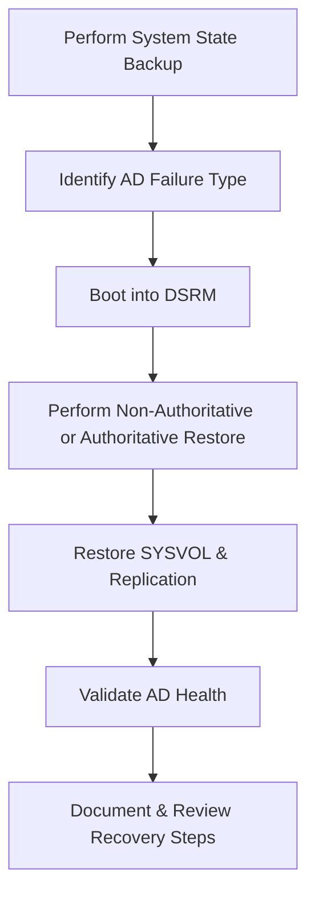

# Enterprise Disaster Recovery Knowledge Base  
## 03 — System State and Active Directory Recovery

---

## Overview

System State and Active Directory (AD) recovery are critical components of enterprise disaster recovery. Windows Server System State includes essential OS and directory service components required to restore domain controllers, recover AD objects, repair corruption, and rebuild domain infrastructure after catastrophic failures.

This document covers:
- System State components  
- Backup requirements  
- AD recovery types  
- Authoritative vs non‑authoritative restore  
- Directory Services Restore Mode (DSRM)  
- SYSVOL recovery  
- FSMO role recovery  
- AD object recovery  
- PowerShell automation  
- Troubleshooting  
- Best practices  

---

## 🧩 Workflow Diagram — AD Recovery Lifecycle



---

# 1. System State Components

System State includes:
- Active Directory Domain Services (NTDS.DIT)  
- SYSVOL (Group Policy, scripts)  
- Registry  
- Boot files  
- COM+ database  
- Certificate Services (if installed)  
- Cluster service metadata (if installed)  

System State is mandatory for:
- Domain controller recovery  
- AD corruption repair  
- SYSVOL rebuild  
- Forest/domain recovery  

---

# 2. System State Backup

### Create System State Backup

```powershell
wbadmin start systemstatebackup -backupTarget:E: -quiet
```

### Verify backup versions

```powershell
wbadmin get versions
```

### Recommended frequency
- **Daily** for domain controllers  
- **Before major AD changes**  
- **Before schema updates**  

---

# 3. Active Directory Recovery Types

### Non‑Authoritative Restore
- Default restore  
- DC restores from backup  
- Replication overwrites restored data  
- Used for corruption, hardware failure  

### Authoritative Restore
- Marks restored objects as authoritative  
- Replication pushes restored data to other DCs  
- Used for accidental deletion of OU, users, groups  

### Full Forest Recovery
- Used for catastrophic AD failure  
- Requires multiple DC backups  

---

# 4. Directory Services Restore Mode (DSRM)

DSRM is required for AD restore operations.

### Boot into DSRM

```powershell
bcdedit /set safeboot dsrepair
shutdown /r /t 0
```

### Reset DSRM password

```powershell
ntdsutil "set dsrm password" "reset password on server null"
```

---

# 5. Non‑Authoritative Restore (Standard AD Recovery)

### Restore System State

```powershell
wbadmin start systemstaterecovery -version:<ID> -quiet
```

### Steps
1. Boot into DSRM  
2. Run System State recovery  
3. Reboot normally  
4. Allow AD replication to update restored DC  
5. Validate AD health  

### Validate replication

```powershell
repadmin /replsummary
```

---

# 6. Authoritative Restore (Recover Deleted AD Objects)

### Enter authoritative restore mode

```powershell
ntdsutil "activate instance ntds" "authoritative restore"
```

### Restore OU

```powershell
restore subtree OU=Finance,DC=corp,DC=local
```

### Restore entire domain

```powershell
restore database
```

### After restore
- Reboot normally  
- Restored objects replicate to other DCs  

---

# 7. SYSVOL Recovery

SYSVOL contains:
- Group Policy Objects  
- Logon scripts  
- Replication metadata  

### Check SYSVOL status

```powershell
dcdiag /test:sysvol
```

### Force SYSVOL rebuild (DFSR)

```powershell
dfsrdiag pollad
```

### Authoritative DFSR restore

```powershell
wmic.exe /namespace:\\root\microsoftdfs path dfsrreplicatedfolderinfo set replicatedfolderflags=1
```

---

# 8. FSMO Role Recovery

FSMO roles:
- Schema Master  
- Domain Naming Master  
- RID Master  
- PDC Emulator  
- Infrastructure Master  

### Check FSMO roles

```powershell
netdom query fsmo
```

### Seize FSMO role

```powershell
ntdsutil "roles" "connections" "connect to server SRV-DC02" "quit" "seize pdc"
```

### When to seize roles
- Original DC permanently offline  
- Hardware failure  
- Corrupt AD database  

---

# 9. AD Object Recovery (Recycle Bin)

### Enable AD Recycle Bin

```powershell
Enable-ADOptionalFeature -Identity 'Recycle Bin Feature' -Scope ForestOrConfigurationSet -Target corp.local
```

### Restore deleted object

```powershell
Restore-ADObject -Identity <GUID>
```

---

# 10. AD Health Validation

### Validate replication

```powershell
repadmin /showrepl
```

### Validate DC health

```powershell
dcdiag /v
```

### Validate DNS

```powershell
dcdiag /test:dns
```

---

# 11. Troubleshooting

| Issue | Cause | Fix |
|-------|-------|-----|
| Restore fails | Wrong backup version | Use correct ID |
| SYSVOL not replicating | DFSR error | Force rebuild |
| AD not starting | NTDS corruption | Perform authoritative restore |
| FSMO roles missing | DC offline | Seize roles |
| Replication errors | DNS issues | Fix SRV records |

### Check NTDS integrity

```powershell
ntdsutil "activate instance ntds" "files" "integrity"
```

---

# 12. Best Practices

- Perform daily System State backups  
- Store backups offsite  
- Test AD restore quarterly  
- Enable AD Recycle Bin  
- Document FSMO role locations  
- Use authoritative restore only when necessary  
- Validate AD health after every restore  
- Protect DSRM credentials  
- Maintain multiple DCs per domain  

---

# References

- Microsoft Learn — Active Directory Recovery  
- Microsoft Learn — System State Backup  
- NIST SP 800‑34 — Directory Service Recovery  
```
