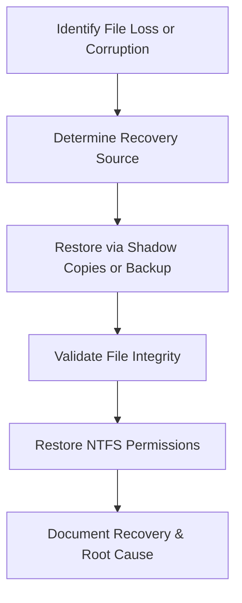

# Enterprise Disaster Recovery Knowledge Base  
## 04 — File and Folder Recovery

---

## Overview

File and folder recovery is one of the most common and essential disaster recovery operations. Whether caused by accidental deletion, corruption, ransomware, or hardware failure, organizations must be able to quickly restore individual files, folders, or entire directory structures without performing full system restores.

Windows Server provides multiple recovery mechanisms including Volume Shadow Copy Service (VSS), Windows Server Backup (WSB), File History, DFS Replication recovery, and third‑party backup solutions.

This document covers:
- File recovery concepts  
- Shadow copies  
- Windows Server Backup file restore  
- Restore from system state  
- DFS Replication recovery  
- NTFS permissions recovery  
- Ransomware‑affected file recovery  
- PowerShell automation  
- Troubleshooting  
- Best practices  

---

## 🧩 Workflow Diagram — File & Folder Recovery Lifecycle



---

# 1. File Recovery Concepts

File recovery ensures:
- Restoration of lost or corrupted data  
- Minimal downtime  
- Protection against accidental deletion  
- Rapid response to ransomware incidents  

Recovery sources:
- Shadow copies  
- Windows Server Backup  
- DFS Replication  
- Cloud/offsite backups  
- Third‑party backup systems  

---

# 2. Shadow Copies (VSS)

Shadow copies allow quick restore of previous file versions.

### Enable Shadow Copies

```powershell
vssadmin add shadowstorage /for=C: /on=D: /maxsize=20GB
```

### Create manual shadow copy

```powershell
vssadmin create shadow /for=C:
```

### Restore file from shadow copy
Steps:
1. Right‑click folder → **Restore previous versions**  
2. Select snapshot  
3. Restore or copy file  

### View shadow copies

```powershell
vssadmin list shadows
```

---

# 3. Windows Server Backup — File Restore

### Restore file from backup

```powershell
wbadmin start recovery -version:<ID> -itemType:File -items:C:\Data\Reports
```

### Restore folder

```powershell
wbadmin start recovery -version:<ID> -itemType:File -items:D:\Shared
```

### Restore to alternate location

```powershell
wbadmin start recovery -version:<ID> -itemType:File -items:C:\Data -recoveryTarget:E:\Recovery
```

---

# 4. Restore from System State Backup

System State includes:
- SYSVOL  
- Registry  
- AD database  
- Boot files  

### Restore SYSVOL files

```powershell
wbadmin start systemstaterecovery -version:<ID> -quiet
```

### Restore Group Policy files

SYSVOL path:
```
C:\Windows\SYSVOL\domain\Policies
```

---

# 5. DFS Replication File Recovery

DFS Replication (DFSR) maintains file copies across servers.

### Check DFSR health

```powershell
dfsrdiag health
```

### Restore deleted file using DFSR conflict folder

Conflict folder location:
```
C:\System Volume Information\DFSR\ConflictAndDeleted
```

### Recover file from DFSR backup

```powershell
dfsrdiag restore /path:"D:\CorpData"
```

---

# 6. NTFS Permissions Recovery

### Backup NTFS permissions

```powershell
icacls D:\CorpData /save D:\PermissionsBackup.txt
```

### Restore NTFS permissions

```powershell
icacls D:\CorpData /restore D:\PermissionsBackup.txt
```

### Reset NTFS permissions

```powershell
icacls D:\CorpData /reset /T
```

---

# 7. Ransomware‑Affected File Recovery

### Steps:
1. **Isolate server**  
2. **Identify encrypted files**  
3. **Check shadow copies**  
4. **Restore from backup**  
5. **Validate integrity**  
6. **Perform malware cleanup**  
7. **Document incident**  

### Identify encrypted files

```powershell
Get-ChildItem -Recurse | Where-Object {$_.Extension -eq ".encrypted"}
```

### Restore clean version

```powershell
wbadmin start recovery -version:<ID> -itemType:File -items:D:\Shared
```

---

# 8. PowerShell Automation

### Restore latest version of file

```powershell
$version = (wbadmin get versions | Select-String "Version identifier").ToString().Split(":")[1].Trim()
wbadmin start recovery -version:$version -itemType:File -items:C:\Data\Reports
```

### Restore folder permissions

```powershell
icacls D:\CorpData /restore D:\PermissionsBackup.txt
```

---

# 9. Troubleshooting

| Issue | Cause | Fix |
|-------|-------|-----|
| Shadow copies missing | Disabled | Enable VSS |
| Backup restore fails | Wrong version | Use correct ID |
| DFSR not restoring | Staging full | Increase staging |
| NTFS permissions lost | Incorrect restore | Use icacls backup |
| Ransomware persists | Malware active | Isolate & clean |

### Check VSS writers

```powershell
vssadmin list writers
```

### Check DFSR replication

```powershell
repadmin /replsummary
```

---

# 10. Best Practices

- Enable shadow copies on critical volumes  
- Use daily file‑level backups  
- Store backups offsite  
- Use DFSR for multi‑site redundancy  
- Backup NTFS permissions regularly  
- Test file restore quarterly  
- Document recovery procedures  
- Use immutable storage for ransomware protection  

---

# References

- Microsoft Learn — File Recovery  
- Microsoft Learn — VSS  
- Microsoft Learn — DFS Replication  
```
