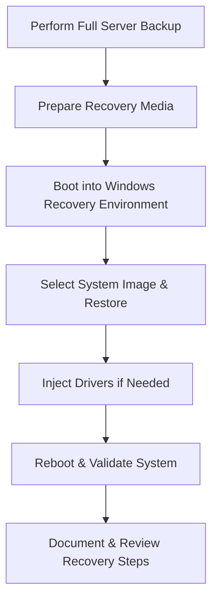

# Enterprise Disaster Recovery Knowledge Base  
## 05 — Bare-Metal Recovery (BMR)

---

## Overview

Bare‑Metal Recovery (BMR) is the process of restoring a server from complete hardware failure, corruption, ransomware, or catastrophic OS malfunction. BMR rebuilds the entire system — operating system, boot files, drivers, applications, and data — onto new or repaired hardware.

Windows Server provides BMR through Windows Server Backup (WSB), Windows Recovery Environment (WinRE), and system image recovery tools. BMR is essential for rapid restoration of critical infrastructure such as domain controllers, Hyper‑V hosts, file servers, and application servers.

This document covers:
- Bare‑metal recovery concepts  
- Backup requirements  
- Recovery environment preparation  
- Full server image restore  
- Driver injection  
- Hardware compatibility considerations  
- Hyper‑V host BMR  
- Post‑restore validation  
- Troubleshooting  
- Best practices  

---

## 🧩 Workflow Diagram — Bare‑Metal Recovery Lifecycle



---

# 1. Bare‑Metal Recovery Concepts

BMR restores:
- Operating system  
- Boot configuration  
- System files  
- Applications  
- Drivers  
- Data volumes  

BMR is required when:
- Server hardware fails  
- OS becomes unbootable  
- Ransomware encrypts system files  
- Disk corruption occurs  
- Major configuration errors break the OS  

---

# 2. Backup Requirements for BMR

### Full Server Backup (Required)

```powershell
wbadmin start backup -backupTarget:E: -include:C: -allCritical -quiet
```

### System State Backup (Recommended)

```powershell
wbadmin start systemstatebackup -backupTarget:E: -quiet
```

### Hyper‑V Host Backup (Recommended)

```powershell
wbadmin start backup -backupTarget:E: -hyperv:*
```

### Store backups:
- On external disk  
- On network share  
- In offsite storage  
- In cloud backup vault  

---

# 3. Prepare Recovery Environment

### Create bootable recovery media

Use Windows Server installation ISO or USB.

### Access Windows Recovery Environment (WinRE)

Options:
1. Boot from installation media  
2. Press **F8** or **Shift+F8** (legacy)  
3. Automatic boot into WinRE after failure  

### Required tools in WinRE:
- System Image Recovery  
- Command Prompt  
- DiskPart  
- Network configuration tools  

---

# 4. Full Bare‑Metal Restore Procedure

## 4.1 Boot into WinRE

Steps:
1. Insert Windows Server installation media  
2. Boot server  
3. Select **Repair your computer**  
4. Choose **Troubleshoot**  
5. Select **System Image Recovery**

---

## 4.2 Locate Backup Image

### Restore from local disk

WinRE automatically detects images.

### Restore from network share

Open Command Prompt:

```powershell
net use Z: \\BackupServer\Backups /user:corp\backupadmin
```

Then select image from Z:\

---

## 4.3 Start Bare‑Metal Recovery

WinRE will:
- Format system disk  
- Restore OS  
- Restore boot files  
- Restore system state  
- Restore applications  
- Restore data volumes (if included)

---

# 5. Driver Injection (Critical for New Hardware)

If restoring to different hardware, drivers may be missing.

### Inject storage/network drivers

```powershell
dism /image:C:\ /add-driver /driver:D:\Drivers\Storage\driver.inf
```

### Inject multiple drivers

```powershell
dism /image:C:\ /add-driver /driver:D:\Drivers /recurse
```

### Common drivers needed:
- RAID controller  
- NVMe storage  
- Network adapters  
- Chipset drivers  

---

# 6. Hardware Compatibility Considerations

### Same hardware = easiest recovery  
### Different hardware = requires:
- Driver injection  
- Boot configuration repair  
- HAL compatibility checks  

### Repair boot configuration

```powershell
bootrec /fixmbr
bootrec /fixboot
bootrec /rebuildbcd
```

---

# 7. Hyper‑V Host Bare‑Metal Recovery

Hyper‑V hosts require special care.

### Restore Hyper‑V host image

```powershell
wbadmin start recovery -version:<ID> -itemType:Volume -items:C:
```

### Validate VM configuration

```powershell
Get-VM
```

### Validate virtual switch configuration

```powershell
Get-VMSwitch
```

### Restore VM files if needed

```
C:\ProgramData\Microsoft\Windows\Hyper-V
```

---

# 8. Post‑Restore Validation

### Validate AD (if DC)

```powershell
dcdiag /v
repadmin /replsummary
```

### Validate DNS

```powershell
dcdiag /test:dns
```

### Validate storage

```powershell
Get-PhysicalDisk
```

### Validate applications
- SQL Server  
- IIS  
- File services  
- Hyper‑V  

---

# 9. Troubleshooting

| Issue | Cause | Fix |
|-------|-------|-----|
| Restore fails | Wrong image | Select correct version |
| OS won't boot | Missing drivers | Inject drivers |
| Boot loop | Corrupt BCD | Run bootrec |
| Network missing | NIC drivers | Inject drivers |
| Hyper‑V VMs missing | Wrong volume restored | Restore VM folder |

### Repair BCD

```powershell
bootrec /rebuildbcd
```

### Check disk integrity

```powershell
chkdsk C: /f
```

---

# 10. Best Practices

- Always perform full server backups  
- Store backups offsite  
- Test BMR quarterly  
- Maintain driver repository for all hardware  
- Document hardware configurations  
- Use identical hardware when possible  
- Validate AD/DC health after restore  
- Use cloud immutable backups for ransomware protection  

---

# References

- Microsoft Learn — Bare‑Metal Recovery  
- Microsoft Learn — Windows Server Backup  
- NIST SP 800‑34 — Contingency Planning  
```
