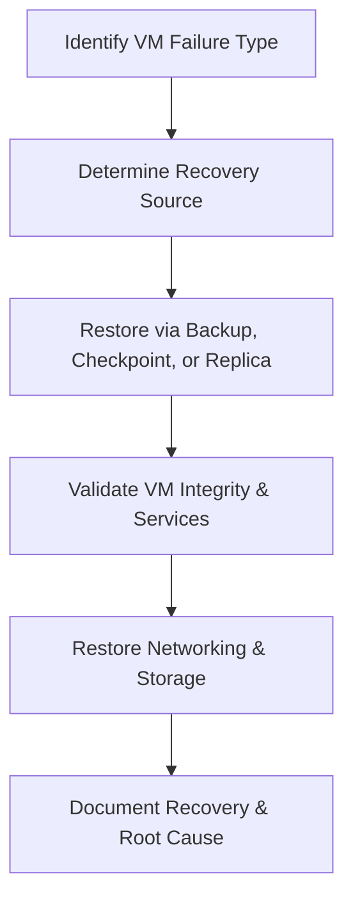

# Enterprise Disaster Recovery Knowledge Base  
## 06 — Hyper‑V Virtual Machine Recovery

---

## Overview

Hyper‑V Virtual Machine (VM) recovery is a critical component of enterprise disaster recovery. Whether caused by corruption, accidental deletion, storage failure, ransomware, or host failure, organizations must be able to rapidly restore VMs to maintain business continuity.

Windows Server Hyper‑V provides multiple recovery mechanisms including VM‑level backup, VSS‑aware backup, checkpoint recovery, export/import, replica failover, and bare‑metal host recovery.

This document covers:
- Hyper‑V recovery concepts  
- VM backup types  
- VSS‑aware VM backup  
- Checkpoint recovery  
- Export/import recovery  
- Hyper‑V Replica failover  
- Storage‑level VM recovery  
- Ransomware‑affected VM recovery  
- PowerShell automation  
- Troubleshooting  
- Best practices  

---

## 🧩 Workflow Diagram — Hyper‑V VM Recovery Lifecycle



---

# 1. Hyper‑V Recovery Concepts

Hyper‑V VM recovery ensures:
- Rapid restoration of workloads  
- Minimal downtime  
- Protection against corruption  
- Recovery from host failure  
- Ransomware mitigation  

Recovery sources:
- Hyper‑V VM backups  
- VSS‑aware backups  
- Checkpoints  
- Hyper‑V Replica  
- Storage snapshots  
- Exported VM copies  

---

# 2. Hyper‑V VM Backup Types

### 2.1 Full VM Backup
- Includes VHDX, configuration, checkpoints  
- Supports full VM restore  

### 2.2 VSS‑Aware Backup
- Application‑consistent  
- Required for SQL, Exchange, AD  

### 2.3 Host‑Level Backup
- Captures all VMs on host  
- Ideal for large environments  

### 2.4 Storage Snapshot Backup
- SAN/NAS snapshots  
- Fast restore  

---

# 3. VSS‑Aware Hyper‑V Backup

### Check VSS writer status

```powershell
vssadmin list writers
```

### Backup VM using Windows Server Backup

```powershell
wbadmin start backup -backupTarget:E: -hyperv:SRV-APP01 -quiet
```

### Requirements
- Integration services enabled  
- VSS writer operational  
- Sufficient storage  

---

# 4. Checkpoint Recovery

Checkpoints allow quick rollback.

### List checkpoints

```powershell
Get-VMCheckpoint -VMName "SRV-APP01"
```

### Apply checkpoint

```powershell
Restore-VMCheckpoint -VMName "SRV-APP01" -Name "BeforeUpdate"
```

### Delete checkpoint

```powershell
Remove-VMCheckpoint -VMName "SRV-APP01"
```

### Use cases
- Failed updates  
- Misconfiguration  
- Application rollback  

---

# 5. Export/Import Recovery

### Export VM

```powershell
Export-VM -Name "SRV-APP01" -Path "D:\Exports"
```

### Import VM

```powershell
Import-VM -Path "D:\Exports\SRV-APP01"
```

### Use cases
- Migration  
- Backup copy  
- Disaster recovery  

---

# 6. Hyper‑V Replica Recovery

Hyper‑V Replica provides asynchronous VM replication.

### Check replication health

```powershell
Get-VMReplication -VMName "SRV-APP01"
```

### Planned failover

```powershell
Start-VMFailover -VMName "SRV-APP01" -Prepare
```

### Unplanned failover

```powershell
Start-VMFailover -VMName "SRV-APP01"
```

### Reverse replication

```powershell
Set-VMReplication -Reverse
```

---

# 7. Storage‑Level VM Recovery

### Restore VHDX from backup

```powershell
Copy-Item "\\BackupServer\Backups\SRV-APP01\SRV-APP01.vhdx" "D:\HyperV\SRV-APP01\"
```

### Reattach VHDX

```powershell
Set-VMHardDiskDrive -VMName "SRV-APP01" -Path "D:\HyperV\SRV-APP01\SRV-APP01.vhdx"
```

### SAN/NAS snapshot restore
- Fast  
- Consistent  
- Requires storage vendor tools  

---

# 8. Ransomware‑Affected VM Recovery

### Steps:
1. **Isolate VM**  
2. **Identify encrypted files**  
3. **Check checkpoints**  
4. **Restore from backup**  
5. **Validate application integrity**  
6. **Perform malware cleanup**  
7. **Document incident**  

### Identify encrypted files

```powershell
Get-ChildItem -Recurse | Where-Object {$_.Extension -eq ".encrypted"}
```

### Restore VM from backup

```powershell
Import-VM -Path "D:\Backups\SRV-APP01"
```

---

# 9. PowerShell Automation

### Restore VM from latest backup

```powershell
$backup = Get-ChildItem "D:\Backups\SRV-APP01" | Sort-Object LastWriteTime -Descending | Select -First 1
Import-VM -Path $backup.FullName
```

### Automated checkpoint creation

```powershell
Checkpoint-VM -Name "SRV-APP01" -SnapshotName "DailyCheckpoint"
```

---

# 10. Troubleshooting

| Issue | Cause | Fix |
|-------|-------|-----|
| VM won't start | Corrupt VHDX | Restore VHDX |
| Backup fails | VSS error | Restart VSS |
| Checkpoint fails | Disk space | Expand storage |
| Replica broken | Network issue | Re‑enable replication |
| VM missing | Host failure | Restore from backup |

### Repair VHDX

```powershell
Repair-VHD -Path "D:\HyperV\SRV-APP01\SRV-APP01.vhdx"
```

### Restart Hyper‑V services

```powershell
Restart-Service vmms
```

---

# 11. Best Practices

- Use VSS‑aware backups for critical VMs  
- Use Hyper‑V Replica for DR sites  
- Store VM backups offsite  
- Use checkpoints sparingly  
- Test VM restores quarterly  
- Document VM configurations  
- Use immutable storage for ransomware protection  
- Monitor Hyper‑V health regularly  

---

# References

- Microsoft Learn — Hyper‑V Recovery  
- Microsoft Learn — VM Backup  
- NIST SP 800‑34 — Virtualization Recovery  
```
