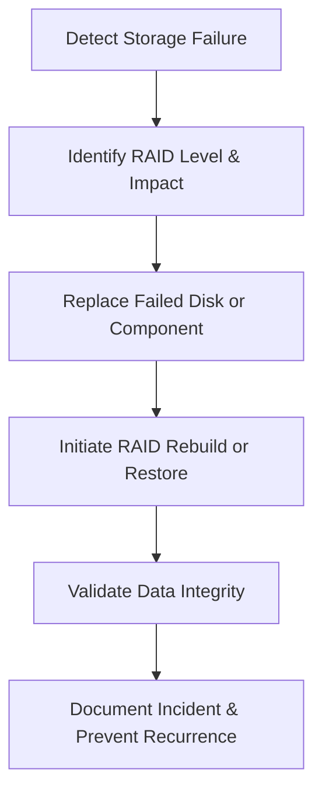

# Enterprise Disaster Recovery Knowledge Base  
## 07 — RAID and Storage Failure Recovery

---

## Overview

RAID and storage subsystem failures are among the most disruptive incidents in enterprise environments. Whether caused by disk failure, controller malfunction, firmware corruption, or human error, storage failures can lead to data loss, downtime, and degraded performance.

Windows Server environments rely heavily on RAID arrays, SAN/NAS appliances, and virtualized storage. This document provides a comprehensive guide to diagnosing, recovering, and rebuilding RAID arrays and storage systems.

This document covers:
- RAID concepts  
- RAID levels and recovery implications  
- Disk failure detection  
- RAID controller recovery  
- Rebuild procedures  
- SAN/NAS recovery  
- Storage Spaces recovery  
- VHDX/VMDK recovery  
- PowerShell diagnostics  
- Troubleshooting  
- Best practices  

---

## 🧩 Workflow Diagram — RAID & Storage Recovery Lifecycle



---

# 1. RAID Concepts

RAID provides:
- Redundancy  
- Performance  
- Fault tolerance  
- Increased storage reliability  

RAID components:
- Disks  
- RAID controller  
- Cache module  
- Battery backup unit (BBU)  
- Firmware  

---

# 2. RAID Levels and Recovery Implications

| RAID Level | Fault Tolerance | Recovery Complexity | Notes |
|------------|------------------|----------------------|-------|
| RAID 0 | None | Impossible | Striping only |
| RAID 1 | 1 disk | Easy | Mirroring |
| RAID 5 | 1 disk | Moderate | Parity-based |
| RAID 6 | 2 disks | Moderate | Dual parity |
| RAID 10 | 1 disk per mirror | Easy | Best for performance |
| RAID 50/60 | Multiple | Complex | Enterprise arrays |

---

# 3. Detecting Disk Failure

### Windows Event Logs

```powershell
Get-WinEvent -LogName System | Where-Object {$_.Id -in 7,11,15}
```

### Storage Spaces

```powershell
Get-PhysicalDisk | Where-Object {$_.HealthStatus -ne "Healthy"}
```

### RAID Controller Alerts
- Dell OMSA  
- HP SSA  
- Lenovo XClarity  
- LSI/Avago MegaRAID  

---

# 4. RAID Controller Failure Recovery

### Symptoms:
- Multiple disks show failed  
- Array offline  
- Foreign configuration detected  
- Controller not recognized  

### Steps:
1. Power cycle server  
2. Check controller firmware  
3. Import foreign configuration  
4. Replace controller if needed  
5. Rebuild array  

### Import foreign configuration (LSI)

```text
Ctrl + R → Foreign Config → Import
```

---

# 5. RAID Rebuild Procedures

## 5.1 RAID 1 Rebuild

Steps:
1. Replace failed disk  
2. Controller auto‑rebuilds  
3. Monitor rebuild progress  

## 5.2 RAID 5 Rebuild

Steps:
1. Replace failed disk  
2. Start rebuild  
3. Monitor for second disk failure  
4. Validate data integrity  

## 5.3 RAID 6 Rebuild

Steps:
1. Replace up to two failed disks  
2. Rebuild parity  
3. Validate array  

## 5.4 RAID 10 Rebuild

Steps:
1. Replace failed disk in mirror  
2. Rebuild mirror  
3. Stripe remains intact  

---

# 6. SAN/NAS Storage Failure Recovery

### Common SAN/NAS issues:
- Controller failure  
- Disk shelf failure  
- Network path failure  
- iSCSI target corruption  
- NFS/SMB share corruption  

### Recover iSCSI target

```powershell
Get-IscsiTarget
Restart-Service msiscsi
```

### Recover NFS/SMB share
- Validate storage pool  
- Validate export configuration  
- Restore from snapshot  

---

# 7. Storage Spaces Recovery

### Check storage pool health

```powershell
Get-StoragePool
```

### Check virtual disk health

```powershell
Get-VirtualDisk
```

### Repair virtual disk

```powershell
Repair-VirtualDisk -FriendlyName "DataDisk"
```

### Replace failed disk

```powershell
Set-PhysicalDisk -FriendlyName "Disk3" -Usage Retired
Add-PhysicalDisk -StoragePoolFriendlyName "MainPool"
```

---

# 8. VHDX/VMDK Recovery (Hyper‑V & VMware)

### Check VHDX integrity

```powershell
Repair-VHD -Path "D:\VMs\SRV-APP01.vhdx"
```

### Recover VMDK (VMware)

Use ESXi host client:
```
Datastore Browser → Restore from snapshot
```

### Restore VM disk from backup

```powershell
Copy-Item "\\BackupServer\VMs\SRV-APP01.vhdx" "D:\VMs\SRV-APP01\"
```

---

# 9. PowerShell Diagnostics

### Check disk health

```powershell
Get-PhysicalDisk | Select FriendlyName,HealthStatus,OperationalStatus
```

### Check storage events

```powershell
Get-WinEvent -LogName System | Where-Object {$_.Id -in 7,11,15}
```

### Check SMART status

```powershell
Get-PhysicalDisk | Select FriendlyName,MediaType,SerialNumber,HealthStatus
```

---

# 10. Troubleshooting

| Issue | Cause | Fix |
|-------|-------|-----|
| RAID offline | Controller failure | Replace controller |
| Rebuild fails | Second disk failure | Restore from backup |
| Slow rebuild | Disk bottleneck | Replace slow disk |
| Foreign config | Controller reset | Import config |
| Storage pool degraded | Disk failure | Replace disk |

### Clear foreign configuration

```text
Ctrl + R → Foreign Config → Clear
```

### Rebuild array

Controller GUI or BIOS utility.

---

# 11. Best Practices

- Use RAID 10 for critical workloads  
- Use RAID 6 for large arrays  
- Replace disks proactively  
- Maintain spare disks onsite  
- Update controller firmware regularly  
- Use SAN/NAS snapshots  
- Monitor SMART data  
- Document RAID configuration  
- Test storage recovery quarterly  

---

# References

- Microsoft Learn — Storage Spaces  
- Dell/HP/Lenovo RAID Documentation  
- NIST SP 800‑34 — Storage Recovery  
```
