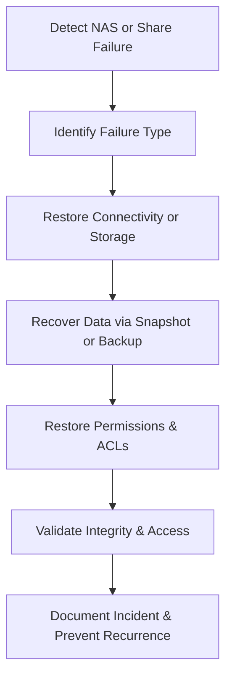

# Enterprise Disaster Recovery Knowledge Base  
## 08 — NAS and Shared Drive Recovery

---

## Overview

Network Attached Storage (NAS) and shared drives are critical components of enterprise file services. They host shared folders, departmental data, application storage, VM repositories, and backup targets. NAS failures can result from disk issues, RAID degradation, controller failure, firmware corruption, ransomware, or network outages.

This document provides a comprehensive guide to diagnosing, recovering, and restoring NAS appliances and shared drives across Windows Server, SMB/NFS environments, and enterprise NAS platforms (Synology, QNAP, NetApp, Dell EMC, HPE).

This document covers:
- NAS architecture  
- Common failure types  
- SMB/NFS share recovery  
- NAS RAID recovery  
- NAS OS/firmware recovery  
- Snapshot and replication recovery  
- Permissions and ACL recovery  
- Ransomware‑affected NAS recovery  
- PowerShell diagnostics  
- Troubleshooting  
- Best practices  

---

## 🧩 Workflow Diagram — NAS & Shared Drive Recovery Lifecycle



---

# 1. NAS Architecture Overview

NAS systems typically include:
- RAID storage pool  
- NAS OS (Linux‑based)  
- SMB/NFS services  
- Network interfaces (Ethernet, LACP, VLAN)  
- Snapshots & replication  
- User/permission management  
- Backup integration  

Common NAS vendors:
- Synology  
- QNAP  
- NetApp  
- Dell EMC Isilon  
- HPE StoreEasy  

---

# 2. Common NAS Failure Types

### Storage‑related failures
- Disk failure  
- RAID degradation  
- Storage pool corruption  
- File system errors  

### Network‑related failures
- NIC failure  
- Switch misconfiguration  
- VLAN issues  
- DNS/SMB discovery issues  

### OS/firmware failures
- Corrupt NAS OS  
- Failed update  
- Boot loop  

### Security failures
- Ransomware  
- Unauthorized access  
- ACL corruption  

---

# 3. SMB/NFS Shared Drive Recovery

## 3.1 Validate NAS connectivity

### Ping NAS

```powershell
Test-Connection 192.168.10.50
```

### Validate SMB port

```powershell
Test-NetConnection 192.168.10.50 -Port 445
```

### Validate NFS port

```powershell
Test-NetConnection 192.168.10.50 -Port 2049
```

---

## 3.2 Reconnect SMB share

```powershell
net use Z: \\NAS01\Shared /user:corp\user1
```

### Clear stale SMB sessions

```powershell
net use * /delete /y
```

---

## 3.3 Reconnect NFS share

```powershell
mount \\NAS01\NFSShare X:
```

---

# 4. NAS RAID Recovery

### Check RAID status (Synology)

```
Storage Manager → HDD/SSD → Health
Storage Manager → Storage Pool → Status
```

### Check RAID status (QNAP)

```
Storage & Snapshots → Storage → RAID Group
```

### Replace failed disk
- Hot‑swap if supported  
- Use identical or larger disk  

### Start RAID rebuild
Automatically triggered or manually initiated.

### Monitor rebuild progress

```powershell
Get-WinEvent -LogName System | Where-Object {$_.Message -like "*RAID*"}
```

---

# 5. NAS OS / Firmware Recovery

### Symptoms:
- NAS not booting  
- Web interface unavailable  
- Firmware update failed  
- Stuck in recovery mode  

### Recovery steps:
1. Power cycle NAS  
2. Boot into vendor recovery mode  
3. Reinstall firmware  
4. Rebuild configuration (if needed)  
5. Restore data from RAID or backup  

### Synology USB recovery  
### QNAP Qfinder recovery  
### NetApp ONTAP recovery tools  

---

# 6. Snapshot and Replication Recovery

Most NAS systems support:
- Local snapshots  
- Remote replication  
- Cloud replication  

### Restore from snapshot (Synology)

```
Snapshot Replication → Restore → Select Snapshot
```

### Restore from snapshot (QNAP)

```
Storage & Snapshots → Snapshot → Restore
```

### Restore from NetApp snapshot

```powershell
snap restore -volume vol1 -snapshot nightly
```

Snapshots are ideal for:
- Ransomware recovery  
- Accidental deletion  
- File corruption  

---

# 7. Permissions and ACL Recovery

### Backup ACLs

```powershell
icacls Z:\Shared /save D:\ACLBackup.txt
```

### Restore ACLs

```powershell
icacls Z:\Shared /restore D:\ACLBackup.txt
```

### Reset ACLs

```powershell
icacls Z:\Shared /reset /T
```

### NAS‑side ACL management
- Synology: Control Panel → Shared Folder → Permissions  
- QNAP: Shared Folders → Edit Permissions  

---

# 8. Ransomware‑Affected NAS Recovery

### Steps:
1. **Isolate NAS from network**  
2. Identify encrypted files  
3. Check snapshots  
4. Restore from snapshot or backup  
5. Validate integrity  
6. Reconnect NAS  
7. Harden NAS security  

### Identify encrypted files

```powershell
Get-ChildItem Z:\Shared -Recurse | Where-Object {$_.Extension -eq ".encrypted"}
```

### Restore from backup

```powershell
robocopy \\BackupServer\NASBackup Z:\Shared /MIR
```

---

# 9. PowerShell Diagnostics

### Check SMB sessions

```powershell
Get-SmbSession
```

### Check SMB shares

```powershell
Get-SmbShare
```

### Check network connectivity

```powershell
Test-NetConnection NAS01 -Port 445
```

---

# 10. Troubleshooting

| Issue | Cause | Fix |
|-------|-------|-----|
| NAS offline | Network issue | Check switch/VLAN |
| RAID degraded | Disk failure | Replace disk |
| SMB share missing | ACL corruption | Restore ACLs |
| Slow access | Network bottleneck | Check NIC teaming |
| Snapshot restore fails | Corrupt snapshot | Use backup |
| Ransomware | SMB vulnerability | Patch NAS OS |

### Reset SMB connection

```powershell
net use * /delete /y
```

### Restart NAS services (vendor‑specific)

---

# 11. Best Practices

- Use RAID 6 or RAID 10 for critical NAS  
- Enable snapshots and replication  
- Backup NAS data to offsite/cloud  
- Use SMB signing and encryption  
- Patch NAS firmware regularly  
- Restrict NAS admin access  
- Monitor NAS health daily  
- Test NAS recovery quarterly  

---

# References

- Synology Knowledge Base — Recovery  
- QNAP Documentation — RAID & Snapshot  
- NetApp ONTAP — Snapshot Recovery  
- Microsoft Learn — SMB/NFS Recovery  
```
