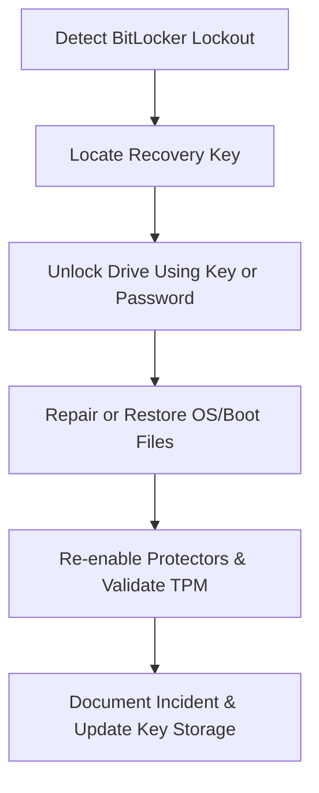

# Enterprise Disaster Recovery Knowledge Base  
## 09 — BitLocker Recovery and Key Management

---

## Overview

BitLocker provides full‑disk encryption for Windows Server and Windows client environments. While it significantly enhances security, it also introduces critical recovery requirements. Losing access to BitLocker‑protected drives without proper key management can result in permanent data loss.

This document provides a complete enterprise‑grade guide to BitLocker recovery, key storage, TPM management, recovery workflows, automation, and troubleshooting.

This document covers:
- BitLocker architecture  
- Recovery key types  
- Key storage locations  
- TPM and protector management  
- Recovery workflows  
- Network Unlock  
- BitLocker on servers  
- PowerShell automation  
- Troubleshooting  
- Best practices  

---

## 🧩 Workflow Diagram — BitLocker Recovery Lifecycle



---

# 1. BitLocker Architecture

BitLocker protects:
- OS volumes  
- Fixed data volumes  
- Removable drives  

Protectors include:
- TPM  
- TPM + PIN  
- Recovery key  
- Recovery password  
- Startup key (USB)  
- Network Unlock  

BitLocker is essential for:
- Servers storing sensitive data  
- Domain controllers  
- Laptops and mobile devices  
- Ransomware protection  
- Compliance (ISO 27001, NIST, PCI‑DSS)  

---

# 2. BitLocker Recovery Key Types

### 1. **Recovery Password (48‑digit key)**
Most common recovery method.

### 2. **Recovery Key File (.BEK)**
Stored on USB or network unlock server.

### 3. **Startup Key**
Used for servers without TPM.

### 4. **TPM Protector**
Hardware‑based protection.

### 5. **AD DS / Azure AD Stored Keys**
Enterprise‑managed recovery.

---

# 3. Key Storage Locations

### 1. **Active Directory (AD DS)**  
Automatically stored when GPO is configured.

Retrieve key:

```powershell
Get-ADObject -Filter 'objectClass -eq "msFVE-RecoveryInformation"' -Properties msFVE-RecoveryPassword
```

### 2. **Azure AD**
For cloud‑joined devices.

### 3. **MBAM (Microsoft BitLocker Administration and Monitoring)**
Centralized enterprise key management.

### 4. **Local USB Key**
Startup key or recovery key.

### 5. **Printed or manually stored keys**
Last‑resort method.

---

# 4. TPM and Protector Management

### Check TPM status

```powershell
Get-Tpm
```

### Add recovery password protector

```powershell
Add-BitLockerKeyProtector -MountPoint "C:" -RecoveryPasswordProtector
```

### Add TPM protector

```powershell
Add-BitLockerKeyProtector -MountPoint "C:" -TpmProtector
```

### Remove protector

```powershell
Remove-BitLockerKeyProtector -MountPoint "C:" -KeyProtectorId <ID>
```

---

# 5. BitLocker Recovery Workflows

## 5.1 Unlock OS Volume

```powershell
manage-bde -unlock C: -RecoveryPassword <48-digit-key>
```

## 5.2 Unlock Data Volume

```powershell
manage-bde -unlock D: -RecoveryKey F:\RecoveryKey.bek
```

## 5.3 Resume Protection

```powershell
manage-bde -protectors -enable C:
```

## 5.4 Disable BitLocker (if required)

```powershell
manage-bde -off C:
```

---

# 6. Network Unlock (Enterprise Servers)

Network Unlock allows servers to boot without manual PIN entry.

Requirements:
- Windows Deployment Services (WDS)  
- Network Unlock feature  
- DHCP + PKI  
- TPM 2.0  

### Check Network Unlock status

```powershell
Get-BitLockerVolume
```

---

# 7. BitLocker on Windows Servers

### Recommended server configuration:
- TPM + Recovery Password  
- Network Unlock for unattended boot  
- Startup key for servers without TPM  

### Enable BitLocker on server

```powershell
Enable-BitLocker -MountPoint "C:" -TpmProtector -RecoveryPasswordProtector
```

### Enable BitLocker on data volume

```powershell
Enable-BitLocker -MountPoint "D:" -RecoveryPasswordProtector
```

---

# 8. Ransomware‑Affected BitLocker Recovery

### Steps:
1. **Isolate server**  
2. Unlock drive using recovery key  
3. Validate file integrity  
4. Restore from backup if needed  
5. Re‑enable protectors  
6. Document incident  

### Identify encrypted files

```powershell
Get-ChildItem -Recurse | Where-Object {$_.Extension -eq ".encrypted"}
```

---

# 9. PowerShell Automation

### Backup recovery keys to file

```powershell
(Get-BitLockerVolume -MountPoint "C:").KeyProtector | Out-File "C:\RecoveryKeys.txt"
```

### Export recovery key to AD

```powershell
Backup-BitLockerKeyProtector -MountPoint "C:"
```

### List protectors

```powershell
manage-bde -protectors -get C:
```

---

# 10. Troubleshooting

| Issue | Cause | Fix |
|-------|-------|-----|
| BitLocker asks for key | TPM reset | Use recovery key |
| Cannot unlock drive | Wrong key | Retrieve correct key |
| TPM not working | Firmware issue | Update BIOS/TPM |
| Recovery key missing | No key backup | Use MBAM/Azure AD |
| OS won't boot | Boot corruption | Use WinRE + recovery key |

### Repair BitLocker metadata

```powershell
manage-bde -repair C: -rk F:\RecoveryKey.bek
```

### Check BitLocker status

```powershell
manage-bde -status
```

---

# 11. Best Practices

- Store recovery keys in AD DS or Azure AD  
- Use TPM + PIN for high‑security systems  
- Enable Network Unlock for servers  
- Backup recovery keys offline  
- Document BitLocker configuration  
- Test recovery quarterly  
- Use MBAM for enterprise key management  
- Protect recovery keys with strict access controls  

---

# References

- Microsoft Learn — BitLocker  
- NIST SP 800‑111 — Storage Encryption  
- MBAM Documentation  
```
