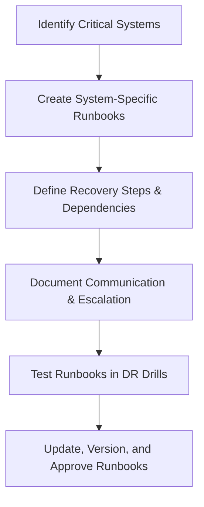

# Enterprise Disaster Recovery Knowledge Base  
## 10 — Disaster Recovery Runbooks and Documentation

---

## Overview

Disaster Recovery (DR) runbooks are the backbone of an organization’s ability to respond to outages, cyberattacks, hardware failures, and catastrophic events. A well‑designed runbook provides clear, step‑by‑step instructions for restoring critical systems, ensuring business continuity, and minimizing downtime.

This document covers:
- Runbook architecture  
- Documentation standards  
- DR workflow design  
- System‑specific runbooks  
- Communication procedures  
- Evidence collection  
- Versioning & change control  
- Automation integration  
- Troubleshooting  
- Best practices  

---

## 🧩 Workflow Diagram — DR Runbook Lifecycle



---

# 1. Runbook Architecture

A DR runbook must include:
- Purpose and scope  
- System overview  
- Recovery prerequisites  
- Step‑by‑step procedures  
- Screenshots and commands  
- Dependencies  
- Communication steps  
- Validation checks  
- Rollback procedures  
- Contact lists  

Runbooks must be:
- Clear  
- Repeatable  
- Testable  
- Version‑controlled  
- Accessible during outages  

---

# 2. Documentation Standards

### Required formatting:
- Markdown (.md)  
- Numbered steps  
- Code blocks for commands  
- Tables for dependencies  
- Diagrams for workflows  
- Clear headings  

### Required metadata:
- Author  
- Last updated  
- Version number  
- Approval status  
- System owner  

---

# 3. DR Workflow Design

### Example DR workflow:

```
Incident Detected
 ├── Assess Severity
 ├── Activate DR Plan
 ├── Notify Stakeholders
 ├── Execute Runbook
 ├── Validate Recovery
 └── Document Incident
```

### Include:
- RTO (Recovery Time Objective)  
- RPO (Recovery Point Objective)  
- Dependencies  
- Failover paths  
- Rollback paths  

---

# 4. System‑Specific Runbooks

Each critical system must have its own runbook.

### Examples:
- Active Directory Recovery  
- DNS Recovery  
- File Server Recovery  
- Hyper‑V VM Recovery  
- SQL Server Recovery  
- Exchange / Microsoft 365 Recovery  
- Network Infrastructure Recovery  
- Storage / SAN Recovery  
- Backup Server Recovery  

### Runbook template:

```
# System Name
## Overview
## Dependencies
## Pre‑Recovery Checklist
## Recovery Steps
## Validation Steps
## Rollback Steps
## Contacts
## Version History
```

---

# 5. Communication Procedures

### Internal communication:
- IT leadership  
- System owners  
- Security team  
- Helpdesk  
- Business units  

### External communication:
- Vendors  
- Cloud providers  
- Managed service providers  

### Communication channels:
- Email  
- Phone  
- Teams/Slack  
- Incident management platform  

### Example escalation table:

| Severity | Action | Escalation |
|----------|--------|------------|
| Sev‑1 | Activate DR | CIO / CTO |
| Sev‑2 | Partial outage | IT Manager |
| Sev‑3 | Minor issue | Sysadmin |

---

# 6. Evidence Collection

During DR events, collect:
- Logs  
- Screenshots  
- Error messages  
- Timeline of events  
- Actions taken  
- Root cause indicators  

### Tools:
```powershell
Get-WinEvent -LogName System
Get-WinEvent -LogName Application
```

---

# 7. Versioning & Change Control

### Version control requirements:
- Git repository  
- Semantic versioning (v1.0.0)  
- Change approval workflow  
- Quarterly review  

### Example version history:

| Version | Date | Author | Notes |
|---------|------|--------|-------|
| 1.0.0 | 2026‑01‑10 | Sushil | Initial release |
| 1.1.0 | 2026‑03‑05 | Sushil | Updated AD recovery steps |

---

# 8. Automation Integration

Runbooks should integrate automation where possible.

### PowerShell automation examples:

#### Automated backup verification

```powershell
wbadmin get versions | Export-Csv "C:\Reports\BackupVersions.csv"
```

#### Automated service restart

```powershell
Restart-Service -Name dns -Force
```

#### Automated VM recovery

```powershell
Import-VM -Path "D:\Backups\SRV-APP01"
```

Automation reduces:
- Human error  
- Recovery time  
- Complexity  

---

# 9. Troubleshooting

| Issue | Cause | Fix |
|-------|-------|-----|
| Runbook unclear | Poor documentation | Rewrite steps |
| Steps missing | No testing | Perform DR drill |
| Wrong commands | Outdated version | Update runbook |
| Slow recovery | Manual tasks | Add automation |
| Team confusion | No communication plan | Add escalation matrix |

### Validate runbook accuracy

```powershell
Test-Connection critical-server
```

---

# 10. Best Practices

- Maintain runbooks for all critical systems  
- Store runbooks in Git with version control  
- Test runbooks during DR drills  
- Keep runbooks simple and actionable  
- Include screenshots and commands  
- Document communication and escalation paths  
- Review runbooks quarterly  
- Ensure offline access (PDF, printed copies)  
- Automate repetitive recovery steps  

---

# References

- NIST SP 800‑34 — Contingency Planning  
- ISO 22301 — Business Continuity  
- Microsoft Learn — Disaster Recovery Documentation  
```
