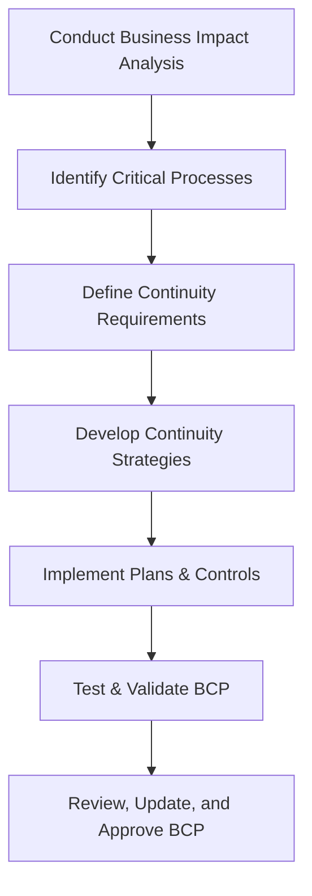

# Enterprise Disaster Recovery Knowledge Base  
## 11 — Business Continuity Planning (BCP)

---

## Overview

Business Continuity Planning (BCP) ensures that critical business functions continue operating during and after disruptive events such as cyberattacks, natural disasters, infrastructure failures, or pandemics. BCP complements Disaster Recovery (DR) by focusing on maintaining business operations, not just restoring IT systems.

This document covers:
- BCP fundamentals  
- Business impact analysis (BIA)  
- Critical process identification  
- RTO/RPO alignment  
- Continuity strategies  
- Workforce continuity  
- Facilities & infrastructure continuity  
- Technology continuity  
- Vendor & supply chain continuity  
- Testing & maintenance  
- Troubleshooting  
- Best practices  

---

## 🧩 Workflow Diagram — Business Continuity Planning Lifecycle



---

# 1. BCP Fundamentals

BCP ensures:
- Critical business functions remain operational  
- Minimal disruption during incidents  
- Rapid recovery of essential services  
- Compliance with regulatory requirements  
- Protection of employees, customers, and assets  

BCP focuses on:
- People  
- Processes  
- Technology  
- Facilities  
- Vendors  

---

# 2. Business Impact Analysis (BIA)

BIA identifies:
- Critical business functions  
- Dependencies  
- Financial impact of downtime  
- Operational impact  
- Legal/regulatory impact  

### BIA Steps:
1. Identify business processes  
2. Determine criticality  
3. Assess impact of disruption  
4. Define RTO/RPO  
5. Document dependencies  

### Example BIA table:

| Process | Criticality | RTO | RPO | Dependencies |
|---------|-------------|-----|-----|--------------|
| Payroll | High | 4 hrs | 1 hr | HR, Finance, AD |
| Email | High | 2 hrs | 15 min | M365, DNS |
| ERP | Critical | 1 hr | 0 min | SQL, Storage |

---

# 3. Identify Critical Processes

Critical processes include:
- Financial operations  
- Customer service  
- Manufacturing  
- IT operations  
- Security operations  
- Communications  
- Supply chain  

### Criteria:
- Revenue impact  
- Compliance impact  
- Safety impact  
- Customer impact  

---

# 4. Define Continuity Requirements

### Recovery Time Objective (RTO)
Maximum acceptable downtime.

### Recovery Point Objective (RPO)
Maximum acceptable data loss.

### Maximum Tolerable Downtime (MTD)
Absolute limit before business failure.

### Example:

| System | RTO | RPO |
|--------|-----|-----|
| AD | 1 hr | 0 min |
| File Server | 4 hrs | 30 min |
| SQL Server | 2 hrs | 15 min |

---

# 5. Continuity Strategies

### 1. **Technology Continuity**
- Redundant systems  
- Failover clusters  
- Cloud replication  
- Offsite backups  
- DR sites  

### 2. **Workforce Continuity**
- Remote work capability  
- Alternate work locations  
- Cross‑training  
- Emergency communication plans  

### 3. **Facilities Continuity**
- Backup power  
- Alternate office locations  
- Environmental controls  

### 4. **Vendor Continuity**
- Vendor SLAs  
- Alternate suppliers  
- Contractual DR requirements  

---

# 6. Workforce Continuity Planning

### Remote work readiness:
- VPN  
- MFA  
- Cloud services  
- Collaboration tools  

### Employee safety:
- Evacuation plans  
- Emergency response procedures  

### Communication:
- SMS alerts  
- Email notifications  
- Incident management platforms  

---

# 7. Facilities & Infrastructure Continuity

### Key components:
- Backup generators  
- UPS systems  
- Redundant cooling  
- Fire suppression  
- Physical security  

### Alternate site types:
- Hot site  
- Warm site  
- Cold site  

---

# 8. Technology Continuity

### Critical systems:
- Active Directory  
- DNS  
- File services  
- Hyper‑V / VMware  
- SQL Server  
- Email (M365/Exchange)  
- Storage systems  

### Strategies:
- Clustering  
- Replication  
- Load balancing  
- Cloud failover  
- DR automation  

---

# 9. Vendor & Supply Chain Continuity

### Evaluate vendor risk:
- Financial stability  
- Geographic risk  
- SLA compliance  
- DR capabilities  

### Maintain:
- Backup vendors  
- Alternate suppliers  
- Contractual DR clauses  

---

# 10. BCP Testing & Maintenance

### Types of tests:
- Tabletop exercises  
- Simulation tests  
- Full DR drills  
- Communication tests  

### Testing frequency:
- Quarterly for critical systems  
- Annually for full BCP  

### Update BCP when:
- New systems added  
- Business processes change  
- After major incidents  

---

# 11. Troubleshooting

| Issue | Cause | Fix |
|-------|-------|-----|
| BCP outdated | No review | Quarterly updates |
| Staff unaware | No training | Conduct BCP training |
| RTO/RPO unrealistic | Poor BIA | Reassess BIA |
| Vendor failure | No backup vendor | Add secondary vendor |
| DR test fails | Missing steps | Update runbook |

### Validate BCP readiness

```powershell
Test-Connection critical-server
```

---

# 12. Best Practices

- Conduct BIA annually  
- Maintain clear, actionable BCP documentation  
- Train employees regularly  
- Test BCP through DR drills  
- Maintain alternate work locations  
- Use cloud services for resilience  
- Document dependencies and RTO/RPO  
- Maintain vendor continuity plans  
- Store BCP offline and in cloud  

---

# References

- ISO 22301 — Business Continuity Management  
- NIST SP 800‑34 — Contingency Planning  
- Microsoft Learn — Business Continuity  
```
