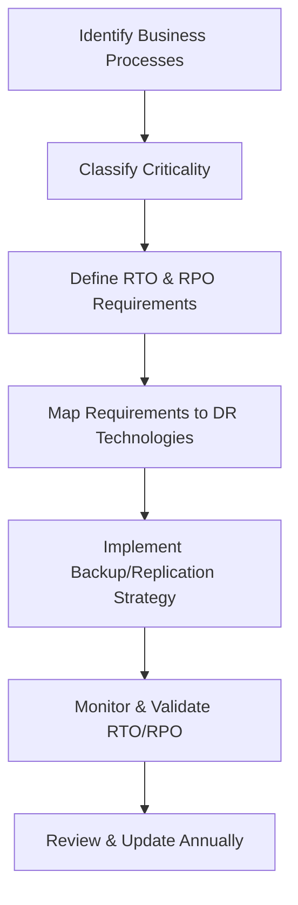

# Enterprise Disaster Recovery Knowledge Base  
## 12 — RTO and RPO Management

---

## Overview

Recovery Time Objective (RTO) and Recovery Point Objective (RPO) are the two most critical metrics in disaster recovery planning. They define how quickly systems must be restored (RTO) and how much data loss is acceptable (RPO). Proper RTO/RPO management ensures alignment between business expectations, technical capabilities, and DR strategy.

This document covers:
- Definitions of RTO and RPO  
- Business impact alignment  
- System classification  
- RTO/RPO calculation  
- Mapping workloads to DR strategies  
- Technology selection based on RTO/RPO  
- Monitoring and reporting  
- Troubleshooting  
- Best practices  

---

## 🧩 Workflow Diagram — RTO/RPO Management Lifecycle



---

# 1. Definitions

### Recovery Time Objective (RTO)
Maximum acceptable downtime for a system or process.

### Recovery Point Objective (RPO)
Maximum acceptable data loss measured in time.

### Example:
- RTO = 2 hours  
- RPO = 15 minutes  

---

# 2. Business Impact Alignment

RTO/RPO must align with:
- Financial impact  
- Operational impact  
- Compliance requirements  
- Customer impact  
- Safety considerations  

### Example impact categories:

| Impact Type | Description |
|-------------|-------------|
| Financial | Revenue loss, penalties |
| Operational | Production delays |
| Compliance | Legal/regulatory violations |
| Customer | Service disruption |
| Safety | Critical health/safety systems |

---

# 3. System Classification

### Tier 1 — Mission Critical
- RTO: < 1 hour  
- RPO: 0–15 minutes  
- Examples: AD, DNS, SQL, ERP, Email  

### Tier 2 — High Importance
- RTO: 4 hours  
- RPO: 30–60 minutes  
- Examples: File servers, application servers  

### Tier 3 — Standard Systems
- RTO: 24 hours  
- RPO: 24 hours  
- Examples: Intranet, non‑critical apps  

### Tier 4 — Non‑Critical
- RTO: 72+ hours  
- RPO: 48+ hours  
- Examples: Test systems, archives  

---

# 4. Calculating RTO and RPO

### RTO Calculation Factors:
- System complexity  
- Recovery method  
- Staff availability  
- Hardware replacement time  
- Backup restore speed  

### RPO Calculation Factors:
- Backup frequency  
- Replication frequency  
- Data change rate  
- Application criticality  

### Example calculation:

```
Backup frequency: Every 15 minutes
→ RPO = 15 minutes

VM restore time: 2 hours
→ RTO = 2 hours
```

---

# 5. Mapping RTO/RPO to DR Technologies

### RTO/RPO Technology Matrix

| RTO | RPO | Recommended Technology |
|-----|-----|-------------------------|
| < 1 hr | 0–15 min | Hyper‑V Replica, SQL Always On, SAN replication |
| 1–4 hrs | 15–60 min | Incremental backups, VM snapshots |
| 4–24 hrs | 1–24 hrs | Daily full backups |
| 24+ hrs | 24+ hrs | Weekly backups, cold storage |

---

# 6. Technology Selection Based on RTO/RPO

### 1. **High Availability (HA)**
- RTO: Near‑zero  
- RPO: Zero  
- Examples: Failover clustering, SQL Always On  

### 2. **Hyper‑V Replica**
- RTO: < 1 hour  
- RPO: 5–15 minutes  

### 3. **SAN/NAS Replication**
- RTO: < 1 hour  
- RPO: Zero to minutes  

### 4. **Backup‑based recovery**
- RTO: Hours  
- RPO: Hours  

### 5. **Cloud DR (Azure Site Recovery)**
- RTO: < 1 hour  
- RPO: Minutes  

---

# 7. Monitoring and Reporting

### Track RTO performance
- Actual recovery time vs target  
- DR drill results  
- Incident logs  

### Track RPO performance
- Backup frequency  
- Replication lag  
- Snapshot intervals  

### PowerShell example: backup age check

```powershell
(Get-Date) - (Get-Item "D:\Backups\DailyBackup.bak").LastWriteTime
```

### PowerShell example: replication health

```powershell
Get-VMReplication | Select VMName,ReplicationHealth,LastReplicationTime
```

---

# 8. Troubleshooting

| Issue | Cause | Fix |
|-------|-------|-----|
| RTO not met | Slow restore | Use faster storage |
| RPO not met | Backup frequency too low | Increase frequency |
| Replication lag | Network bottleneck | Increase bandwidth |
| Backup corruption | Storage failure | Validate disks |
| DR drill failure | Missing steps | Update runbook |

### Validate backup integrity

```powershell
wbadmin get versions
```

### Validate replication

```powershell
repadmin /replsummary
```

---

# 9. Best Practices

- Define RTO/RPO during BIA  
- Align RTO/RPO with business impact  
- Use replication for low RPO  
- Use clustering for low RTO  
- Test RTO/RPO quarterly  
- Document RTO/RPO for all systems  
- Monitor backup and replication health  
- Review RTO/RPO annually  

---

# References

- NIST SP 800‑34 — Contingency Planning  
- ISO 22301 — Business Continuity  
- Microsoft Learn — Backup & Replication  
```
