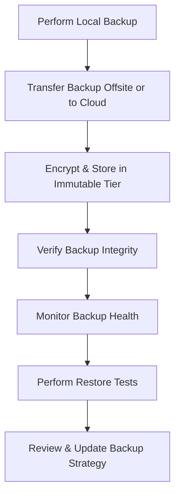

# Enterprise Disaster Recovery Knowledge Base  
## 13 — Offsite and Cloud Backup Management

---

## Overview

Offsite and cloud backup management ensures that critical data remains protected even when primary datacenter infrastructure is compromised. Whether due to natural disasters, ransomware, hardware failure, or human error, offsite and cloud backups provide the last line of defense for enterprise continuity.

This document covers:
- Offsite backup strategies  
- Cloud backup architecture  
- Backup tiers and storage classes  
- Encryption and security  
- Data transfer methods  
- Cloud immutability  
- Backup verification  
- Hybrid backup models  
- PowerShell automation  
- Troubleshooting  
- Best practices  

---

## 🧩 Workflow Diagram — Offsite & Cloud Backup Lifecycle



---

# 1. Offsite Backup Strategy

Offsite backups protect against:
- Datacenter destruction  
- Ransomware encryption  
- Insider threats  
- Hardware failure  
- Regional disasters  

### Offsite storage options:
- Secondary datacenter  
- Colocation facility  
- Tape vaulting  
- Cloud storage (Azure, AWS, GCP)  

### Recommended offsite schedule:
- Daily incremental  
- Weekly full  
- Monthly archive  

---

# 2. Cloud Backup Architecture

Cloud backup provides:
- Geographic redundancy  
- High durability (11 nines)  
- Immutable storage  
- Automated lifecycle management  
- Cost‑optimized tiers  

### Cloud backup components:
- Backup agent  
- Cloud storage account  
- Encryption keys  
- Retention policies  
- Monitoring and alerting  

---

# 3. Backup Tiers and Storage Classes

### Azure Storage Tiers
| Tier | Use Case |
|------|----------|
| Hot | Frequent restores |
| Cool | Infrequent access |
| Archive | Long‑term retention |

### AWS S3 Storage Classes
| Class | Use Case |
|-------|----------|
| Standard | General purpose |
| IA | Infrequent access |
| Glacier | Long‑term archive |
| Glacier Deep Archive | Lowest cost |

### On‑premise tape tiers
- LTO‑8 / LTO‑9  
- Offsite vaulting  
- Long‑term archival  

---

# 4. Encryption and Security

### Encrypt backups at rest
- AES‑256  
- BitLocker  
- Cloud provider encryption  

### Encrypt backups in transit
- TLS 1.2+  
- VPN tunnels  
- Private peering  

### Key management
- Azure Key Vault  
- AWS KMS  
- On‑prem HSM  

### Zero‑trust backup access
- MFA  
- Role‑based access control  
- Privileged Access Workstations (PAWs)  

---

# 5. Data Transfer Methods

### 1. **Direct Cloud Upload**
- Backup agent → Cloud  
- Best for daily backups  

### 2. **Cloud Gateway**
- On‑prem appliance  
- Caches data  
- Sends to cloud  

### 3. **Offline Transfer**
- Azure Data Box  
- AWS Snowball  
- Used for large datasets  

### 4. **Hybrid Backup**
- Local backup + cloud replication  

---

# 6. Cloud Immutability

Immutability protects backups from:
- Ransomware  
- Insider threats  
- Accidental deletion  

### Azure Immutable Storage
- Time‑based retention  
- Legal hold  

### AWS S3 Object Lock
- Compliance mode  
- Governance mode  

### On‑prem immutable storage
- WORM storage  
- Immutable NAS snapshots  

---

# 7. Backup Verification and Integrity Checks

### Verify cloud backup status

```powershell
Get-AzRecoveryServicesBackupJob
```

### Verify backup age

```powershell
(Get-Date) - (Get-Item "D:\Backups\DailyBackup.bak").LastWriteTime
```

### Verify offsite tape inventory
- Barcode scanning  
- Tape rotation logs  

### Perform quarterly restore tests
- VM restore  
- File restore  
- Application restore  

---

# 8. Hybrid Backup Models

### Model 1 — Local + Cloud
- Fast local restore  
- Cloud for DR  

### Model 2 — Cloud‑only
- No local storage  
- Ideal for remote offices  

### Model 3 — Multi‑cloud
- Azure + AWS  
- Redundant DR strategy  

### Model 4 — Local + Tape + Cloud
- Maximum resilience  

---

# 9. PowerShell Automation

### Upload backup to Azure

```powershell
Set-AzStorageBlobContent -File "D:\Backups\DailyBackup.bak" -Container "backups" -Blob "DailyBackup.bak"
```

### Upload backup to AWS S3

```powershell
Write-S3Object -BucketName "corp-backups" -File "D:\Backups\DailyBackup.bak"
```

### Verify cloud backup integrity

```powershell
Get-AzStorageBlob -Container "backups"
```

---

# 10. Troubleshooting

| Issue | Cause | Fix |
|-------|-------|-----|
| Slow upload | Bandwidth bottleneck | Use offline transfer |
| Backup corruption | Storage failure | Validate disks |
| Cloud backup fails | Authentication | Re‑authorize agent |
| High cloud cost | Wrong tier | Move to archive |
| Ransomware | No immutability | Enable object lock |

### Check network throughput

```powershell
Test-NetConnection backupserver -Port 443
```

### Validate cloud connectivity

```powershell
Test-NetConnection azure.com -Port 443
```

---

# 11. Best Practices

- Use immutable cloud storage  
- Encrypt backups end‑to‑end  
- Maintain offsite copies  
- Use hybrid backup strategy  
- Test restores quarterly  
- Monitor backup health daily  
- Store keys in secure vault  
- Use cloud lifecycle policies  
- Document offsite backup procedures  

---

# References

- Microsoft Learn — Azure Backup  
- AWS Documentation — S3 & Glacier  
- NIST SP 800‑34 — Backup & Offsite Storage  
```
