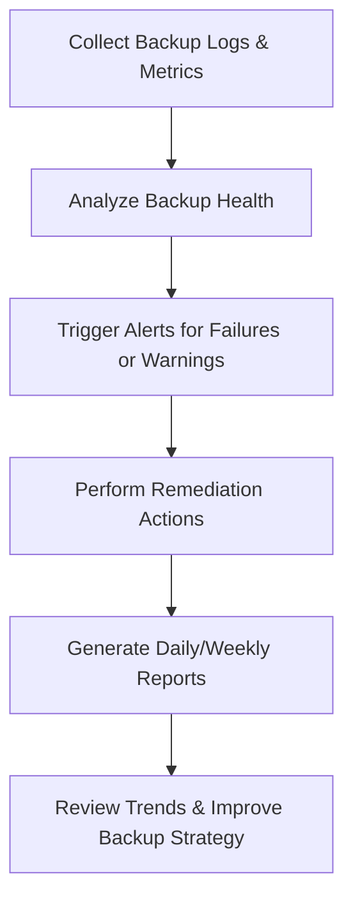

# Enterprise Disaster Recovery Knowledge Base  
## 14 — Backup Monitoring and Alerting

---

## Overview

Backup monitoring and alerting ensure that backup systems operate reliably, failures are detected early, and recovery points remain valid. Without proper monitoring, organizations risk silent backup failures, corrupted restore points, missed schedules, and non‑compliance with RTO/RPO requirements.

This document covers:
- Backup monitoring architecture  
- Critical metrics  
- Alerting thresholds  
- Monitoring tools  
- Log analysis  
- Cloud backup monitoring  
- Automated reporting  
- PowerShell monitoring scripts  
- Troubleshooting  
- Best practices  

---

## 🧩 Workflow Diagram — Backup Monitoring Lifecycle



---

# 1. Backup Monitoring Architecture

Backup monitoring includes:
- Job status tracking  
- Backup age validation  
- Storage capacity monitoring  
- Backup integrity checks  
- Alerting and notifications  
- Reporting and dashboards  

Monitoring sources:
- Windows Server Backup  
- Veeam  
- Commvault  
- Azure Backup  
- AWS Backup  
- NAS/SAN snapshot logs  

---

# 2. Critical Backup Metrics

### 1. Backup Job Status
- Success  
- Warning  
- Failure  

### 2. Backup Age
- Last successful backup  
- Last full backup  
- Last incremental backup  

### 3. Backup Size
- Sudden size changes indicate issues  

### 4. Storage Capacity
- Backup disk usage  
- Cloud storage usage  

### 5. Backup Duration
- Increased duration may indicate bottlenecks  

### 6. RPO Compliance
- Backup frequency meets RPO requirements  

---

# 3. Alerting Thresholds

### Critical Alerts (Immediate Action)
- Backup job failure  
- Backup repository offline  
- Backup corruption detected  
- RPO violation  
- Cloud backup authentication failure  

### Warning Alerts
- Backup job completed with warnings  
- Backup storage > 80%  
- Backup duration increased > 30%  
- Missed scheduled backup  

### Informational Alerts
- Backup job completed successfully  
- Backup repository cleanup completed  

---

# 4. Monitoring Tools

### Windows Server Backup
- Event Viewer  
- PowerShell  
- Scheduled reports  

### Veeam Backup & Replication
- Real‑time monitoring  
- Email alerts  
- Veeam ONE dashboards  

### Azure Backup
- Azure Monitor  
- Log Analytics  
- Backup center  

### AWS Backup
- CloudWatch metrics  
- SNS notifications  

### NAS/SAN Monitoring
- Synology Active Insight  
- QNAP Notification Center  
- NetApp ONTAP alerts  

---

# 5. Log Analysis

### Windows Server Backup Logs

```powershell
Get-WinEvent -LogName Microsoft-Windows-Backup
```

### VSS Logs

```powershell
Get-WinEvent -LogName Application | Where-Object {$_.Id -in 8193,12289}
```

### Azure Backup Logs

```powershell
Get-AzRecoveryServicesBackupJob
```

### AWS Backup Logs

```powershell
Get-BackupJob
```

---

# 6. Cloud Backup Monitoring

### Azure Backup Monitoring

```powershell
Get-AzRecoveryServicesBackupJob -Status Failed
```

### AWS Backup Monitoring

```powershell
Get-BackupJob -ByStatus FAILED
```

### Cloud alerting options:
- Azure Monitor Alerts  
- AWS CloudWatch Alarms  
- Email/SMS notifications  
- Teams/Slack integration  

---

# 7. Automated Reporting

### Daily Backup Report

Include:
- Job status  
- Backup age  
- Storage usage  
- RPO compliance  
- Failed jobs  
- Warning jobs  

### Weekly Backup Report

Include:
- Trend analysis  
- Storage growth  
- Backup duration trends  
- RPO/RTO compliance summary  

### Monthly Backup Report

Include:
- SLA compliance  
- Capacity planning  
- Backup policy review  

---

# 8. PowerShell Monitoring Scripts

### Check last backup time

```powershell
(Get-Date) - (Get-Item "D:\Backups\DailyBackup.bak").LastWriteTime
```

### List failed backup jobs

```powershell
Get-WinEvent -LogName Microsoft-Windows-Backup | Where-Object {$_.LevelDisplayName -eq "Error"}
```

### Email backup report

```powershell
Send-MailMessage -To "admin@corp.local" -From "backup@corp.local" -Subject "Daily Backup Report" -Body (Get-WinEvent -LogName Microsoft-Windows-Backup)
```

### Azure backup job summary

```powershell
Get-AzRecoveryServicesBackupJob | Select Status,StartTime,EndTime
```

---

# 9. Troubleshooting

| Issue | Cause | Fix |
|-------|-------|-----|
| Backup job fails | VSS error | Restart VSS |
| Backup slow | Network bottleneck | Use dedicated NIC |
| Backup corrupt | Disk failure | Validate storage |
| Cloud backup fails | Authentication | Re‑authorize agent |
| Alerts not triggering | Misconfigured rules | Update alert thresholds |

### Restart VSS

```powershell
net stop vss
net start vss
```

### Check backup service status

```powershell
Get-Service -Name wbengine
```

---

# 10. Best Practices

- Monitor backups daily  
- Use automated alerts  
- Validate backup integrity weekly  
- Test restores quarterly  
- Use cloud monitoring dashboards  
- Store logs centrally  
- Document backup failures  
- Review backup trends monthly  
- Ensure RPO compliance  

---

# References

- Microsoft Learn — Backup Monitoring  
- Azure Backup Documentation  
- AWS Backup Monitoring  
- NIST SP 800‑34 — Backup Oversight  
```
