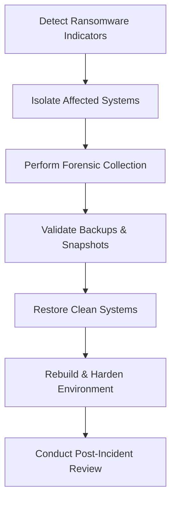

# Enterprise Disaster Recovery Knowledge Base  
## 15 — Ransomware Recovery Procedure

---

## Overview

Ransomware attacks are among the most severe incidents an organization can face. They encrypt data, disrupt operations, compromise backups, and threaten business continuity. A well‑defined ransomware recovery procedure ensures rapid containment, eradication, and restoration of critical systems while preserving forensic evidence and minimizing downtime.

This document covers:
- Ransomware attack indicators  
- Containment procedures  
- Isolation and triage  
- Forensic evidence collection  
- Backup validation  
- Recovery workflows  
- Immutable storage usage  
- Post‑incident hardening  
- PowerShell detection tools  
- Troubleshooting  
- Best practices  

---

## 🧩 Workflow Diagram — Ransomware Recovery Lifecycle



---

# 1. Ransomware Attack Indicators

### Technical indicators:
- Files renamed with unusual extensions  
- Sudden spikes in CPU/disk usage  
- Shadow copies deleted  
- Backup jobs failing  
- Unauthorized scheduled tasks  
- Unknown processes running  

### User‑reported indicators:
- Files inaccessible  
- Ransom note displayed  
- Locked screens  
- Slow system performance  

### PowerShell detection example:

```powershell
Get-ChildItem -Recurse | Where-Object {$_.Extension -match "(\.locked|\.encrypted|\.crypt)"}
```

---

# 2. Immediate Containment Procedures

### 1. **Isolate infected systems**
- Disconnect network cable  
- Disable Wi‑Fi  
- Remove from VLAN  
- Block IP on firewall  

### 2. **Stop ransomware spread**
- Disable SMB shares  
- Disable AD accounts showing suspicious activity  
- Block malicious processes  

### 3. **Activate Incident Response (IR) team**

### 4. **Do NOT reboot infected systems**
Rebooting may destroy forensic evidence.

---

# 3. Forensic Evidence Collection

### Collect:
- Ransom notes  
- Malicious binaries  
- Event logs  
- Network logs  
- Memory dumps  
- Timeline of events  

### Export Windows event logs

```powershell
wevtutil epl System C:\Forensics\system.evtx
wevtutil epl Security C:\Forensics\security.evtx
```

### Capture running processes

```powershell
Get-Process | Export-Csv C:\Forensics\processes.csv
```

---

# 4. Backup Validation Before Recovery

### Validate backup integrity

```powershell
wbadmin get versions
```

### Validate cloud backup status

```powershell
Get-AzRecoveryServicesBackupJob -Status Completed
```

### Validate NAS/SAN snapshots
- Ensure snapshots predate attack  
- Ensure snapshots are immutable  

### DO NOT restore from backups created after infection.

---

# 5. Ransomware Recovery Workflow

## Step 1 — Identify infection scope
- Servers  
- Workstations  
- NAS/SAN  
- Cloud workloads  
- Domain controllers  

## Step 2 — Wipe and rebuild infected systems
Never trust a system that was encrypted.

## Step 3 — Restore clean backups
- VM restore  
- File restore  
- Application restore  
- Database restore  

## Step 4 — Validate restored systems
- Check AD replication  
- Check DNS  
- Check file integrity  
- Check application functionality  

## Step 5 — Reconnect systems to network

---

# 6. Immutable Storage Usage

### Immutable backup types:
- Azure Immutable Blob Storage  
- AWS S3 Object Lock  
- NAS WORM snapshots  
- Offline tape backups  

### Benefits:
- Prevents ransomware from encrypting backups  
- Ensures clean restore points  
- Meets compliance requirements  

---

# 7. Recovery Procedures by System Type

## 7.1 File Servers

### Identify encrypted files

```powershell
Get-ChildItem D:\Shared -Recurse | Where-Object {$_.Extension -eq ".encrypted"}
```

### Restore from snapshot or backup

```powershell
robocopy \\BackupServer\Shared D:\Shared /MIR
```

---

## 7.2 Hyper‑V Virtual Machines

### Restore VM from backup

```powershell
Import-VM -Path "D:\Backups\SRV-APP01"
```

### Validate VHDX integrity

```powershell
Repair-VHD -Path "D:\VMs\SRV-APP01.vhdx"
```

---

## 7.3 Domain Controllers

### Restore from system state backup

```powershell
wbadmin start systemstaterecovery -version:<ID> -quiet
```

### Validate AD health

```powershell
dcdiag /v
repadmin /replsummary
```

---

## 7.4 SQL Databases

### Restore database

```powershell
RESTORE DATABASE CorpDB FROM DISK='D:\Backups\CorpDB.bak' WITH REPLACE
```

### Validate DB integrity

```sql
DBCC CHECKDB('CorpDB')
```

---

# 8. Post‑Incident Hardening

### 1. Patch systems  
### 2. Reset all passwords  
### 3. Enable MFA everywhere  
### 4. Implement least privilege  
### 5. Deploy EDR/XDR  
### 6. Enable immutable backups  
### 7. Review firewall rules  
### 8. Conduct security awareness training  

---

# 9. PowerShell Tools for Ransomware Detection

### Detect suspicious scheduled tasks

```powershell
Get-ScheduledTask | Where-Object {$_.TaskName -match "update|backup|system"}
```

### Detect unauthorized services

```powershell
Get-Service | Where-Object {$_.Status -eq "Running" -and $_.Name -match "crypt|lock"}
```

### Detect mass file changes

```powershell
Get-ChildItem -Recurse | Measure-Object
```

---

# 10. Troubleshooting

| Issue | Cause | Fix |
|-------|-------|-----|
| Backup corrupted | Ransomware reached backup | Use immutable backup |
| Restore fails | Wrong version | Use earlier backup |
| Infection returns | Malware persists | Full wipe & rebuild |
| NAS encrypted | SMB vulnerability | Restore from snapshot |
| AD broken | DC infected | System state restore |

### Check VSS status

```powershell
vssadmin list writers
```

---

# 11. Best Practices

- Use immutable cloud backups  
- Maintain offline backups  
- Segment networks  
- Use MFA for all privileged accounts  
- Patch systems regularly  
- Monitor backup health daily  
- Conduct quarterly DR drills  
- Document ransomware incidents  
- Train staff on phishing prevention  

---

# References

- NIST SP 800‑83 — Malware Incident Handling  
- Microsoft Learn — Ransomware Recovery  
- CISA Ransomware Guidance  
```


and proceed through the entire Disaster Recovery Knowledge Base (01 → 25).
