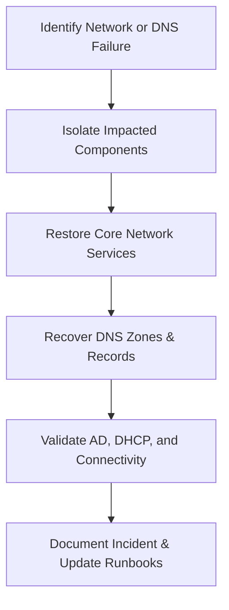

Absolutely, Sushil — continuing your **Enterprise Disaster Recovery Knowledge Base** with **Document 16**, following the same professional, GitHub‑ready, deeply structured format used in Documents 01–15.

---

# ✅ **16‑Network‑and‑DNS‑Recovery.md**  
### *Enterprise Disaster Recovery Knowledge Base – Document 16*

```md
# Enterprise Disaster Recovery Knowledge Base  
## 16 — Network and DNS Recovery

---

## Overview

Network and DNS failures can cripple an organization’s ability to authenticate users, access applications, resolve hostnames, and maintain connectivity across critical systems. Because Active Directory, email, file services, and cloud workloads all depend on DNS and network availability, rapid recovery is essential.

This document covers:
- Network failure types  
- DNS failure types  
- Recovery workflows  
- AD‑integrated DNS recovery  
- DHCP recovery  
- Switch/router recovery  
- Firewall recovery  
- IPAM recovery  
- PowerShell diagnostics  
- Troubleshooting  
- Best practices  

---

## 🧩 Workflow Diagram — Network & DNS Recovery Lifecycle



---

# 1. Network Failure Types

### 1. Physical Layer Failures
- Cable damage  
- Switch port failure  
- Power outage  
- NIC failure  

### 2. Logical Layer Failures
- VLAN misconfiguration  
- Routing issues  
- DHCP failure  
- DNS failure  

### 3. Security‑Related Failures
- Firewall misconfiguration  
- ACL blocking  
- Zero‑trust policy misalignment  

### 4. External Network Failures
- ISP outage  
- Cloud connectivity failure  
- VPN tunnel failure  

---

# 2. DNS Failure Types

### 1. AD‑Integrated DNS Failure
- Corrupt DNS zones  
- Missing SRV records  
- Replication failure  

### 2. Standalone DNS Failure
- Service stopped  
- Zone file corruption  

### 3. DNS Resolution Failure
- Incorrect forwarders  
- Firewall blocking port 53  
- DNS cache poisoning  

### 4. DNS Infrastructure Failure
- DNS server offline  
- NIC misconfiguration  
- IP conflict  

---

# 3. Network Recovery Workflow

## Step 1 — Identify Scope of Failure
- Single server  
- Single subnet  
- Entire site  
- Multi‑site outage  

### Check connectivity

```powershell
Test-Connection 192.168.10.1
```

### Check routing

```powershell
tracert 8.8.8.8
```

---

## Step 2 — Restore Core Network Services

### Restart network services

```powershell
Restart-Service -Name dnscache
Restart-Service -Name dhcp
```

### Validate NIC configuration

```powershell
Get-NetIPAddress
Get-NetAdapter
```

### Reset NIC

```powershell
Disable-NetAdapter -Name "Ethernet0" -Confirm:$false
Enable-NetAdapter -Name "Ethernet0"
```

---

## Step 3 — Switch & Router Recovery

### Validate switch port status
- Check link lights  
- Check VLAN assignment  
- Check trunking  

### Validate router status
- Routing table  
- Static routes  
- OSPF/BGP status  

### Restart switch port

```
interface Gi1/0/10
shutdown
no shutdown
```

---

## Step 4 — Firewall Recovery

### Validate firewall rules
- DNS (53 TCP/UDP)  
- DHCP (67/68)  
- LDAP (389)  
- Kerberos (88)  
- SMB (445)  

### Test firewall connectivity

```powershell
Test-NetConnection dnsserver -Port 53
```

---

# 4. DNS Recovery Workflow

## Step 1 — Validate DNS Service

```powershell
Get-Service -Name DNS
```

Restart DNS service:

```powershell
Restart-Service -Name DNS
```

---

## Step 2 — Validate AD‑Integrated DNS Zones

### List DNS zones

```powershell
Get-DnsServerZone
```

### Validate zone health

```powershell
Get-DnsServerZoneAging -Name corp.local
```

### Validate SRV records

```powershell
Get-DnsServerResourceRecord -ZoneName corp.local -RRType SRV
```

---

## Step 3 — Restore DNS Zones

### Restore DNS zone from backup

```powershell
Restore-DnsServerZone -Name corp.local -File "corp.local.dns"
```

### Recreate missing SRV records

```powershell
Add-DnsServerResourceRecord -ZoneName corp.local -Srv -Name "_ldap._tcp.dc._msdcs" -DomainName "SRV-DC01.corp.local" -Priority 0 -Weight 100 -Port 389
```

---

## Step 4 — Fix DNS Replication Issues

### Validate AD replication

```powershell
repadmin /replsummary
```

### Force replication

```powershell
repadmin /syncall /AeD
```

### Check DNS partition replication

```powershell
repadmin /showrepl * dc=DomainDnsZones,dc=corp,dc=local
```

---

## Step 5 — Flush & Rebuild DNS Cache

### Flush DNS cache

```powershell
Clear-DnsClientCache
```

### Rebuild server cache

```powershell
dnscmd /clearcache
```

---

# 5. DHCP Recovery

### Validate DHCP service

```powershell
Get-Service -Name dhcpserver
```

### Restore DHCP database

```powershell
netsh dhcp server import C:\Backup\dhcp.bak all
```

### Validate scopes

```powershell
Get-DhcpServerv4Scope
```

---

# 6. IPAM Recovery

### Validate IPAM service

```powershell
Get-Service -Name ipam
```

### Restore IPAM database
- SQL restore  
- IPAM backup restore  

---

# 7. PowerShell Diagnostics

### Check DNS health

```powershell
dcdiag /test:dns
```

### Check network adapters

```powershell
Get-NetAdapter | Select Name,Status,MacAddress
```

### Check DNS client settings

```powershell
Get-DnsClientServerAddress
```

### Check domain controller DNS registration

```powershell
nltest /dsregdns
```

---

# 8. Troubleshooting

| Issue | Cause | Fix |
|-------|-------|-----|
| DNS not resolving | DNS service stopped | Restart DNS |
| AD replication failing | DNS SRV missing | Recreate SRV |
| DHCP not issuing IPs | Scope disabled | Enable scope |
| Network outage | VLAN misconfig | Correct VLAN |
| Firewall blocking DNS | Rule missing | Add port 53 |

### Reset TCP/IP stack

```powershell
netsh int ip reset
```

### Reset Winsock

```powershell
netsh winsock reset
```

---

# 9. Best Practices

- Use redundant DNS servers  
- Use DHCP failover  
- Document VLANs and routing  
- Monitor DNS health daily  
- Use AD‑integrated DNS zones  
- Backup DNS zones weekly  
- Test DNS failover quarterly  
- Use firewall automation  
- Maintain network topology diagrams  

---

# References

- Microsoft Learn — DNS  
- Microsoft Learn — DHCP  
- NIST SP 800‑34 — Network Recovery  
```
