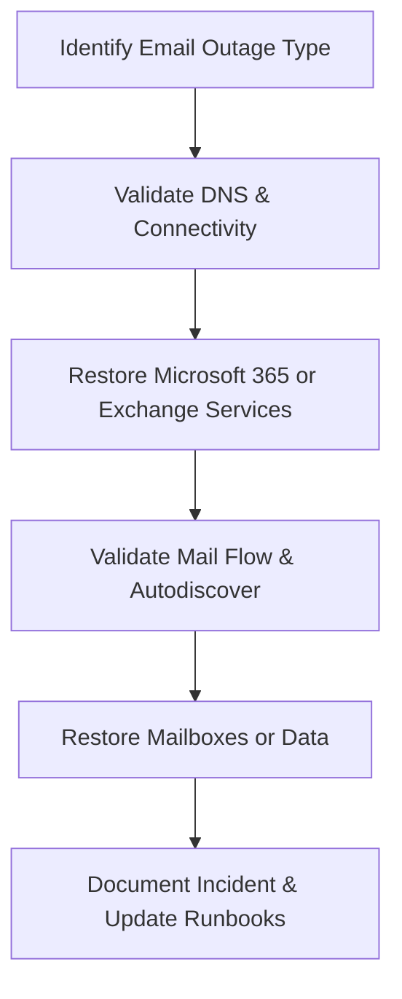

# Enterprise Disaster Recovery Knowledge Base  
## 17 — Email and Microsoft 365 Recovery

---

## Overview

Email is one of the most critical communication systems in any organization. Outages in Microsoft 365 (M365), Exchange Online, or on‑premises Exchange can disrupt business operations, authentication workflows, security alerts, and customer communication. Rapid recovery is essential to maintain business continuity.

This document covers:
- Email outage types  
- Microsoft 365 recovery workflows  
- Exchange Online recovery  
- On‑prem Exchange recovery  
- Hybrid environment recovery  
- DNS and Autodiscover recovery  
- Mail flow troubleshooting  
- Backup and restore options  
- PowerShell automation  
- Troubleshooting  
- Best practices  

---

## 🧩 Workflow Diagram — Email & M365 Recovery Lifecycle



---

# 1. Email Outage Types

### 1. Microsoft 365 Outages
- Service degradation  
- Regional outage  
- Authentication failure  
- Exchange Online service disruption  

### 2. On‑Premises Exchange Outages
- Database corruption  
- DAG failure  
- Transport service failure  
- IIS/Autodiscover failure  

### 3. Hybrid Outages
- Connector failure  
- Federation issues  
- AAD Connect sync failure  

### 4. DNS‑Related Outages
- MX record issues  
- Autodiscover misconfiguration  
- SPF/DKIM/DMARC issues  

---

# 2. Microsoft 365 Recovery Workflow

## Step 1 — Check Microsoft 365 Health

### Microsoft 365 Service Health Dashboard
- Exchange Online  
- Outlook  
- Authentication  
- Directory services  

### PowerShell check

```powershell
Get-ServiceHealth
```

---

## Step 2 — Validate Tenant Connectivity

### Test Exchange Online connection

```powershell
Connect-ExchangeOnline
Get-EXOMailbox
```

### Test Outlook connectivity

```powershell
Test-OutlookConnectivity
```

---

## Step 3 — Restore Mail Flow

### Validate MX records

```powershell
nslookup -type=mx corp.com
```

### Validate SPF

```powershell
nslookup -type=txt corp.com
```

### Validate DKIM

```powershell
Get-DkimSigningConfig
```

### Validate mail flow

```powershell
Test-MailFlow -TargetEmailAddress "admin@corp.com"
```

---

## Step 4 — Restore Mailboxes

### Restore deleted mailbox (soft delete)

```powershell
Undo-SoftDeletedMailbox -Identity user@corp.com
```

### Restore mailbox items

```powershell
Search-Mailbox -Identity user@corp.com -SearchQuery "subject:Important" -TargetMailbox admin@corp.com
```

---

# 3. Exchange Online Recovery

### Restart Exchange Online PowerShell session

```powershell
Disconnect-ExchangeOnline
Connect-ExchangeOnline
```

### Validate mailbox health

```powershell
Get-Mailbox -Identity user@corp.com | Format-List
```

### Validate transport service

```powershell
Get-TransportService
```

---

# 4. On‑Premises Exchange Recovery

## Step 1 — Validate Exchange Services

```powershell
Get-Service | Where-Object {$_.Name -like "MSExchange*"}
```

Restart services:

```powershell
Restart-Service MSExchangeTransport
Restart-Service MSExchangeIS
Restart-Service W3SVC
```

---

## Step 2 — Database Recovery

### Check database status

```powershell
Get-MailboxDatabase -Status
```

### Mount database

```powershell
Mount-Database "DB01"
```

### Repair database

```powershell
eseutil /r E00
eseutil /p "DB01.edb"
```

---

## Step 3 — DAG Recovery

### Validate DAG health

```powershell
Get-DatabaseAvailabilityGroup -Identity DAG01 -Status
```

### Activate database copy

```powershell
Move-ActiveMailboxDatabase -Identity DB01 -Server EXCH02
```

---

# 5. Hybrid Environment Recovery

### Validate AAD Connect sync

```powershell
Start-ADSyncSyncCycle -PolicyType Delta
```

### Validate hybrid mail flow

```powershell
Get-InboundConnector
Get-OutboundConnector
```

### Validate Autodiscover

```powershell
Test-OutlookWebServices
```

---

# 6. DNS and Autodiscover Recovery

### Validate Autodiscover DNS

```powershell
nslookup autodiscover.corp.com
```

### Validate SRV record

```powershell
nslookup -type=srv _autodiscover._tcp.corp.com
```

### Validate CNAME

```powershell
nslookup autodiscover.corp.com
```

### Fix Autodiscover virtual directory

```powershell
Set-AutodiscoverVirtualDirectory -Identity "EXCH01\Autodiscover (Default Web Site)" -ExternalUrl https://autodiscover.corp.com/autodiscover/autodiscover.xml
```

---

# 7. Backup and Restore Options

### Microsoft 365
- Litigation hold  
- Retention policies  
- eDiscovery  
- Third‑party backup (Veeam, Commvault)  

### On‑Prem Exchange
- Windows Server Backup  
- DAG replication  
- VSS‑aware backups  
- Database restore via ESEUTIL  

---

# 8. PowerShell Automation

### Check mail flow

```powershell
Test-MailFlow -TargetEmailAddress "admin@corp.com"
```

### Export mailbox to PST

```powershell
New-MailboxExportRequest -Mailbox user@corp.com -FilePath "\\server\PST\user.pst"
```

### Import PST

```powershell
New-MailboxImportRequest -Mailbox user@corp.com -FilePath "\\server\PST\user.pst"
```

---

# 9. Troubleshooting

| Issue | Cause | Fix |
|-------|-------|-----|
| Mail flow stopped | MX misconfigured | Fix DNS |
| Outlook cannot connect | Autodiscover broken | Fix SRV/CNAME |
| Exchange DB won't mount | Corruption | ESEUTIL repair |
| Hybrid mail flow broken | Connector issue | Recreate connectors |
| M365 outage | Regional issue | Failover to alternate region |

### Flush DNS

```powershell
Clear-DnsClientCache
```

### Restart IIS

```powershell
iisreset
```

---

# 10. Best Practices

- Use redundant DNS providers  
- Enable M365 retention policies  
- Backup Exchange Online with third‑party tools  
- Document Autodiscover configuration  
- Monitor mail flow daily  
- Test mailbox restore quarterly  
- Maintain hybrid connectors  
- Use MFA for all admin accounts  
- Maintain offline copies of critical mailboxes  

---

# References

- Microsoft Learn — Exchange Online  
- Microsoft Learn — Autodiscover  
- NIST SP 800‑34 — Email Continuity  
```
