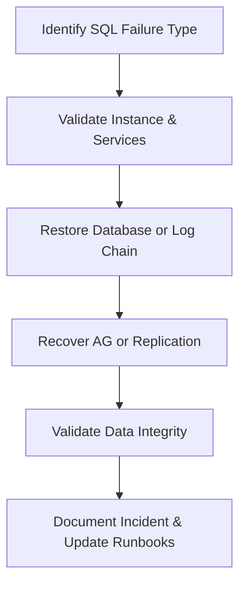

# Enterprise Disaster Recovery Knowledge Base  
## 18 — SQL Server Recovery

---

## Overview

SQL Server is a core component of enterprise applications, ERP systems, authentication services, reporting platforms, and financial systems. Outages or corruption in SQL Server can cause severe business disruption. Rapid and accurate recovery is essential to maintain data integrity, minimize downtime, and meet RTO/RPO requirements.

This document covers:
- SQL Server failure types  
- Recovery models  
- Backup types  
- Database restore workflows  
- Log chain recovery  
- Always On Availability Group recovery  
- SQL Server Agent recovery  
- TempDB recovery  
- Master/MSDB database recovery  
- PowerShell & T‑SQL automation  
- Troubleshooting  
- Best practices  

---

## 🧩 Workflow Diagram — SQL Server Recovery Lifecycle



---

# 1. SQL Server Failure Types

### 1. Database Corruption
- Hardware failure  
- Storage issues  
- Improper shutdown  
- Ransomware  

### 2. SQL Instance Failure
- Service stopped  
- Configuration corruption  
- Missing binaries  

### 3. Transaction Log Issues
- Log full  
- Log chain broken  
- Log corruption  

### 4. Availability Group Failure
- Node offline  
- Replica desync  
- Listener failure  

### 5. System Database Failure
- Master database corruption  
- MSDB corruption  
- TempDB issues  

---

# 2. SQL Server Recovery Models

### Simple
- No log backups  
- RPO: Full backup only  
- Suitable for non‑critical systems  

### Full
- Supports log backups  
- Required for point‑in‑time recovery  
- Recommended for critical systems  

### Bulk‑Logged
- Minimal logging for bulk operations  
- Used temporarily during large imports  

---

# 3. SQL Backup Types

### Full Backup

```sql
BACKUP DATABASE CorpDB TO DISK='D:\Backups\CorpDB_full.bak';
```

### Differential Backup

```sql
BACKUP DATABASE CorpDB TO DISK='D:\Backups\CorpDB_diff.bak' WITH DIFFERENTIAL;
```

### Log Backup

```sql
BACKUP LOG CorpDB TO DISK='D:\Backups\CorpDB_log.trn';
```

### Tail‑Log Backup (before restore)

```sql
BACKUP LOG CorpDB TO DISK='D:\Backups\CorpDB_tail.trn' WITH NORECOVERY;
```

---

# 4. Database Restore Workflow

## Step 1 — Restore Full Backup

```sql
RESTORE DATABASE CorpDB FROM DISK='D:\Backups\CorpDB_full.bak' WITH NORECOVERY;
```

## Step 2 — Restore Differential Backup (if exists)

```sql
RESTORE DATABASE CorpDB FROM DISK='D:\Backups\CorpDB_diff.bak' WITH NORECOVERY;
```

## Step 3 — Restore Log Chain

```sql
RESTORE LOG CorpDB FROM DISK='D:\Backups\CorpDB_log.trn' WITH NORECOVERY;
```

## Step 4 — Finalize Restore

```sql
RESTORE DATABASE CorpDB WITH RECOVERY;
```

---

# 5. Point‑in‑Time Recovery

```sql
RESTORE LOG CorpDB 
FROM DISK='D:\Backups\CorpDB_log.trn'
WITH STOPAT='2026-07-21T18:30:00', RECOVERY;
```

---

# 6. Always On Availability Group Recovery

### Validate AG health

```sql
SELECT * FROM sys.dm_hadr_availability_group_states;
```

### Failover to secondary

```sql
ALTER AVAILABILITY GROUP AG1 FAILOVER;
```

### Re‑sync replica

```sql
ALTER DATABASE CorpDB SET HADR RESUME;
```

### Remove unhealthy replica

```sql
ALTER AVAILABILITY GROUP AG1 REMOVE REPLICA ON 'SQLNODE3';
```

---

# 7. SQL Server Agent Recovery

### Restart SQL Agent

```powershell
Restart-Service -Name SQLSERVERAGENT
```

### Validate jobs

```sql
SELECT * FROM msdb.dbo.sysjobs;
```

### Re‑enable disabled jobs

```sql
EXEC msdb.dbo.sp_update_job @job_name='DailyBackup', @enabled=1;
```

---

# 8. TempDB Recovery

### Symptoms:
- SQL won’t start  
- TempDB corruption  
- Disk full  

### Reset TempDB

Stop SQL service → delete TempDB files → restart SQL.

```powershell
Stop-Service MSSQLSERVER
Start-Service MSSQLSERVER
```

SQL recreates TempDB automatically.

---

# 9. Master & MSDB Database Recovery

### Restore master database

```sql
RESTORE DATABASE master FROM DISK='D:\Backups\master.bak' WITH REPLACE;
```

### Restore MSDB database

```sql
RESTORE DATABASE msdb FROM DISK='D:\Backups\msdb.bak' WITH REPLACE;
```

---

# 10. PowerShell & T‑SQL Automation

### PowerShell — Check SQL service

```powershell
Get-Service -Name MSSQLSERVER
```

### PowerShell — Backup all databases

```powershell
Invoke-Sqlcmd -Query "EXEC sp_msforeachdb 'BACKUP DATABASE [?] TO DISK=''D:\Backups\?.bak''';"
```

### T‑SQL — Check corruption

```sql
DBCC CHECKDB('CorpDB');
```

### T‑SQL — Repair corruption

```sql
DBCC CHECKDB('CorpDB', REPAIR_ALLOW_DATA_LOSS);
```

---

# 11. Troubleshooting

| Issue | Cause | Fix |
|-------|-------|-----|
| DB won’t mount | Corruption | DBCC CHECKDB |
| Log chain broken | Missing log backup | Use full restore |
| AG desync | Network issue | Resume HADR |
| SQL won’t start | Master DB corrupt | Restore master |
| Slow performance | TempDB issues | Reset TempDB |

### Check SQL error logs

```sql
EXEC xp_readerrorlog;
```

### Check storage latency

```powershell
Get-PhysicalDisk
```

---

# 12. Best Practices

- Use Full recovery model for critical DBs  
- Perform log backups every 15 minutes  
- Use Always On for HA/DR  
- Store backups offsite and in cloud  
- Test SQL restores quarterly  
- Monitor SQL Agent jobs  
- Use DBCC CHECKDB weekly  
- Document SQL recovery procedures  

---

# References

- Microsoft Learn — SQL Server Recovery  
- NIST SP 800‑34 — Database Recovery  
- SQL Server Disaster Recovery Guide  
```
