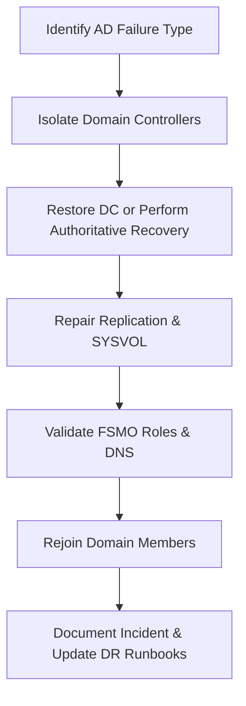

# Enterprise Disaster Recovery Knowledge Base  
## 19 — Active Directory Forest and Domain Recovery

---

## Overview

Active Directory (AD) is the backbone of enterprise identity, authentication, authorization, and directory services. A failure in AD — whether due to corruption, ransomware, accidental deletion, replication issues, or domain controller loss — can cripple the entire organization.

Forest and domain recovery is one of the most complex and high‑risk disaster recovery operations. This document provides a complete, enterprise‑grade guide to restoring AD domains, forests, domain controllers, DNS, SYSVOL, and replication.

This document covers:
- AD failure types  
- Forest vs domain recovery  
- DC recovery workflows  
- Authoritative vs non‑authoritative restore  
- SYSVOL recovery  
- RID master recovery  
- FSMO role recovery  
- Replication repair  
- Ransomware‑affected AD recovery  
- PowerShell automation  
- Troubleshooting  
- Best practices  

---

## 🧩 Workflow Diagram — AD Forest & Domain Recovery Lifecycle



---

# 1. Active Directory Failure Types

### 1. Domain Controller Failure
- Hardware failure  
- OS corruption  
- Boot failure  
- Ransomware  

### 2. AD Database (NTDS.dit) Corruption
- Disk corruption  
- Improper shutdown  
- Malware  

### 3. SYSVOL Failure
- Missing policies  
- Broken replication  
- FRS/DFSR corruption  

### 4. Forest‑wide Failure
- Schema corruption  
- FSMO role failure  
- Replication collapse  

### 5. Ransomware Attack
- Encrypted NTDS.dit  
- Encrypted SYSVOL  
- Compromised domain admin accounts  

---

# 2. Forest vs Domain Recovery

### Domain Recovery
Used when:
- One domain is corrupted  
- One or more DCs fail  
- SYSVOL is broken  
- DNS is corrupted  

### Forest Recovery
Used when:
- Schema is corrupted  
- All DCs are compromised  
- Replication is completely broken  
- Ransomware encrypts entire AD  

Forest recovery is **rare** but extremely critical.

---

# 3. Domain Controller Recovery Workflow

## Step 1 — Identify failure type

### Check DC health

```powershell
dcdiag /v
```

### Check replication

```powershell
repadmin /replsummary
```

---

## Step 2 — Restore DC from backup

### Non‑authoritative restore (default)

```powershell
wbadmin start systemstaterecovery -version:<ID> -quiet
```

### Authoritative restore (for AD objects)

Boot into Directory Services Restore Mode (DSRM):

```
F8 → Directory Services Restore Mode
```

Run authoritative restore:

```powershell
ntdsutil "authoritative restore" "restore database" quit
```

---

## Step 3 — SYSVOL Recovery

### Check SYSVOL status

```powershell
dfsrmig /getmigrationstate
```

### Rebuild SYSVOL (DFSR)

```powershell
dfsrdiag pollad
```

### Authoritative SYSVOL restore

```powershell
wmic /namespace:\\root\microsoftdfs path dfsrreplicatedfolderinfo set ReplicationState=4
```

---

## Step 4 — DNS Recovery

### Validate DNS zones

```powershell
Get-DnsServerZone
```

### Recreate SRV records if missing

```powershell
Add-DnsServerResourceRecord -ZoneName corp.local -Srv -Name "_ldap._tcp.dc._msdcs" -DomainName "SRV-DC01.corp.local" -Priority 0 -Weight 100 -Port 389
```

---

## Step 5 — Replication Repair

### Force replication

```powershell
repadmin /syncall /AeD
```

### Check replication partners

```powershell
repadmin /showrepl
```

### Remove lingering objects

```powershell
repadmin /removelingeringobjects
```

---

# 4. FSMO Role Recovery

### List FSMO roles

```powershell
netdom query fsmo
```

### Seize FSMO roles (if DC is unrecoverable)

```powershell
ntdsutil roles seize schema master
ntdsutil roles seize domain naming master
ntdsutil roles seize rid master
ntdsutil roles seize pdc
ntdsutil roles seize infrastructure master
```

### Validate FSMO roles

```powershell
netdom query fsmo
```

---

# 5. RID Master Recovery

### Check RID pool

```powershell
dcdiag /test:ridmanager
```

### Reset RID pool (rare)

```powershell
ntdsutil "roles" "connections" "connect to server <DC>" "quit" "seize rid master"
```

---

# 6. Forest Recovery Workflow

Forest recovery is used when:
- All DCs are compromised  
- Schema corruption  
- Ransomware encrypts NTDS.dit  
- Replication collapse  

### Steps:
1. **Isolate all DCs**  
2. **Restore one DC per domain from backup**  
3. **Perform authoritative restore**  
4. **Rebuild forest trust relationships**  
5. **Rejoin DCs**  
6. **Rebuild replication topology**  

---

# 7. Ransomware‑Affected AD Recovery

### Steps:
1. **Isolate DCs**  
2. **Collect forensic evidence**  
3. **Restore DC from clean backup**  
4. **Reset all privileged accounts**  
5. **Rebuild SYSVOL**  
6. **Rebuild replication**  
7. **Validate AD health**  

### Identify encrypted AD files

```powershell
Get-ChildItem C:\Windows\NTDS -Recurse | Where-Object {$_.Extension -eq ".encrypted"}
```

---

# 8. PowerShell Automation

### Check AD health

```powershell
dcdiag /v
```

### Check replication

```powershell
repadmin /replsummary
```

### Check DNS health

```powershell
dcdiag /test:dns
```

### Backup AD

```powershell
wbadmin start systemstatebackup -backupTarget:E: -quiet
```

---

# 9. Troubleshooting

| Issue | Cause | Fix |
|-------|-------|-----|
| Replication broken | DNS issue | Fix SRV records |
| SYSVOL not replicating | DFSR issue | Rebuild SYSVOL |
| FSMO roles missing | DC failure | Seize roles |
| AD corruption | Disk failure | Authoritative restore |
| DC won’t boot | NTDS.dit corrupt | Restore from backup |

### Check NTDS integrity

```powershell
esentutl /g C:\Windows\NTDS\ntds.dit
```

---

# 10. Best Practices

- Use AD‑integrated DNS  
- Maintain at least 2 DCs per domain  
- Backup system state daily  
- Use immutable backups  
- Test AD recovery quarterly  
- Document FSMO role locations  
- Monitor replication daily  
- Use tiered admin model (Tier 0/1/2)  
- Enable LAPS for local admin passwords  

---

# References

- Microsoft Learn — AD Forest Recovery  
- NIST SP 800‑34 — Directory Services Recovery  
- Microsoft AD Disaster Recovery Guide  
```
