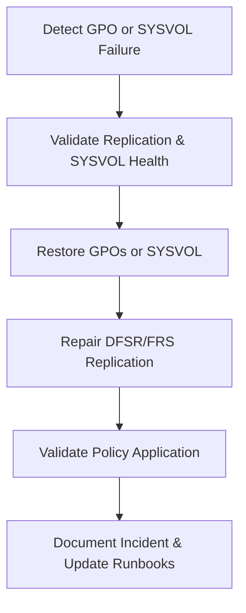

# Enterprise Disaster Recovery Knowledge Base  
## 20 — Group Policy Recovery

---

## Overview

Group Policy (GPO) is essential for enforcing security baselines, configuration standards, software deployment, and domain‑wide policies across Windows environments. When Group Policy fails — due to SYSVOL corruption, replication issues, accidental deletion, ransomware, or misconfiguration — the impact can be severe, affecting authentication, security posture, and system stability.

This document provides a complete enterprise‑grade guide to diagnosing, recovering, and restoring Group Policy Objects (GPOs), SYSVOL, replication, and policy application.

This document covers:
- GPO failure types  
- SYSVOL and DFSR recovery  
- GPO backup and restore  
- Replication repair  
- GPO version conflicts  
- Ransomware‑affected GPO recovery  
- PowerShell automation  
- Troubleshooting  
- Best practices  

---

## 🧩 Workflow Diagram — Group Policy Recovery Lifecycle



---

# 1. Group Policy Failure Types

### 1. GPO Corruption
- Damaged GPT.ini  
- Missing XML files  
- Incorrect permissions  

### 2. SYSVOL Failure
- Missing policies  
- DFSR/FRS replication failure  
- Ransomware encryption  

### 3. Replication Failure
- AD replication broken  
- DFSR backlog  
- DNS issues  

### 4. Accidental Deletion
- GPO deleted in GPMC  
- SYSVOL folder removed  

### 5. Ransomware Attack
- Encrypted SYSVOL  
- Encrypted GPO files  
- Malicious scripts added  

---

# 2. Validate Group Policy Health

### Check GPO health

```powershell
gpresult /h C:\Reports\gpresult.html
```

### Check GPO list

```powershell
Get-GPO -All
```

### Check GPO permissions

```powershell
Get-GPPermission -Name "Default Domain Policy"
```

---

# 3. Validate SYSVOL Health

### Check SYSVOL status

```powershell
dfsrmig /getmigrationstate
```

### Check SYSVOL folder

```
C:\Windows\SYSVOL\domain\Policies
```

### Check DFSR replication

```powershell
dfsrdiag backlog /rgname:"Domain System Volume" /rfname:"SYSVOL Share" /smem:DC01 /rmem:DC02
```

---

# 4. Restore Group Policy Objects (GPOs)

## 4.1 Restore GPO from Backup

### Backup GPO

```powershell
Backup-GPO -Name "Default Domain Policy" -Path "D:\GPOBackup"
```

### Restore GPO

```powershell
Restore-GPO -Name "Default Domain Policy" -Path "D:\GPOBackup"
```

---

## 4.2 Restore Deleted GPO

### List deleted GPOs

```powershell
Get-GPO -All | Where-Object {$_.DisplayName -eq "Deleted"}
```

### Restore deleted GPO

```powershell
Restore-GPO -Guid "<GPO-GUID>" -Path "D:\GPOBackup"
```

---

# 5. SYSVOL Recovery

## 5.1 Non‑Authoritative SYSVOL Restore

Used when SYSVOL exists on at least one healthy DC.

```powershell
wmic /namespace:\\root\microsoftdfs path dfsrreplicatedfolderinfo set ReplicationState=0
```

## 5.2 Authoritative SYSVOL Restore

Used when SYSVOL is corrupted on all DCs.

```powershell
wmic /namespace:\\root\microsoftdfs path dfsrreplicatedfolderinfo set ReplicationState=4
```

### Force DFSR to resync

```powershell
dfsrdiag pollad
```

---

# 6. Replication Repair

### Check AD replication

```powershell
repadmin /replsummary
```

### Force replication

```powershell
repadmin /syncall /AeD
```

### Check DFSR health

```powershell
dfsrdiag health
```

---

# 7. GPO Version Conflict Resolution

### Check GPO version numbers

```powershell
Get-GPO -Name "Default Domain Policy" | Select-Object DisplayName,UserVersion,ComputerVersion
```

### Reset GPO version

```powershell
Set-GPO -Name "Default Domain Policy" -Comment "Version reset after recovery"
```

---

# 8. Ransomware‑Affected GPO Recovery

### Identify encrypted GPO files

```powershell
Get-ChildItem C:\Windows\SYSVOL\domain\Policies -Recurse | Where-Object {$_.Extension -eq ".encrypted"}
```

### Steps:
1. **Isolate DCs**  
2. **Restore SYSVOL from backup**  
3. **Restore GPOs from backup**  
4. **Reset GPO permissions**  
5. **Validate policy application**  
6. **Rebuild replication**  

---

# 9. Validate Policy Application

### Force policy update

```powershell
gpupdate /force
```

### Validate applied policies

```powershell
gpresult /r
```

### Check event logs

```powershell
Get-WinEvent -LogName "Microsoft-Windows-GroupPolicy/Operational"
```

---

# 10. PowerShell Automation

### Backup all GPOs

```powershell
Get-GPO -All | ForEach-Object { Backup-GPO -Guid $_.Id -Path "D:\GPOBackup" }
```

### Restore all GPOs

```powershell
Get-ChildItem "D:\GPOBackup" | ForEach-Object { Restore-GPO -Path $_.FullName }
```

### Check SYSVOL replication

```powershell
dfsrdiag backlog /rgname:"Domain System Volume"
```

---

# 11. Troubleshooting

| Issue | Cause | Fix |
|-------|-------|-----|
| GPO not applying | SYSVOL missing | Restore SYSVOL |
| GPO corrupted | GPT.ini damaged | Restore GPO |
| Replication broken | DNS issue | Fix SRV records |
| GPO deleted | Human error | Restore from backup |
| Ransomware | Encrypted SYSVOL | Restore from immutable backup |

### Reset GPO permissions

```powershell
Set-GPPermission -Name "Default Domain Policy" -PermissionLevel GpoEdit -TargetName "Domain Admins" -TargetType Group
```

---

# 12. Best Practices

- Backup GPOs weekly  
- Use DFSR (not FRS) for SYSVOL  
- Maintain at least 2 DCs per domain  
- Store GPO backups offsite  
- Use immutable backups  
- Document all GPO changes  
- Use AGPM (Advanced Group Policy Management)  
- Test GPO restore quarterly  
- Monitor SYSVOL replication daily  

---

# References

- Microsoft Learn — Group Policy  
- Microsoft Learn — SYSVOL & DFSR  
- NIST SP 800‑34 — Directory Services Recovery  
```
