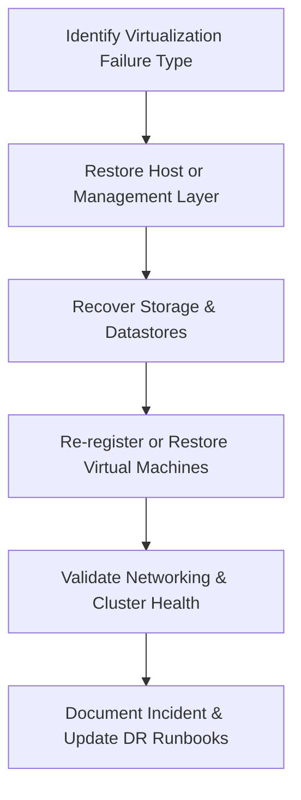

# Enterprise Disaster Recovery Knowledge Base  
## 21 — Virtualization Platform Recovery (Hyper‑V and VMware)

---

## Overview

Virtualization platforms such as Hyper‑V and VMware vSphere are foundational to modern enterprise infrastructure. They host critical servers, databases, applications, and services. When virtualization platforms fail — due to host failure, storage corruption, vCenter outage, cluster failure, or ransomware — rapid recovery is essential to restore business operations.

This document provides a comprehensive guide to recovering Hyper‑V and VMware environments, including hosts, clusters, VMs, storage, networking, and management components.

This document covers:
- Hyper‑V host recovery  
- VMware ESXi host recovery  
- Cluster recovery  
- vCenter recovery  
- VM registration and re‑attachment  
- Storage and datastore recovery  
- Networking recovery  
- Ransomware‑affected virtualization recovery  
- PowerShell/ESXCLI automation  
- Troubleshooting  
- Best practices  

---

## 🧩 Workflow Diagram — Virtualization Platform Recovery Lifecycle



---

# 1. Virtualization Failure Types

### Hyper‑V Failures
- Host OS corruption  
- VMMS service failure  
- VHDX corruption  
- Cluster failure  
- Switch misconfiguration  

### VMware Failures
- ESXi host failure  
- vCenter outage  
- Datastore corruption  
- VMX/VMDK corruption  
- vSAN failure  

### Shared Failures
- Storage outage  
- Network outage  
- Ransomware  
- Backup corruption  

---

# 2. Hyper‑V Host Recovery

## Step 1 — Validate Hyper‑V Services

```powershell
Get-Service vmms
Restart-Service vmms
```

## Step 2 — Validate Virtual Switches

```powershell
Get-VMSwitch
```

Recreate switch if missing:

```powershell
New-VMSwitch -Name "ProdSwitch" -NetAdapterName "Ethernet0"
```

## Step 3 — Re-register VMs

```powershell
Import-VM -Path "D:\VMs\SRV-APP01"
```

## Step 4 — Validate VHDX integrity

```powershell
Repair-VHD -Path "D:\VMs\SRV-APP01.vhdx"
```

---

# 3. Hyper‑V Cluster Recovery

### Validate cluster health

```powershell
Get-ClusterNode
Get-ClusterGroup
```

### Restart cluster service

```powershell
Restart-Service clussvc
```

### Failover VM

```powershell
Move-ClusterVirtualMachineRole -Name "SRV-APP01" -Node "HV02"
```

### Validate CSV (Cluster Shared Volume)

```powershell
Get-ClusterSharedVolume
```

---

# 4. VMware ESXi Host Recovery

## Step 1 — Validate ESXi Host Status

SSH or console:

```bash
vim-cmd hostsvc/runtimeinfo
```

Restart management agents:

```bash
/etc/init.d/hostd restart
/etc/init.d/vpxa restart
```

## Step 2 — Validate Datastores

```bash
esxcli storage filesystem list
```

Rescan storage:

```bash
esxcli storage core adapter rescan --all
```

## Step 3 — Re-register VMs

```bash
vim-cmd solo/registervm /vmfs/volumes/datastore1/SRV-APP01/SRV-APP01.vmx
```

---

# 5. VMware vCenter Recovery

### Validate vCenter services

```bash
service-control --status --all
```

Restart vCenter services:

```bash
service-control --start --all
```

### Restore vCenter from backup
- vCenter VCSA backup  
- File‑based restore  
- Image‑based restore  

### Reconnect ESXi hosts

```bash
vim-cmd hostsvc/connect
```

---

# 6. Datastore & Storage Recovery

### Hyper‑V Storage Recovery

#### Reattach VHDX

```powershell
Set-VMHardDiskDrive -VMName "SRV-APP01" -Path "D:\VMs\SRV-APP01.vhdx"
```

### VMware Storage Recovery

#### Check VMDK integrity

```bash
vmkfstools -x check /vmfs/volumes/datastore1/SRV-APP01/SRV-APP01.vmdk
```

#### Repair VMDK

```bash
vmkfstools -x repair /vmfs/volumes/datastore1/SRV-APP01/SRV-APP01.vmdk
```

---

# 7. Virtual Networking Recovery

### Hyper‑V

```powershell
Get-VMSwitch
Get-VMNetworkAdapter
```

Recreate switch if corrupted.

### VMware

```bash
esxcli network vswitch standard list
esxcli network nic list
```

Rebuild vSwitch if needed.

---

# 8. Ransomware‑Affected Virtualization Recovery

### Steps:
1. **Isolate hosts**  
2. Identify encrypted VMs  
3. Validate snapshots  
4. Restore VMs from backup  
5. Validate datastore integrity  
6. Rebuild management layer if needed  
7. Harden environment  

### Identify encrypted VHDX/VMDK

```powershell
Get-ChildItem -Recurse | Where-Object {$_.Extension -eq ".encrypted"}
```

---

# 9. PowerShell & ESXCLI Automation

### Hyper‑V — List all VMs

```powershell
Get-VM
```

### Hyper‑V — Automated VM restore

```powershell
Import-VM -Path (Get-ChildItem "D:\Backups\SRV-APP01" | Sort LastWriteTime -Descending | Select -First 1).FullName
```

### VMware — List VMs

```bash
vim-cmd vmsvc/getallvms
```

### VMware — Restart host agents

```bash
/etc/init.d/hostd restart
/etc/init.d/vpxa restart
```

---

# 10. Troubleshooting

| Issue | Cause | Fix |
|-------|-------|-----|
| VM won’t start | Disk corruption | Repair VHDX/VMDK |
| Host offline | NIC failure | Reconfigure NIC |
| Cluster down | CSV failure | Restart cluster |
| vCenter offline | Service failure | Restart services |
| Datastore missing | Storage outage | Rescan adapters |

### Hyper‑V event logs

```powershell
Get-WinEvent -LogName System | Where-Object {$_.Id -in 7,11,15}
```

### VMware logs

```
/var/log/vmkernel.log
/var/log/hostd.log
```

---

# 11. Best Practices

- Maintain redundant hosts  
- Use cluster‑aware storage  
- Backup VMs daily  
- Use immutable backups  
- Monitor host health  
- Patch hypervisors regularly  
- Document VM configurations  
- Test VM restore quarterly  
- Use dedicated management networks  
- Protect vCenter/Hyper‑V hosts with MFA  

---

# References

- Microsoft Learn — Hyper‑V Recovery  
- VMware Documentation — ESXi & vCenter Recovery  
- NIST SP 800‑34 — Virtualization Recovery  
```
