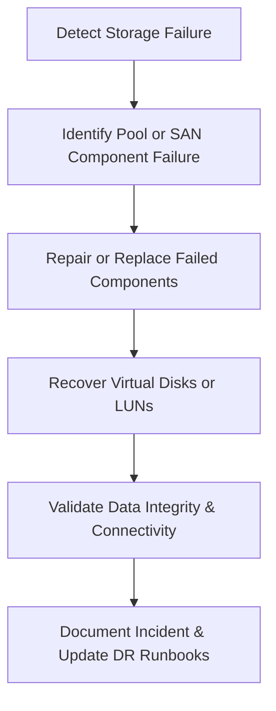

# Enterprise Disaster Recovery Knowledge Base  
## 22 — Storage Spaces and SAN Recovery

---

## Overview

Storage Spaces (Windows Server) and SAN (Storage Area Network) platforms form the backbone of enterprise storage infrastructure. Failures in these systems — whether due to disk corruption, controller failure, pool degradation, RAID collapse, firmware issues, or network fabric outages — can lead to severe data loss and downtime.

This document provides a comprehensive guide to diagnosing, recovering, and restoring Storage Spaces pools, virtual disks, SAN arrays, LUNs, and iSCSI/Fibre Channel connectivity.

This document covers:
- Storage Spaces architecture  
- SAN architecture  
- Failure types  
- Storage Spaces pool recovery  
- Virtual disk repair  
- SAN controller and disk shelf recovery  
- LUN and volume recovery  
- iSCSI and Fibre Channel recovery  
- PowerShell diagnostics  
- Troubleshooting  
- Best practices  

---

## 🧩 Workflow Diagram — Storage Spaces & SAN Recovery Lifecycle



---

# 1. Storage Spaces Architecture Overview

Storage Spaces includes:
- Physical disks  
- Storage pools  
- Virtual disks  
- Resiliency types (Mirror, Parity)  
- Storage Spaces Direct (S2D)  
- Cluster Shared Volumes (CSV)  

### Resiliency Types
| Type | Fault Tolerance | Use Case |
|------|------------------|----------|
| Simple | None | Temp data |
| Mirror | 1–2 disks | Critical workloads |
| Parity | 1–2 disks | Archival workloads |
| Mirror‑Accelerated Parity | Hybrid | Balanced workloads |

---

# 2. SAN Architecture Overview

SAN components:
- Controllers  
- Disk shelves  
- RAID groups  
- LUNs  
- Fibre Channel or iSCSI fabric  
- Multipath I/O (MPIO)  
- Snapshots and replication  

Common SAN vendors:
- Dell EMC  
- HPE 3PAR / Nimble  
- NetApp  
- IBM Storwize  
- Synology / QNAP enterprise units  

---

# 3. Storage Failure Types

### Storage Spaces Failures
- Pool degradation  
- Virtual disk corruption  
- Disk failure  
- Metadata corruption  
- S2D node failure  

### SAN Failures
- Controller failure  
- RAID group degradation  
- LUN offline  
- Fabric outage  
- iSCSI target failure  
- Snapshot corruption  

---

# 4. Storage Spaces Recovery

## Step 1 — Check Storage Pool Health

```powershell
Get-StoragePool
```

### Identify unhealthy disks

```powershell
Get-PhysicalDisk | Where-Object {$_.HealthStatus -ne "Healthy"}
```

---

## Step 2 — Repair Virtual Disk

```powershell
Repair-VirtualDisk -FriendlyName "DataDisk"
```

### Check virtual disk status

```powershell
Get-VirtualDisk
```

---

## Step 3 — Replace Failed Disk

Mark disk as retired:

```powershell
Set-PhysicalDisk -FriendlyName "Disk3" -Usage Retired
```

Add replacement disk:

```powershell
Add-PhysicalDisk -StoragePoolFriendlyName "MainPool"
```

---

## Step 4 — Rebuild Storage Pool

```powershell
Optimize-StoragePool -FriendlyName "MainPool"
```

---

## Step 5 — S2D (Storage Spaces Direct) Recovery

### Validate S2D health

```powershell
Get-ClusterStorageSpacesDirect
```

### Repair S2D volumes

```powershell
Repair-Volume -DriveLetter V
```

### Rebalance S2D storage

```powershell
Update-StoragePool -FriendlyName "S2DPool"
```

---

# 5. SAN Recovery

## Step 1 — Identify SAN Component Failure

### Controller failure symptoms:
- Multiple LUNs offline  
- RAID groups degraded  
- SAN management UI inaccessible  

### Disk shelf failure symptoms:
- Entire shelf offline  
- Multiple disks missing  

---

## Step 2 — Recover SAN Controllers

### Steps:
1. Restart controller  
2. Failover to secondary controller  
3. Update firmware  
4. Replace controller if needed  
5. Rebuild RAID groups  

---

## Step 3 — Recover RAID Groups

### Rebuild RAID group (vendor UI)
- Dell EMC Unisphere  
- HPE 3PAR SSMC  
- NetApp ONTAP  

### Monitor rebuild progress

```powershell
Get-WinEvent -LogName System | Where-Object {$_.Message -like "*RAID*"}
```

---

## Step 4 — Recover LUNs

### Check LUN status (Windows)

```powershell
Get-Disk
```

### Rescan disks

```powershell
Update-HostStorageCache
```

### Reconnect iSCSI LUN

```powershell
Get-IscsiTarget
Restart-Service msiscsi
```

---

# 6. iSCSI Recovery

### Restart iSCSI service

```powershell
Restart-Service msiscsi
```

### Reconnect target

```powershell
Connect-IscsiTarget -NodeAddress "iqn.2026-01.com.san:data"
```

### Validate sessions

```powershell
Get-IscsiSession
```

---

# 7. Fibre Channel Recovery

### Validate HBA status

```powershell
Get-InitiatorPort
```

### Rescan FC bus

```powershell
Get-InitiatorPort | ForEach-Object {Send-IscsiSendTarget -InitiatorPort $_}
```

### Validate MPIO

```powershell
mpclaim -s -d
```

---

# 8. Snapshot and Replication Recovery

### Restore from SAN snapshot
- Dell EMC: SnapView  
- NetApp: Snapshot  
- HPE: Recovery Manager  

### Restore from replication
- Synchronous replication  
- Asynchronous replication  

---

# 9. PowerShell Diagnostics

### Check disk health

```powershell
Get-PhysicalDisk | Select FriendlyName,HealthStatus,OperationalStatus
```

### Check storage events

```powershell
Get-WinEvent -LogName System | Where-Object {$_.Id -in 7,11,15}
```

### Check MPIO paths

```powershell
mpclaim -s -d
```

---

# 10. Troubleshooting

| Issue | Cause | Fix |
|-------|-------|-----|
| Pool degraded | Disk failure | Replace disk |
| Virtual disk offline | Metadata corruption | Repair virtual disk |
| LUN offline | Controller failure | Failover controller |
| Slow SAN performance | Fabric congestion | Check FC switches |
| iSCSI disconnects | Network issue | Restart msiscsi |

### Clear iSCSI sessions

```powershell
Disconnect-IscsiTarget -NodeAddress "iqn.2026-01.com.san:data"
```

---

# 11. Best Practices

- Use redundant SAN controllers  
- Use S2D for hyper‑converged workloads  
- Maintain spare disks onsite  
- Use SAN snapshots and replication  
- Monitor storage health daily  
- Update firmware regularly  
- Use MPIO for SAN connectivity  
- Test storage recovery quarterly  
- Document storage topology  

---

# References

- Microsoft Learn — Storage Spaces  
- NetApp ONTAP Recovery Guide  
- Dell EMC SAN Recovery Documentation  
- NIST SP 800‑34 — Storage Recovery  
```
