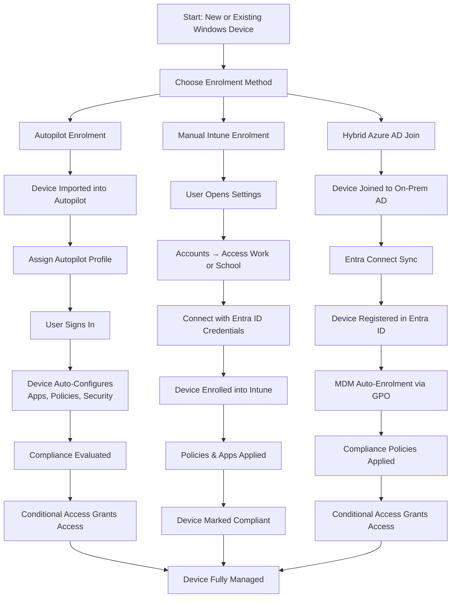

# Microsoft Intune Knowledge Base  
## 01 — Windows Device Enrolment

---

## Overview

Windows Device Enrolment is the foundational step for managing Windows 10/11 devices in Microsoft Intune. Enrolment enables centralized configuration, compliance enforcement, application deployment, security baselines, and remote management.

This document covers:
- Enrolment methods  
- Autopilot vs. Manual enrolment  
- Hybrid Azure AD Join  
- Licensing requirements  
- Compliance prerequisites  
- Troubleshooting  
- Best practices  
- **Workflow diagram for Windows device enrolment**  

---

## 🧩 Workflow Diagram — Windows Device Enrolment (Intune + Entra ID)



---

# 1. Enrolment Methods

## 1.1 Autopilot Enrolment (Recommended)

Autopilot provides:
- Zero‑touch provisioning  
- Automatic Intune enrolment  
- Standardized configuration  
- Seamless user setup  
- Ideal for new devices or remote deployments  

---

## 1.2 Manual Intune Enrolment

Used when:
- Device already in use  
- Autopilot not configured  
- BYOD scenarios  

Steps:
```
Settings → Accounts → Access work or school → Connect
```

---

## 1.3 Hybrid Azure AD Join

Used when:
- On‑prem Active Directory required  
- Legacy apps need domain join  
- Entra Connect is deployed  

Flow:
- Join on‑prem AD  
- Sync to Entra ID  
- Auto‑enrol into Intune  

---

# 2. Licensing Requirements

To enrol Windows devices, users must have:

### Required Licenses
- **Microsoft Intune**  
- **Microsoft Entra ID P1/P2** (for Conditional Access)  
- **Microsoft 365 E3/E5** (optional but common)  

---

# 3. Windows Autopilot

## 3.1 Collect Hardware Hash

### PowerShell (run on device)
```powershell
Get-WindowsAutopilotInfo -Online
```

### Or upload CSV:
```
Intune Admin Center → Devices → Windows → Windows Enrollment → Devices → Import
```

---

## 3.2 Assign Autopilot Profile

```
Intune Admin Center → Devices → Windows → Windows Enrollment → Deployment Profiles
```

Profile includes:
- User-driven or pre-provisioned  
- Skip privacy settings  
- Skip EULA  
- Auto-enrol in Intune  

---

## 3.3 Autopilot Deployment Flow

User signs in → Device configures automatically:
- Apps installed  
- Policies applied  
- Security baselines enforced  
- Compliance evaluated  

---

# 4. Manual Intune Enrolment

## 4.1 Enrol Device

```
Settings → Accounts → Access work or school → Connect
```

Sign in with Microsoft 365 credentials.

---

## 4.2 Verify Enrolment

```
Settings → Accounts → Access work or school → Info
```

Check:
- MDM = Microsoft Intune  
- MAM = Enabled (optional)  

---

# 5. Hybrid Azure AD Join

## 5.1 Requirements

- Entra Connect  
- Device GPO for auto-enrolment  
- Intune MDM authority set  

---

## 5.2 Configure GPO

```
Computer Configuration → Policies → Administrative Templates → Windows Components → MDM → Enable automatic MDM enrollment
```

---

## 5.3 Verify Hybrid Join

PowerShell:
```powershell
dsregcmd /status
```

Look for:
- AzureAdJoined = YES  
- DomainJoined = YES  

---

# 6. Compliance Requirements

Compliance policies enforce:
- PIN/password  
- Encryption (BitLocker)  
- Antivirus  
- Firewall  
- OS version  
- Secure boot  

---

## 6.1 Create Compliance Policy

```
Intune Admin Center → Devices → Compliance Policies → Create Policy
```

---

## 6.2 Non‑Compliant Device Actions

- Email user  
- Mark device non‑compliant  
- Block access via Conditional Access  
- Wipe corporate data  

---

# 7. Conditional Access Integration

Conditional Access ensures only compliant devices can access corporate apps.

Recommended policy:
```
Users: All users
Apps: Office 365
Grant: Require device to be marked as compliant
```

---

# 8. Troubleshooting Windows Enrolment

## Issue 1 — Device not enrolling

### Causes
- Incorrect license  
- MDM authority not set  
- Conditional Access blocking  

### Fix
- Assign Intune license  
- Verify MDM authority  
- Review CA policies  

---

## Issue 2 — Device not compliant

### Causes
- Missing PIN  
- Encryption disabled  
- OS outdated  

### Fix
- Enable PIN  
- Enable BitLocker  
- Update OS  

---

## Issue 3 — Autopilot profile not applying

### Causes
- Device not assigned  
- Sync delay  

### Fix
- Assign profile  
- Wait 5–30 minutes  

---

## Issue 4 — Hybrid join failing

### Causes
- Entra Connect misconfiguration  
- GPO not applied  

### Fix
- Check Entra Connect logs  
- Run `gpupdate /force`  

---

# 9. Verification Checklist

| Task | Completed |
|------|-----------|
| Device enrolled | ✔ |
| Compliance policy applied | ✔ |
| Conditional Access functioning | ✔ |
| Apps installed | ✔ |
| Security baselines applied | ✔ |
| Autopilot profile applied (if used) | ✔ |
| Device visible in Intune | ✔ |

---

# 10. Best Practices

- Use Autopilot for all new devices  
- Enforce compliance before access  
- Use Conditional Access for Zero Trust  
- Require BitLocker on all devices  
- Use security baselines  
- Document enrolment workflows  
- Review device compliance monthly  

---

# References

- Microsoft Learn — Windows Autopilot  
- Microsoft Learn — Intune Device Enrollment  
- Microsoft Learn — Hybrid Azure AD Join  
