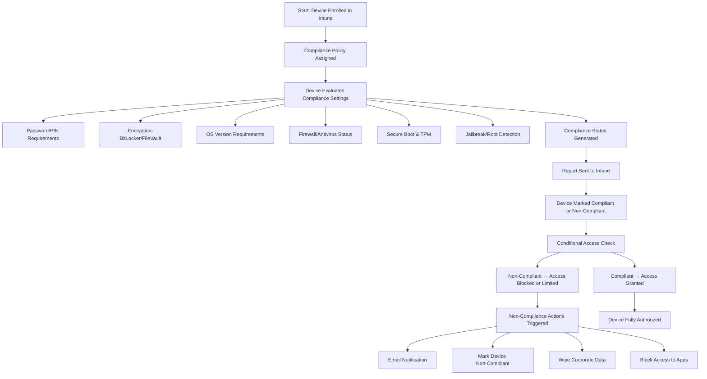

# Microsoft Intune Knowledge Base  
## 03 — Device Compliance Policies

---

## Overview

Device Compliance Policies in Microsoft Intune define the minimum security and configuration requirements a device must meet before accessing corporate resources. Compliance integrates directly with Conditional Access to enforce Zero Trust principles.

This document covers:
- Compliance policy concepts  
- Supported platforms  
- Compliance settings  
- Non‑compliance actions  
- Conditional Access integration  
- Monitoring compliance  
- Troubleshooting  
- Best practices  
- **Workflow diagram for compliance evaluation**  

---

## 🧩 Workflow Diagram — Device Compliance Evaluation (Intune + Conditional Access)



---

# 1. Compliance Policy Concepts

## 1.1 What Compliance Policies Do

Compliance policies:
- Define minimum security requirements  
- Evaluate device health  
- Report compliance status to Intune  
- Integrate with Conditional Access  
- Protect corporate data  

---

## 1.2 Supported Platforms

- Windows 10/11  
- macOS  
- iOS/iPadOS  
- Android (Fully Managed / Work Profile)  
- Linux (limited)  

---

# 2. Creating Compliance Policies

## 2.1 Create Policy (Intune Admin Center)

```
Intune Admin Center → Devices → Compliance Policies → Create Policy
```

Select platform:
- Windows  
- macOS  
- iOS/iPadOS  
- Android  

---

## 2.2 Common Windows Compliance Settings

| Setting | Description |
|--------|-------------|
| **Password/PIN** | Enforces secure authentication |
| **Encryption** | Requires BitLocker |
| **Firewall** | Must be enabled |
| **Antivirus** | Defender or third‑party AV required |
| **Secure Boot** | Ensures trusted boot process |
| **Minimum OS Version** | Blocks outdated OS versions |
| **TPM Requirement** | Ensures hardware security |

---

## 2.3 Custom Compliance (Advanced)

Custom compliance allows:
- PowerShell scripts  
- JSON-based compliance checks  
- Custom reporting  

---

# 3. Non‑Compliance Actions

Configure actions under:
```
Compliance Policy → Actions for Non‑Compliance
```

### Available Actions
- **Mark device non‑compliant** (default)  
- **Send email to user**  
- **Send push notification**  
- **Wipe corporate data**  
- **Block access via Conditional Access**  

---

# 4. Compliance + Conditional Access

Compliance policies alone do **not** block access.  
Conditional Access enforces compliance.

### Recommended Conditional Access Policy

```
Users: All users
Apps: Office 365
Grant: Require device to be marked as compliant
```

This ensures:
- Only secure devices access corporate data  
- Non‑compliant devices are blocked automatically  

---

# 5. Monitoring Compliance

## 5.1 Device Compliance Dashboard

```
Intune Admin Center → Devices → Monitor → Device Compliance
```

Shows:
- Compliant devices  
- Non‑compliant devices  
- Not evaluated  
- Error states  

---

## 5.2 Per‑Device Compliance Report

```
Intune Admin Center → Devices → All Devices → Select Device → Device Compliance
```

---

## 5.3 Per‑User Compliance Report

```
Intune Admin Center → Users → Select User → Devices
```

---

# 6. Troubleshooting Compliance

## Issue 1 — Device shows “Not Compliant”

### Causes
- Missing PIN  
- BitLocker disabled  
- OS outdated  

### Fix
- Enable PIN  
- Turn on BitLocker  
- Update OS  

---

## Issue 2 — Compliance not evaluated

### Causes
- Device not syncing  
- Intune service delay  

### Fix
- Run sync:
```
Settings → Accounts → Access work or school → Info → Sync
```

---

## Issue 3 — Conditional Access blocking compliant device

### Causes
- CA policy misconfiguration  
- Multiple CA policies overlapping  

### Fix
- Review CA policy assignments  
- Check sign‑in logs  

---

## Issue 4 — Custom compliance script failing

### Causes
- Script error  
- JSON output invalid  

### Fix
- Validate script locally  
- Check Intune logs  

---

# 7. Verification Checklist

| Task | Completed |
|------|-----------|
| Compliance policy created | ✔ |
| Policy assigned to correct groups | ✔ |
| Conditional Access configured | ✔ |
| Device evaluated | ✔ |
| Device marked compliant | ✔ |
| Access granted | ✔ |

---

# 8. Best Practices

- Require BitLocker on all Windows devices  
- Enforce minimum OS versions  
- Use Conditional Access for Zero Trust  
- Apply compliance policies per platform  
- Use dynamic groups for device targeting  
- Review compliance reports weekly  
- Document compliance requirements  
- Use custom compliance for advanced checks  

---

# References

- Microsoft Learn — Intune Compliance Policies  
- Microsoft Learn — Conditional Access  
- Microsoft Learn — Device Security Requirements  
```

