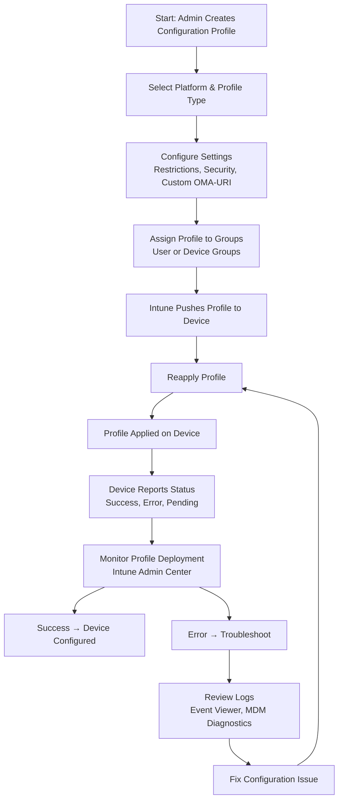

# Microsoft Intune Knowledge Base  
## 04 — Configuration Profiles

---

## Overview

Configuration Profiles in Microsoft Intune allow administrators to deploy settings, restrictions, security controls, and device configurations across Windows, macOS, iOS/iPadOS, and Android devices. They are essential for enforcing organizational standards, hardening devices, and automating configuration at scale.

This document covers:
- Profile types  
- Supported platforms  
- Windows configuration methods  
- Custom OMA‑URI settings  
- Security baselines  
- Profile assignment  
- Monitoring & reporting  
- Troubleshooting  
- Best practices  
- **Workflow diagram for configuration profile deployment**  

---

## 🧩 Workflow Diagram — Configuration Profile Deployment (Intune)



---

# 1. Configuration Profile Concepts

## 1.1 What Configuration Profiles Do

Configuration profiles:
- Apply device settings  
- Enforce restrictions  
- Configure security controls  
- Deploy certificates, Wi‑Fi, VPN  
- Customize Windows experience  
- Support custom OMA‑URI for advanced settings  

---

## 1.2 Supported Platforms

- Windows 10/11  
- macOS  
- iOS/iPadOS  
- Android (Fully Managed / Work Profile)  
- Linux (limited)  

---

# 2. Profile Types

## 2.1 Windows Profile Types

| Profile Type | Description |
|--------------|-------------|
| **Settings Catalog** | Modern, granular configuration method |
| **Templates** | Predefined profiles (Wi‑Fi, VPN, email, etc.) |
| **Custom (OMA‑URI)** | Advanced configuration using CSPs |
| **Security Baselines** | Preconfigured Microsoft security settings |
| **Administrative Templates** | Similar to GPOs for Windows devices |

---

## 2.2 Mobile Profile Types

- Device restrictions  
- App configuration  
- Email profiles  
- Wi‑Fi profiles  
- VPN profiles  
- Certificate profiles  
- Custom configuration  

---

# 3. Creating Configuration Profiles

## 3.1 Create Profile (Intune Admin Center)

```
Intune Admin Center → Devices → Configuration Profiles → Create Profile
```

Select:
- Platform  
- Profile type  
- Settings  

---

## 3.2 Settings Catalog (Recommended)

Provides:
- Granular settings  
- Searchable configuration options  
- Modern replacement for templates  

Examples:
- Password policies  
- BitLocker settings  
- Windows Update settings  
- Firewall configuration  
- USB restrictions  

---

## 3.3 Administrative Templates

Similar to Group Policy Objects (GPOs).

Examples:
- OneDrive settings  
- Office configuration  
- Windows Explorer settings  

---

## 3.4 Custom OMA‑URI Profiles

Used for advanced configuration.

Example:
```text
OMA-URI: ./Device/Vendor/MSFT/Policy/Config/DeviceLock/MaxDevicePasswordFailedAttempts
Value: 5
```

---

# 4. Security Baselines

Security baselines provide Microsoft‑recommended security configurations.

Available baselines:
- Windows 10/11 Security Baseline  
- Microsoft Defender Baseline  
- Microsoft Edge Baseline  

Benefits:
- Preconfigured secure settings  
- Easy deployment  
- Regular updates  

---

# 5. Profile Assignment

Assign profiles to:
- User groups  
- Device groups  
- Dynamic groups  

### Recommended:
Use **device groups** for device configuration profiles.

---

# 6. Monitoring & Reporting

## 6.1 Profile Status

```
Intune Admin Center → Devices → Configuration Profiles → Select Profile → Device Status
```

Status values:
- **Success**  
- **Error**  
- **Pending**  
- **Conflict**  

---

## 6.2 Per‑Device Status

```
Intune Admin Center → Devices → All Devices → Select Device → Device Configuration
```

---

# 7. Troubleshooting Configuration Profiles

## Issue 1 — Profile shows “Error”

### Causes
- Unsupported setting  
- OS version mismatch  
- Conflicting profiles  

### Fix
- Review error details  
- Check OS version  
- Remove conflicting profiles  

---

## Issue 2 — Profile stuck on “Pending”

### Causes
- Device not syncing  
- Network restrictions  

### Fix
- Force sync:
```
Settings → Accounts → Access work or school → Info → Sync
```

---

## Issue 3 — OMA‑URI not applying

### Causes
- Incorrect CSP path  
- Wrong data type  

### Fix
- Validate CSP documentation  
- Correct value format  

---

## Issue 4 — Security baseline conflicts

### Causes
- Overlapping settings  
- Multiple baselines applied  

### Fix
- Use one baseline per platform  
- Review baseline settings  

---

# 8. Verification Checklist

| Task | Completed |
|------|-----------|
| Profile created | ✔ |
| Correct platform selected | ✔ |
| Settings configured | ✔ |
| Profile assigned | ✔ |
| Device synced | ✔ |
| Profile applied | ✔ |
| No conflicts or errors | ✔ |

---

# 9. Best Practices

- Use Settings Catalog for modern configuration  
- Avoid overlapping profiles  
- Use device groups for device settings  
- Document all custom OMA‑URI profiles  
- Test profiles before production rollout  
- Use security baselines for standard hardening  
- Review profile deployment weekly  

---

# References

- Microsoft Learn — Intune Configuration Profiles  
- Microsoft Learn — Settings Catalog  
- Microsoft Learn — OMA‑URI and CSPs  
- Microsoft Learn — Security Baselines  
```
