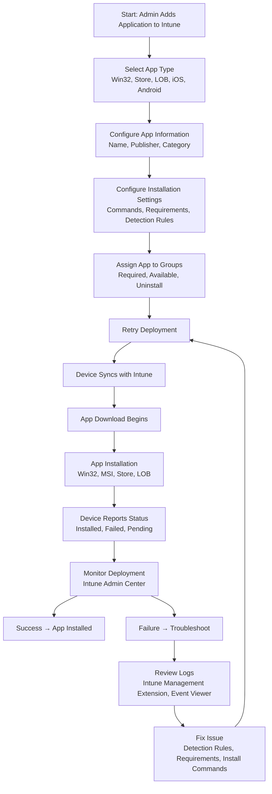

# Microsoft Intune Knowledge Base  
## 05 — Application Deployment

---

## Overview

Application Deployment in Microsoft Intune enables administrators to distribute, update, and manage applications across Windows, macOS, iOS/iPadOS, and Android devices. Intune supports a wide range of app types, deployment models, installation behaviors, and assignment strategies.

This document covers:
- Supported app types  
- Deployment workflow  
- Win32 app packaging  
- Microsoft Store app deployment  
- Line-of-business (LOB) apps  
- App assignment  
- App protection policies  
- Monitoring & troubleshooting  
- Best practices  
- **Workflow diagram for Intune application deployment**  

---

## 🧩 Workflow Diagram — Intune Application Deployment



---

# 1. Supported Application Types

## 1.1 Windows App Types

| App Type | Description |
|----------|-------------|
| **Win32 (.intunewin)** | Packaged apps using IntuneWin tool |
| **MSI** | Standard Windows installer packages |
| **Microsoft Store Apps** | Store apps via new Store integration |
| **Line-of-Business (LOB)** | Custom enterprise apps |
| **Scripts** | PowerShell scripts for configuration or installation |

---

## 1.2 Mobile App Types

- iOS/iPadOS Store apps  
- Android Managed Google Play apps  
- LOB apps (IPA/APK)  
- Web apps  
- Managed app configurations  

---

# 2. Adding Applications to Intune

## 2.1 Add App (Intune Admin Center)

```
Intune Admin Center → Apps → All Apps → Add
```

Select:
- Platform  
- App type  

---

# 3. Win32 Application Deployment

Win32 apps require packaging using the **IntuneWinAppUtil.exe** tool.

## 3.1 Package Win32 App

```powershell
IntuneWinAppUtil.exe -c "C:\SourceFolder" -s "setup.exe" -o "C:\OutputFolder"
```

---

## 3.2 Configure Win32 App Settings

### Installation Command
```text
setup.exe /quiet /norestart
```

### Uninstall Command
```text
setup.exe /uninstall /quiet
```

### Detection Rules
- File existence  
- Registry key  
- MSI product code  

### Requirements
- OS version  
- Disk space  
- Architecture (x64/x86)  

---

# 4. Microsoft Store App Deployment

## 4.1 Add Store App

```
Apps → Windows → Add → Microsoft Store App (New)
```

Benefits:
- No packaging required  
- Automatic updates  
- Large catalog  

---

# 5. Line-of-Business (LOB) Apps

Used for:
- Custom enterprise apps  
- Internal tools  
- Vendor-provided installers  

Supported formats:
- MSI  
- EXE (via Win32 packaging)  
- MSIX  

---

# 6. App Assignment

## 6.1 Assignment Types

| Assignment | Description |
|------------|-------------|
| **Required** | Automatically installs on targeted devices |
| **Available** | User installs via Company Portal |
| **Uninstall** | Removes app from targeted devices |

---

## 6.2 Targeting Groups

Use:
- User groups (for user-based apps)  
- Device groups (for device-based apps)  
- Dynamic groups (recommended)  

---

# 7. App Protection Policies (MAM)

App protection policies secure corporate data inside apps.

### Examples:
- Prevent copy/paste  
- Require PIN  
- Encrypt app data  
- Block unmanaged apps  

Configure:
```
Intune Admin Center → Apps → App Protection Policies
```

---

# 8. Monitoring Application Deployment

## 8.1 App Overview

```
Apps → All Apps → Select App → Device Install Status
```

Shows:
- Installed  
- Pending  
- Failed  
- Not applicable  

---

## 8.2 Per‑Device App Status

```
Devices → All Devices → Select Device → Managed Apps
```

---

# 9. Troubleshooting Application Deployment

## Issue 1 — App installation failed

### Causes
- Incorrect install command  
- Missing dependencies  
- Detection rule mismatch  

### Fix
- Validate install command manually  
- Check detection rules  
- Review Intune Management Extension logs  

---

## Issue 2 — App stuck on “Pending”

### Causes
- Device not syncing  
- Network restrictions  

### Fix
- Force sync  
- Check firewall/proxy  

---

## Issue 3 — Win32 app not installing

### Causes
- Packaging error  
- Wrong architecture  

### Fix
- Repackage app  
- Validate requirements  

---

## Issue 4 — Store app not installing

### Causes
- Store service disabled  
- Licensing issue  

### Fix
- Enable Microsoft Store  
- Check Store integration settings  

---

# 10. Verification Checklist

| Task | Completed |
|------|-----------|
| App packaged (if Win32) | ✔ |
| App added to Intune | ✔ |
| Install/uninstall commands configured | ✔ |
| Detection rules validated | ✔ |
| App assigned to correct groups | ✔ |
| Device synced | ✔ |
| App installed successfully | ✔ |

---

# 11. Best Practices

- Use Win32 packaging for EXE installers  
- Use dynamic groups for targeting  
- Test apps before production rollout  
- Document install/uninstall commands  
- Use detection rules carefully  
- Monitor app deployment weekly  
- Avoid duplicate app assignments  
- Use MAM policies for BYOD scenarios  

---

# References

- Microsoft Learn — Intune Application Management  
- Microsoft Learn — Win32 App Packaging  
- Microsoft Learn — App Protection Policies  
```

