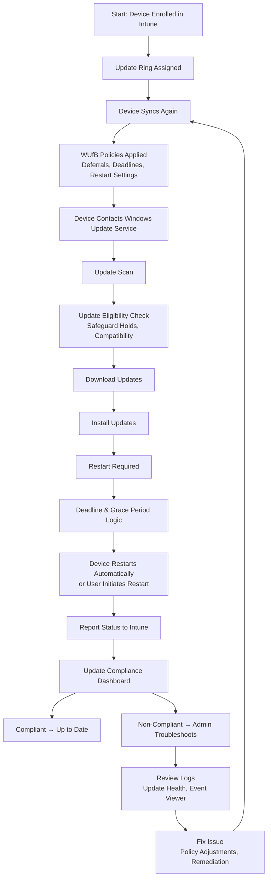

# Microsoft Intune Knowledge Base  
## 06 — Windows Update for Business (WUfB)

---

## Overview

Windows Update for Business (WUfB) is Microsoft’s cloud-based update management framework for Windows 10/11 devices. It allows administrators to control update deployment rings, quality and feature update deferrals, deadlines, automatic restarts, and safeguard holds — all without on‑premises infrastructure.

This document covers:
- Update rings  
- Feature update policies  
- Quality update policies  
- Deadlines & grace periods  
- Safeguard holds  
- Monitoring update compliance  
- Troubleshooting  
- Best practices  
- **Workflow diagram for WUfB update lifecycle**  

---

## 🧩 Workflow Diagram — Windows Update for Business Lifecycle



---

# 1. Windows Update for Business Concepts

## 1.1 What WUfB Controls

- Quality updates (Patch Tuesday)  
- Feature updates (Windows 11 versions)  
- Driver updates (optional)  
- Firmware updates (optional)  
- Restart behavior  
- Deferral periods  
- Deadlines & grace periods  
- Safeguard holds  

---

## 1.2 Why Use WUfB

- No WSUS or SCCM required  
- Cloud-native update management  
- Granular control over update rollout  
- Reduced update failures  
- Improved security posture  
- Integrated with Intune reporting  

---

# 2. Update Rings

Update rings define:
- When devices receive updates  
- How long updates are deferred  
- Restart behavior  
- User experience controls  

## 2.1 Create Update Ring

```
Intune Admin Center → Devices → Windows → Update Rings → Create
```

### Common Ring Strategy

| Ring | Purpose | Deferral |
|------|---------|----------|
| **Preview** | IT testing | 0–3 days |
| **Pilot** | Small user group | 7 days |
| **Broad** | All users | 14–30 days |

---

## 2.2 Update Ring Settings

### Quality Updates
- Deferral: 0–30 days  
- Deadline: 2–7 days  

### Feature Updates
- Deferral: 0–365 days  
- Deadline: 7–30 days  

### Restart Controls
- Auto-restart  
- Grace period  
- User notifications  
- Active hours  

---

# 3. Feature Update Policies

Feature update policies lock devices to a specific Windows version.

## 3.1 Create Feature Update Policy

```
Intune Admin Center → Devices → Windows → Feature Updates → Create
```

### Benefits
- Prevents unwanted upgrades  
- Ensures stable rollout  
- Allows staged deployment  
- Supports rollback via Update Health  

---

# 4. Quality Update Policies

Quality update policies allow:
- Expedited updates  
- Emergency patch deployment  
- Faster rollout for critical CVEs  

## 4.1 Expedited Updates

```
Intune Admin Center → Devices → Windows → Quality Updates → Expedite
```

Use for:
- Zero-day vulnerabilities  
- Critical security patches  

---

# 5. Deadlines & Grace Periods

## 5.1 Deadlines

Defines how long a device can delay:
- Download  
- Install  
- Restart  

## 5.2 Grace Period

Allows users time to restart before forced reboot.

Example:
```
Deadline: 7 days
Grace period: 2 days
```

---

# 6. Safeguard Holds

Safeguard holds prevent devices from installing updates known to cause issues.

Examples:
- Driver incompatibility  
- Application crashes  
- Hardware issues  

Admins can override holds (not recommended).

---

# 7. Monitoring Update Compliance

## 7.1 Update Compliance Dashboard

```
Intune Admin Center → Reports → Windows Updates
```

Shows:
- Installed updates  
- Missing updates  
- Failed updates  
- Safeguard holds  
- Device readiness  

---

## 7.2 Per‑Device Update Status

```
Devices → All Devices → Select Device → Windows Update
```

---

# 8. Troubleshooting WUfB

## Issue 1 — Device not receiving updates

### Causes
- Wrong update ring  
- Deferral too long  
- Device not syncing  

### Fix
- Review ring assignment  
- Force sync  
- Check Windows Update logs  

---

## Issue 2 — Update installation failing

### Causes
- Safeguard hold  
- Disk space  
- Corrupt update cache  

### Fix
- Check safeguard hold status  
- Clear update cache:
```powershell
wuauclt /updatenow
```

---

## Issue 3 — Device not restarting

### Causes
- Restart deadline not reached  
- User deferring restart  

### Fix
- Adjust deadline  
- Reduce grace period  

---

## Issue 4 — Feature update stuck

### Causes
- Compatibility issue  
- Driver conflict  

### Fix
- Review Update Health logs  
- Update drivers  

---

# 9. Verification Checklist

| Task | Completed |
|------|-----------|
| Update ring created | ✔ |
| Feature update policy configured | ✔ |
| Quality update policy configured | ✔ |
| Deadlines & grace periods set | ✔ |
| Devices assigned correctly | ✔ |
| Update compliance monitored | ✔ |
| No safeguard holds blocking rollout | ✔ |

---

# 10. Best Practices

- Use multiple rings for staged rollout  
- Keep feature updates deferred 30–90 days  
- Use expedited updates for critical patches  
- Avoid overriding safeguard holds  
- Monitor update compliance weekly  
- Document update strategy  
- Test updates on pilot devices first  

---

# References

- Microsoft Learn — Windows Update for Business  
- Microsoft Learn — Intune Update Rings  
- Microsoft Learn — Feature Update Policies  
- Microsoft Learn — Quality Update Policies  
```
