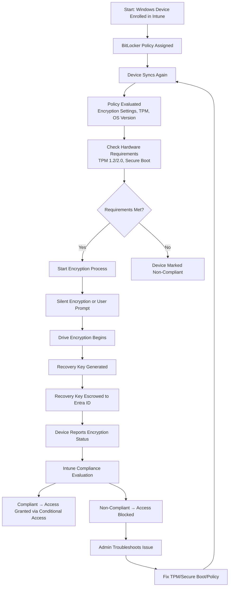

# Microsoft Intune Knowledge Base  
## 07 — BitLocker Management

---

## Overview

BitLocker Management in Microsoft Intune provides centralized control over Windows disk encryption. It ensures devices meet organizational security requirements by enforcing encryption, storing recovery keys securely in Entra ID, and monitoring compliance.

This document covers:
- BitLocker concepts  
- Encryption requirements  
- Intune BitLocker policy configuration  
- Recovery key management  
- Silent encryption  
- Monitoring & reporting  
- Troubleshooting  
- Best practices  
- **Workflow diagram for BitLocker enforcement via Intune**  

---

## 🧩 Workflow Diagram — BitLocker Enforcement & Recovery Key Management



---

# 1. BitLocker Concepts

## 1.1 What BitLocker Does

BitLocker provides:
- Full disk encryption  
- Protection against data theft  
- Secure key storage  
- Integration with TPM  
- Automatic recovery key backup  

---

## 1.2 Why Manage BitLocker with Intune

- Enforce encryption across all devices  
- Silent deployment without user interaction  
- Automatic recovery key escrow  
- Compliance reporting  
- Integration with Conditional Access  

---

# 2. BitLocker Requirements

## 2.1 Hardware Requirements

- TPM 1.2 or 2.0  
- Secure Boot enabled  
- UEFI recommended  
- Windows 10/11 Pro, Enterprise, Education  

---

## 2.2 Licensing Requirements

- Microsoft Intune  
- Microsoft Entra ID P1/P2  
- Microsoft 365 E3/E5 (optional)  

---

# 3. Configuring BitLocker in Intune

## 3.1 Create BitLocker Policy

```
Intune Admin Center → Endpoint Security → Disk Encryption → Create Policy
```

Select:
- Platform: Windows 10/11  
- Profile: BitLocker  

---

## 3.2 Recommended BitLocker Settings

### Encryption Settings
- Encrypt device: **Enabled**  
- Encryption method: **XTS-AES 256**  
- OS drive encryption: **Required**  
- Fixed drive encryption: **Required**  
- Removable drive encryption: **Required**  

### Silent Encryption
- Allow silent encryption: **Enabled**  
- TPM-only: **Enabled**  

### Recovery Key Settings
- Store recovery key in Entra ID: **Enabled**  
- Require recovery key backup: **Enabled**  

### Additional Controls
- Pre-boot recovery message  
- Password complexity  
- Block standard users from changing BitLocker settings  

---

# 4. Silent Encryption

Silent encryption allows BitLocker to activate without user interaction.

### Requirements:
- TPM present  
- No PIN or password required  
- Device joined to Entra ID or Hybrid AD  
- Policy configured for silent mode  

---

# 5. Recovery Key Management

## 5.1 View Recovery Key (Admin)

```
Entra Admin Center → Devices → All Devices → Select Device → BitLocker Keys
```

## 5.2 View Recovery Key (User)

```
https://myaccount.microsoft.com/devices
```

---

# 6. Monitoring BitLocker Status

## 6.1 Device-Level Status

```
Intune Admin Center → Devices → All Devices → Select Device → Encryption
```

Shows:
- Encrypted  
- Not encrypted  
- Partially encrypted  
- Recovery key stored  

---

## 6.2 Policy-Level Status

```
Endpoint Security → Disk Encryption → Select Policy → Device Status
```

---

# 7. Troubleshooting BitLocker

## Issue 1 — Device not encrypting

### Causes
- TPM missing or disabled  
- Secure Boot disabled  
- Unsupported OS edition  

### Fix
- Enable TPM in BIOS  
- Enable Secure Boot  
- Upgrade OS edition  

---

## Issue 2 — Recovery key not stored in Entra ID

### Causes
- Policy misconfiguration  
- Device not joined to Entra ID  

### Fix
- Enable key escrow  
- Verify device join status  

---

## Issue 3 — Silent encryption not working

### Causes
- TPM not ready  
- User interaction required  

### Fix
- Run TPM initialization  
- Switch to TPM-only mode  

---

## Issue 4 — Device marked non‑compliant

### Causes
- Encryption not completed  
- Policy conflict  

### Fix
- Review compliance policy  
- Check encryption progress  

---

# 8. Verification Checklist

| Task | Completed |
|------|-----------|
| BitLocker policy created | ✔ |
| Silent encryption enabled | ✔ |
| Recovery key escrow enabled | ✔ |
| Policy assigned to correct groups | ✔ |
| Device encrypted | ✔ |
| Recovery key stored in Entra ID | ✔ |
| Device marked compliant | ✔ |

---

# 9. Best Practices

- Use silent encryption for all corporate devices  
- Require XTS-AES 256 encryption  
- Store recovery keys in Entra ID  
- Enforce Secure Boot and TPM  
- Use Conditional Access to require encryption  
- Monitor encryption status weekly  
- Document BitLocker recovery procedures  

---

# References

- Microsoft Learn — BitLocker Management in Intune  
- Microsoft Learn — Disk Encryption Policies  
- Microsoft Learn — Windows Security Baselines  
```
