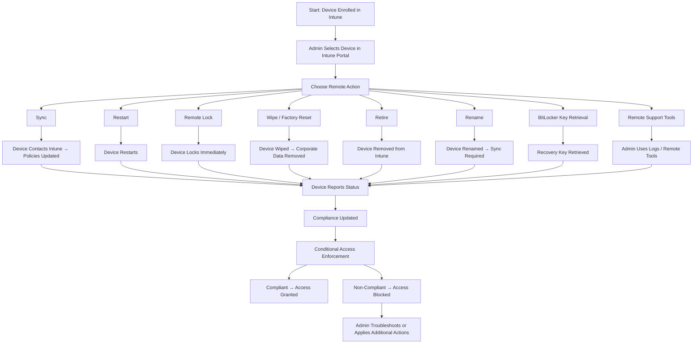

# Microsoft Intune Knowledge Base  
## 08 — Remote Device Actions

---

## Overview

Remote Device Actions in Microsoft Intune allow administrators to manage, secure, and troubleshoot devices without physical access. These actions are essential for modern device management, enabling IT teams to remotely wipe, lock, restart, sync, rename, retire, and troubleshoot devices across Windows, macOS, iOS/iPadOS, and Android platforms.

This document covers:
- Supported remote actions  
- Platform differences  
- Security implications  
- Device retirement  
- Remote troubleshooting  
- Monitoring  
- Best practices  
- **Workflow diagram for remote device actions**  

---

## 🧩 Workflow Diagram — Remote Device Actions (Intune)



---

# 1. Supported Remote Device Actions

## 1.1 Windows 10/11

- **Sync**
- **Restart**
- **Remote lock**
- **Wipe (Full or Selective)**
- **Retire**
- **Rename**
- **BitLocker key retrieval**
- **Fresh Start**
- **Autopilot reset**
- **Remote assistance (logs)**

---

## 1.2 macOS

- **Sync**
- **Restart**
- **Lock**
- **Wipe**
- **Rotate FileVault key**
- **Device inventory actions**

---

## 1.3 iOS/iPadOS

- **Sync**
- **Restart**
- **Lost mode**
- **Wipe**
- **Retire**
- **Passcode reset**
- **Disable activation lock**

---

## 1.4 Android (Fully Managed / Work Profile)

- **Sync**
- **Restart**
- **Wipe**
- **Retire**
- **Lock**
- **Reset work profile**

---

# 2. Remote Sync

Forces the device to immediately check in with Intune.

### Use Cases
- Apply new policies  
- Push apps  
- Update compliance status  
- Refresh configuration profiles  

### Location
```
Intune Admin Center → Devices → All Devices → Select Device → Sync
```

---

# 3. Remote Restart

Restarts the device remotely.

### Use Cases
- Apply updates  
- Resolve performance issues  
- Complete app installations  

### Notes
- Supported on Windows and macOS  
- User receives notification  

---

# 4. Remote Lock

Locks the device immediately.

### Use Cases
- Lost or stolen device  
- Security incident  
- Unauthorized access  

### Behavior
- Windows: Locks screen  
- iOS/macOS: Device fully locked  
- Android: Locks work profile or full device  

---

# 5. Wipe (Factory Reset)

## 5.1 Full Wipe

Erases all data and restores factory settings.

### Use Cases
- Lost/stolen device  
- Device repurposing  
- Security breach  

### Behavior
- Removes all apps, data, settings  
- Removes device from Intune  

---

## 5.2 Selective Wipe (Corporate Wipe)

Removes only corporate data.

### Use Cases
- BYOD devices  
- User leaving organization  

### Behavior
- Removes work profile (Android)  
- Removes managed apps (iOS)  
- Removes corporate data (Windows)  

---

# 6. Retire Device

Retire removes Intune management but leaves personal data intact.

### Use Cases
- User offboarding  
- Device replacement  
- BYOD removal  

### Behavior
- Removes Intune policies  
- Removes managed apps  
- Removes corporate data  
- Device remains usable  

---

# 7. Rename Device

Renames Windows devices remotely.

### Use Cases
- Standardized naming conventions  
- Autopilot device naming  
- Inventory management  

### Notes
- Requires restart  
- Sync needed after rename  

---

# 8. BitLocker Key Retrieval

Admins can retrieve BitLocker recovery keys stored in Entra ID.

### Location
```
Entra Admin Center → Devices → Select Device → BitLocker Keys
```

---

# 9. Remote Support Tools

## 9.1 Collect Diagnostics

Collect logs from Windows devices:
- Intune Management Extension logs  
- MDM diagnostic logs  
- Event Viewer logs  

## 9.2 Remote Assistance (Third‑Party)

Intune integrates with:
- TeamViewer  
- Remote Help (Microsoft)  

---

# 10. Troubleshooting Remote Actions

## Issue 1 — Remote action not executing

### Causes
- Device offline  
- MDM agent not running  

### Fix
- Ensure device is online  
- Restart device  
- Check MDM enrollment  

---

## Issue 2 — Wipe fails

### Causes
- OS corruption  
- Network restrictions  

### Fix
- Retry wipe  
- Use Autopilot reset  

---

## Issue 3 — Sync not updating

### Causes
- Policy conflict  
- Device not checking in  

### Fix
- Review device check-in logs  
- Restart device  

---

## Issue 4 — BitLocker key missing

### Causes
- Key not escrowed  
- Policy misconfiguration  

### Fix
- Ensure BitLocker policy requires key backup  
- Re-encrypt drive if needed  

---

# 11. Verification Checklist

| Task | Completed |
|------|-----------|
| Remote action executed | ✔ |
| Device responded | ✔ |
| Compliance updated | ✔ |
| Conditional Access validated | ✔ |
| No errors in device logs | ✔ |

---

# 12. Best Practices

- Use selective wipe for BYOD  
- Use full wipe for corporate devices  
- Always verify recovery keys before encryption  
- Document remote action procedures  
- Monitor device status after remote actions  
- Use naming conventions for device renaming  
- Use Remote Help for troubleshooting  

---

# References

- Microsoft Learn — Intune Remote Actions  
- Microsoft Learn — Device Wipe & Retire  
- Microsoft Learn — BitLocker Key Management  
```
