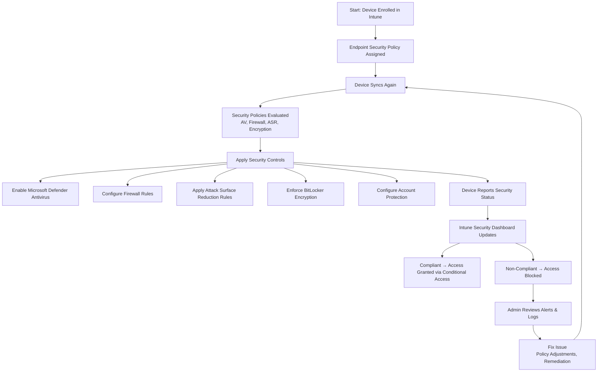

# Microsoft Intune Knowledge Base  
## 09 — Endpoint Security Policies

---

## Overview

Endpoint Security Policies in Microsoft Intune provide centralized management of security configurations across Windows, macOS, iOS/iPadOS, and Android devices. These policies enforce critical protections such as antivirus, firewall, disk encryption, attack surface reduction, and account protection.

This document covers:
- Endpoint security policy types  
- Microsoft Defender integration  
- Attack Surface Reduction (ASR)  
- Firewall management  
- Account protection  
- Security baselines  
- Monitoring & reporting  
- Troubleshooting  
- Best practices  
- **Workflow diagram for endpoint security enforcement**  

---

## 🧩 Workflow Diagram — Endpoint Security Enforcement (Intune + Defender)



---

# 1. Endpoint Security Policy Types

Intune provides dedicated security-focused policy categories:

## 1.1 Microsoft Defender Antivirus

Controls:
- Real-time protection  
- Cloud-delivered protection  
- Scan schedules  
- Exclusions  
- Threat remediation  

---

## 1.2 Firewall Policies

Controls:
- Firewall state  
- Inbound/outbound rules  
- App-based rules  
- Network protection  

---

## 1.3 Disk Encryption (BitLocker/FileVault)

Controls:
- Encryption enforcement  
- Recovery key storage  
- Silent encryption  
- TPM requirements  

---

## 1.4 Attack Surface Reduction (ASR)

Controls:
- Block executable content  
- Block Office macro abuse  
- Block credential theft  
- Block ransomware techniques  

---

## 1.5 Account Protection

Controls:
- Windows Hello for Business  
- Credential Guard  
- Local admin restrictions  

---

## 1.6 Security Baselines

Preconfigured Microsoft security templates:
- Windows 10/11 Security Baseline  
- Microsoft Defender Baseline  
- Microsoft Edge Baseline  

---

# 2. Microsoft Defender Antivirus Policies

## 2.1 Create Policy

```
Intune Admin Center → Endpoint Security → Antivirus → Create Policy
```

## 2.2 Recommended Settings

- Real-time protection: **Enabled**  
- Cloud protection: **Enabled**  
- Tamper protection: **Enabled**  
- Scheduled scans: **Daily**  
- Remediation: **Automatic**  

---

# 3. Firewall Policies

## 3.1 Create Policy

```
Endpoint Security → Firewall → Create Policy
```

## 3.2 Recommended Settings

- Firewall: **Enabled**  
- Block inbound connections: **Enabled**  
- Allow outbound connections: **Enabled**  
- Add app/network rules as needed  

---

# 4. Attack Surface Reduction (ASR)

ASR rules protect devices from advanced threats.

## 4.1 Create Policy

```
Endpoint Security → Attack Surface Reduction → Create Policy
```

## 4.2 Recommended ASR Rules

- Block Office macros  
- Block executable content from email/web  
- Block credential theft  
- Block ransomware behaviors  

---

# 5. Account Protection

## 5.1 Windows Hello for Business

Enforce:
- PIN  
- Biometrics  
- MFA-backed authentication  

## 5.2 Credential Guard

Protects credentials from theft.

## 5.3 Local Admin Restrictions

Prevent unauthorized privilege escalation.

---

# 6. Security Baselines

Security baselines provide Microsoft-recommended configurations.

## 6.1 Available Baselines

- Windows 10/11 Security Baseline  
- Microsoft Defender Baseline  
- Microsoft Edge Baseline  

## 6.2 Benefits

- Preconfigured secure settings  
- Easy deployment  
- Regular updates  

---

# 7. Monitoring Endpoint Security

## 7.1 Security Dashboard

```
Intune Admin Center → Endpoint Security → Overview
```

Shows:
- Antivirus status  
- Firewall status  
- Encryption status  
- ASR rule compliance  

---

## 7.2 Device-Level Security Status

```
Devices → All Devices → Select Device → Security
```

---

# 8. Troubleshooting Endpoint Security

## Issue 1 — Antivirus not enabled

### Causes
- Third-party AV installed  
- Policy conflict  

### Fix
- Remove third-party AV  
- Review policy assignments  

---

## Issue 2 — Firewall disabled

### Causes
- Local override  
- GPO conflict  

### Fix
- Remove conflicting GPO  
- Reapply Intune policy  

---

## Issue 3 — ASR rules not applying

### Causes
- OS version too old  
- Conflicting baseline  

### Fix
- Update OS  
- Review baseline settings  

---

## Issue 4 — Device marked non‑compliant

### Causes
- Missing encryption  
- AV disabled  
- Firewall off  

### Fix
- Review compliance policy  
- Check device security status  

---

# 9. Verification Checklist

| Task | Completed |
|------|-----------|
| Antivirus policy applied | ✔ |
| Firewall policy applied | ✔ |
| ASR rules applied | ✔ |
| BitLocker/FileVault enabled | ✔ |
| Account protection configured | ✔ |
| Device marked compliant | ✔ |
| Conditional Access validated | ✔ |

---

# 10. Best Practices

- Use Defender Antivirus across all Windows devices  
- Enable ASR rules for maximum protection  
- Enforce BitLocker/FileVault encryption  
- Use security baselines for standardization  
- Avoid overlapping policies  
- Monitor endpoint security weekly  
- Document all security configurations  

---

# References

- Microsoft Learn — Endpoint Security in Intune  
- Microsoft Learn — Microsoft Defender Policies  
- Microsoft Learn — Attack Surface Reduction  
- Microsoft Learn — Security Baselines  
```
