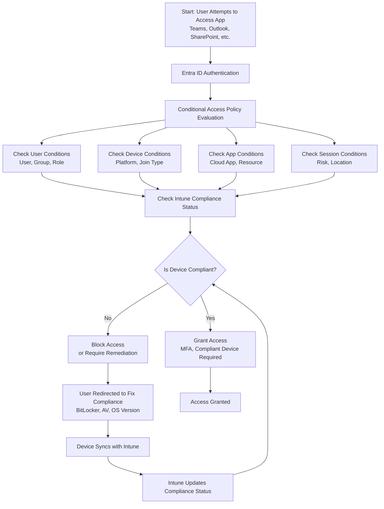

# Microsoft Intune Knowledge Base  
## 10 — Conditional Access Integration

---

## Overview

Conditional Access (CA) is the policy engine of Microsoft Entra ID that enforces Zero Trust access controls. When integrated with Intune, Conditional Access ensures that only **compliant**, **managed**, and **trusted** devices can access corporate applications and data.

This document covers:
- Conditional Access concepts  
- Intune compliance integration  
- Device-based CA policies  
- App-based CA policies  
- Session controls  
- Troubleshooting  
- Best practices  
- **Workflow diagram for Conditional Access + Intune compliance enforcement**  

---

## 🧩 Workflow Diagram — Conditional Access + Intune Compliance Enforcement



---

# 1. Conditional Access Concepts

## 1.1 What Conditional Access Does

Conditional Access enforces:
- Who can access resources  
- From which devices  
- Under what conditions  
- With what security requirements  

It is the core of Microsoft’s Zero Trust model.

---

## 1.2 Why Integrate CA with Intune

- Enforces device compliance  
- Blocks unmanaged devices  
- Protects corporate data  
- Ensures secure access  
- Enables granular access control  

---

# 2. Intune + Conditional Access Integration

Conditional Access uses Intune compliance status to determine whether a device is trusted.

## 2.1 Compliance Signals Used by CA

- BitLocker enabled  
- Antivirus active  
- Firewall enabled  
- OS version meets minimum  
- Device not jailbroken/rooted  
- Device enrolled in Intune  
- Device configuration profiles applied  

---

## 2.2 Required Licensing

- Microsoft Entra ID P1 (minimum)  
- Microsoft Intune  
- Microsoft 365 E3/E5 (optional)  

---

# 3. Creating Conditional Access Policies

## 3.1 Create CA Policy

```
Entra Admin Center → Protection → Conditional Access → New Policy
```

---

## 3.2 Recommended Device-Based CA Policy

### Assignments
- **Users:** All users  
- **Cloud apps:** Office 365  
- **Conditions:**  
  - Device platform: Windows, macOS, iOS, Android  
  - Locations: Exclude trusted locations (optional)

### Access Controls
- **Grant:** Require device to be marked as compliant  
- **Session:** Sign-in frequency (optional)

---

## 3.3 App-Based CA Policies

Examples:
- Require MFA for sensitive apps  
- Block legacy authentication  
- Require compliant device for SharePoint/OneDrive  
- Require approved apps for mobile access  

---

# 4. Conditional Access Conditions

## 4.1 User Conditions

- User  
- Group  
- Role  
- Guest users  

---

## 4.2 Device Conditions

- Platform  
- Device state  
- Compliance status  
- Join type (Entra ID / Hybrid)  

---

## 4.3 App Conditions

- Cloud apps  
- App protection policies  
- App enforced restrictions  

---

## 4.4 Session Controls

- Sign-in frequency  
- Persistent browser session  
- Conditional Access App Control (MCAS)  

---

# 5. Monitoring Conditional Access

## 5.1 Sign-In Logs

```
Entra Admin Center → Monitoring → Sign-in Logs
```

Shows:
- CA policy applied  
- Access granted/blocked  
- Compliance reason  

---

## 5.2 Conditional Access Insights

```
Entra Admin Center → Protection → Conditional Access → Insights & Reporting
```

---

# 6. Troubleshooting Conditional Access

## Issue 1 — Compliant device blocked

### Causes
- Multiple CA policies  
- Compliance not updated  
- Device not syncing  

### Fix
- Review sign-in logs  
- Force device sync  
- Check policy precedence  

---

## Issue 2 — Unmanaged device accessing resources

### Causes
- CA policy missing  
- Incorrect assignments  

### Fix
- Add “Require compliant device”  
- Review user/app assignments  

---

## Issue 3 — Mobile device blocked unexpectedly

### Causes
- App protection policy required  
- Device not enrolled  

### Fix
- Enrol device  
- Use approved apps  

---

## Issue 4 — Legacy authentication bypassing CA

### Causes
- Legacy protocols enabled  

### Fix
- Block legacy authentication  

---

# 7. Verification Checklist

| Task | Completed |
|------|-----------|
| CA policy created | ✔ |
| Device compliance integrated | ✔ |
| Policy assigned correctly | ✔ |
| Sign-in logs validated | ✔ |
| Device access tested | ✔ |
| No unmanaged devices allowed | ✔ |

---

# 8. Best Practices

- Always require compliant devices  
- Block legacy authentication  
- Use MFA for all users  
- Use session controls for sensitive apps  
- Test CA policies before rollout  
- Document all CA configurations  
- Monitor sign-in logs weekly  

---

# References

- Microsoft Learn — Conditional Access  
- Microsoft Learn — Intune Compliance Integration  
- Microsoft Learn — Zero Trust Architecture  
```
