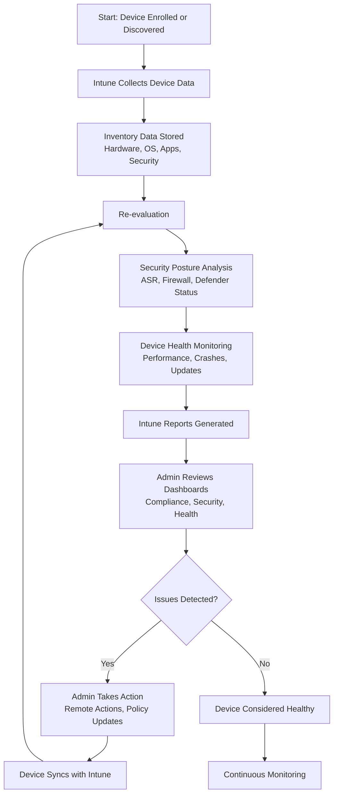

# Microsoft Intune Knowledge Base  
## 11 — Device Inventory and Monitoring

---

## Overview

Device Inventory and Monitoring in Microsoft Intune provides real‑time visibility into all managed and unmanaged devices across Windows, macOS, iOS/iPadOS, Android, and Linux. It enables administrators to track device health, compliance, configuration status, security posture, and operational readiness.

This document covers:
- Device inventory concepts  
- Device categories  
- Hardware & software reporting  
- Compliance monitoring  
- Security posture monitoring  
- Device health analytics  
- Alerts & notifications  
- Troubleshooting  
- Best practices  
- **Workflow diagram for device inventory & monitoring lifecycle**  

---

## 🧩 Workflow Diagram — Device Inventory & Monitoring Lifecycle



---

# 1. Device Inventory Concepts

## 1.1 What Device Inventory Provides

Intune collects:
- Hardware details  
- OS version & build  
- Installed applications  
- Security configuration  
- Compliance status  
- Update status  
- Device health metrics  

---

## 1.2 Why Inventory Matters

- Ensures devices meet security standards  
- Helps identify outdated or vulnerable devices  
- Supports lifecycle management  
- Enables proactive troubleshooting  
- Provides audit and compliance evidence  

---

# 2. Device Categories

## 2.1 Managed Devices

Devices enrolled in Intune:
- Windows 10/11  
- macOS  
- iOS/iPadOS  
- Android  
- Linux (limited)  

## 2.2 Unmanaged Devices

Devices discovered but not enrolled:
- Azure AD registered  
- Devices accessing corporate apps  
- Devices detected via Conditional Access  

---

# 3. Hardware & Software Inventory

## 3.1 Hardware Inventory

Intune collects:
- Device model  
- Manufacturer  
- Serial number  
- Processor  
- RAM  
- Storage capacity  
- TPM status  

## 3.2 Software Inventory

Intune collects:
- Installed apps  
- App versions  
- App publisher  
- OS version  
- OS build number  

---

# 4. Compliance Monitoring

Compliance monitoring evaluates:
- Encryption (BitLocker/FileVault)  
- Antivirus status  
- Firewall status  
- OS version  
- Password/PIN requirements  
- Jailbreak/root detection  

### Location
```
Intune Admin Center → Devices → Monitor → Device Compliance
```

---

# 5. Security Posture Monitoring

Security posture includes:
- Microsoft Defender status  
- Attack Surface Reduction (ASR)  
- Firewall configuration  
- Credential Guard  
- Windows Hello for Business  
- Security baselines  

### Location
```
Endpoint Security → Overview
```

---

# 6. Device Health Monitoring

Intune integrates with:
- **Endpoint Analytics**  
- **Windows Update for Business**  
- **Device performance metrics**  

## 6.1 Endpoint Analytics Provides

- Boot time  
- App reliability  
- Device performance score  
- Recommended optimizations  

### Location
```
Reports → Endpoint Analytics
```

---

# 7. Alerts & Notifications

Intune generates alerts for:
- Non‑compliant devices  
- Security baseline failures  
- Update failures  
- App installation failures  
- Device health degradation  

Admins can configure:
- Email alerts  
- Automated remediation scripts  
- Conditional Access enforcement  

---

# 8. Troubleshooting Device Inventory & Monitoring

## Issue 1 — Device not reporting inventory

### Causes
- Device offline  
- MDM agent not running  

### Fix
- Restart device  
- Force sync  
- Check enrollment status  

---

## Issue 2 — Missing hardware data

### Causes
- OS restrictions  
- Enrollment type  

### Fix
- Ensure full MDM enrollment  
- Check platform limitations  

---

## Issue 3 — Compliance not updating

### Causes
- Policy conflict  
- Device not syncing  

### Fix
- Review compliance policy  
- Force sync  

---

## Issue 4 — Security posture incorrect

### Causes
- Defender disabled  
- Firewall off  

### Fix
- Reapply endpoint security policies  
- Check local overrides  

---

# 9. Verification Checklist

| Task | Completed |
|------|-----------|
| Device inventory collected | ✔ |
| Hardware & software data visible | ✔ |
| Compliance evaluated | ✔ |
| Security posture monitored | ✔ |
| Device health metrics available | ✔ |
| Alerts configured | ✔ |
| Reports reviewed | ✔ |

---

# 10. Best Practices

- Use dynamic groups for device targeting  
- Review inventory weekly  
- Enforce compliance via Conditional Access  
- Use Endpoint Analytics for performance insights  
- Document device lifecycle processes  
- Monitor update compliance regularly  
- Use security baselines for standardization  

---

# References

- Microsoft Learn — Intune Device Inventory  
- Microsoft Learn — Endpoint Analytics  
- Microsoft Learn — Device Compliance  
- Microsoft Learn — Security Baselines  
```
