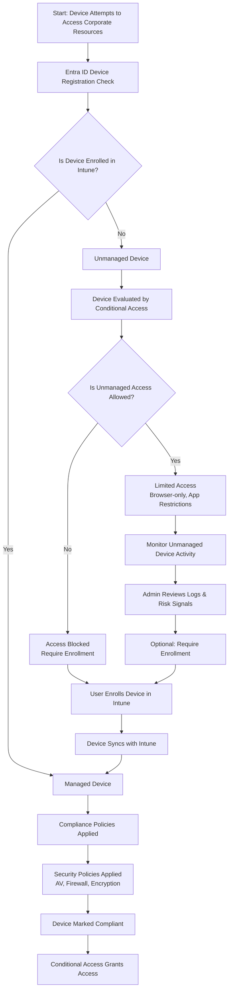

# Microsoft Intune Knowledge Base  
## 12 — Managed and Unmanaged Devices

---

## Overview

Microsoft Intune manages both **managed** and **unmanaged** devices within an organization. Understanding the difference between these device states is essential for enforcing security, compliance, Conditional Access, and data protection.

This document covers:
- Definitions of managed vs. unmanaged devices  
- Enrollment types  
- Compliance implications  
- Conditional Access enforcement  
- BYOD vs. corporate-owned devices  
- Monitoring unmanaged devices  
- Transitioning devices to managed state  
- Troubleshooting  
- Best practices  
- **Workflow diagram for managed/unmanaged device lifecycle**  

---

## 🧩 Workflow Diagram — Managed vs. Unmanaged Device Lifecycle



---

# 1. Definitions

## 1.1 Managed Devices

Devices that are:
- Fully enrolled in Intune  
- Receive configuration profiles  
- Receive compliance policies  
- Receive security baselines  
- Can be remotely wiped, locked, or retired  
- Provide full inventory and monitoring  

Examples:
- Corporate-owned Windows laptops  
- Enrolled BYOD mobile devices  
- Autopilot-provisioned devices  

---

## 1.2 Unmanaged Devices

Devices that:
- Are **not** enrolled in Intune  
- May be Azure AD registered  
- May access corporate apps  
- Provide limited visibility  
- Cannot receive Intune policies  
- Cannot be remotely controlled  

Examples:
- Personal laptops accessing Outlook Web  
- Mobile devices using unmanaged apps  
- Guest devices  

---

# 2. Enrollment Types

## 2.1 Fully Managed (MDM)

- Full Intune enrollment  
- Corporate-owned devices  
- Full policy enforcement  

## 2.2 MAM-Only (App Protection Policies)

- No device enrollment  
- Only apps are protected  
- Ideal for BYOD  

## 2.3 Azure AD Registered

- Device known to Entra ID  
- Not managed by Intune  
- Limited access depending on CA  

## 2.4 Hybrid Azure AD Joined

- On-prem AD + Entra ID  
- Auto-enrolled into Intune  

---

# 3. Compliance Implications

## 3.1 Managed Devices

- Must meet compliance requirements  
- Required for full access  
- Evaluated continuously  

## 3.2 Unmanaged Devices

- Cannot be compliant  
- Access depends on CA policies  
- Often restricted to browser-only access  

---

# 4. Conditional Access Enforcement

Conditional Access determines access based on device state.

### Managed Device
- Access granted if compliant  
- Full app access allowed  

### Unmanaged Device
- Access blocked or restricted  
- May require MFA  
- May require enrollment  
- May require approved apps  

---

# 5. BYOD vs. Corporate-Owned Devices

## 5.1 BYOD (Bring Your Own Device)

Options:
- MAM-only protection  
- Selective wipe  
- No full device control  

## 5.2 Corporate-Owned

Options:
- Full MDM enrollment  
- Autopilot provisioning  
- Full policy enforcement  
- Remote actions allowed  

---

# 6. Monitoring Unmanaged Devices

Unmanaged devices appear in:
```
Entra Admin Center → Devices → All Devices
```

Admins can see:
- Device name  
- OS  
- Join type  
- Sign-in activity  
- Risk level  

But cannot:
- Apply policies  
- Enforce compliance  
- Collect inventory  

---

# 7. Transitioning Unmanaged Devices to Managed State

Steps:
1. User attempts access  
2. Conditional Access blocks access  
3. User prompted to enroll  
4. Device enrolls via Intune  
5. Compliance evaluated  
6. Access granted  

---

# 8. Troubleshooting Managed vs. Unmanaged Devices

## Issue 1 — Device appears unmanaged

### Causes
- User registered device instead of enrolling  
- Enrollment failure  

### Fix
- Guide user to full enrollment  
- Check MDM authority  

---

## Issue 2 — Unmanaged device accessing corporate apps

### Causes
- CA policy missing  
- Incorrect assignments  

### Fix
- Require compliant device  
- Review CA assignments  

---

## Issue 3 — BYOD device blocked unexpectedly

### Causes
- CA requires MDM enrollment  
- App protection policy missing  

### Fix
- Allow MAM-only access  
- Configure approved apps  

---

## Issue 4 — Managed device marked non‑compliant

### Causes
- Missing encryption  
- AV disabled  
- OS outdated  

### Fix
- Review compliance policy  
- Sync device  

---

# 9. Verification Checklist

| Task | Completed |
|------|-----------|
| Managed devices enrolled | ✔ |
| Unmanaged devices identified | ✔ |
| CA policies configured | ✔ |
| BYOD strategy defined | ✔ |
| Compliance enforced | ✔ |
| Monitoring enabled | ✔ |

---

# 10. Best Practices

- Block unmanaged devices from accessing sensitive apps  
- Use MAM-only for BYOD scenarios  
- Require compliant devices for corporate data  
- Monitor unmanaged device sign-ins  
- Document enrollment workflows  
- Use Autopilot for corporate devices  
- Review device inventory weekly  

---

# References

- Microsoft Learn — Intune Device Management  
- Microsoft Learn — Conditional Access  
- Microsoft Learn — App Protection Policies  
- Microsoft Learn — Device Compliance  
