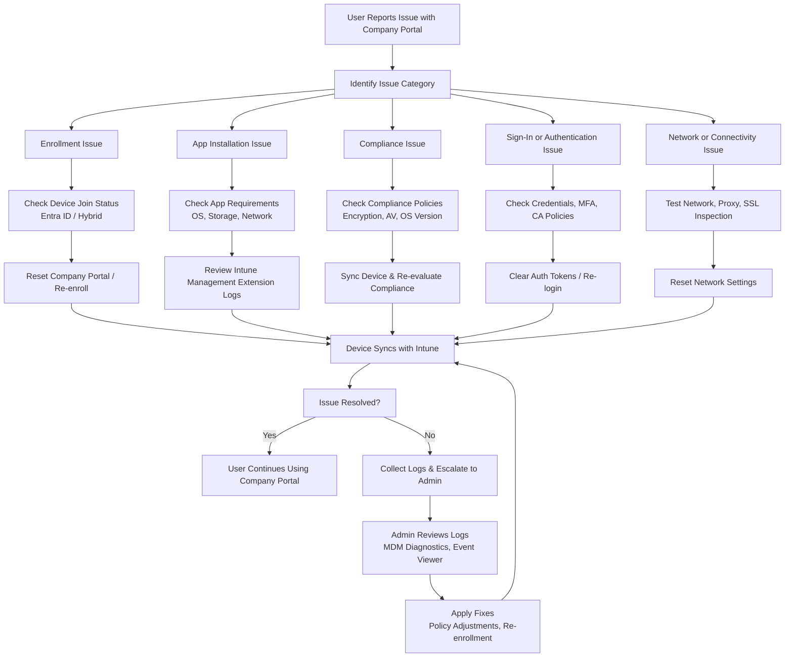

# Microsoft Intune Knowledge Base  
## 13 — Company Portal Troubleshooting

---

## Overview

The Company Portal app is the primary interface for users to enroll devices, install applications, check compliance, and access corporate resources. When issues occur, users may be unable to enroll, install apps, or meet compliance requirements.

This document covers:
- Common Company Portal issues  
- Enrollment troubleshooting  
- App installation troubleshooting  
- Compliance troubleshooting  
- Network & certificate issues  
- Logs & diagnostics  
- Remediation steps  
- Best practices  
- **Workflow diagram for Company Portal troubleshooting**  

---

## 🧩 Workflow Diagram — Company Portal Troubleshooting Flow



---

# 1. Common Company Portal Issues

## 1.1 Enrollment Issues
- Device not enrolling  
- Stuck on “Setting up your device”  
- MDM authority errors  
- Azure AD registration instead of enrollment  

## 1.2 App Installation Issues
- Apps stuck on “Pending”  
- Win32 apps failing  
- Store apps not installing  
- App requirements not met  

## 1.3 Compliance Issues
- Device marked non‑compliant  
- Encryption not detected  
- Antivirus status incorrect  
- OS version not meeting requirements  

## 1.4 Authentication Issues
- MFA failures  
- Conditional Access blocks  
- Sign-in loops  
- Token corruption  

## 1.5 Network Issues
- Proxy/SSL inspection blocking traffic  
- Company Portal cannot reach Intune  
- Device cannot sync  

---

# 2. Enrollment Troubleshooting

## 2.1 Check Device Join Status

### Windows
```powershell
dsregcmd /status
```

Look for:
- AzureAdJoined = YES  
- MDMUrl = Intune  

### macOS/iOS/Android
Check Company Portal → Device Status.

---

## 2.2 Reset Company Portal

### Windows
```
Settings → Apps → Company Portal → Advanced Options → Reset
```

### Mobile
- Sign out  
- Clear app data  
- Reinstall Company Portal  

---

## 2.3 Re-Enroll Device

### Windows
```
Settings → Accounts → Access work or school → Disconnect → Re-enroll
```

---

# 3. App Installation Troubleshooting

## 3.1 Check Intune Management Extension (IME)

### Windows Logs
```
C:\ProgramData\Microsoft\IntuneManagementExtension\Logs
```

Key logs:
- IntuneManagementExtension.log  
- AgentExecutor.log  

---

## 3.2 Common Fixes

- Restart IME service  
- Restart device  
- Ensure device meets app requirements  
- Check detection rules  
- Validate install/uninstall commands  

---

## 3.3 Store App Issues

Fix:
- Ensure Microsoft Store is enabled  
- Check network restrictions  
- Sync device  

---

# 4. Compliance Troubleshooting

## 4.1 Force Device Sync

```
Company Portal → Devices → Select Device → Sync
```

---

## 4.2 Check Compliance Policies

Common failures:
- BitLocker not enabled  
- Antivirus disabled  
- Firewall off  
- OS outdated  

---

## 4.3 Reset Compliance State

Windows:
```
Settings → Accounts → Access work or school → Info → Sync
```

---

# 5. Authentication Troubleshooting

## 5.1 Clear Authentication Tokens

### Windows
```
Settings → Accounts → Access work or school → Disconnect → Reconnect
```

### Mobile
- Sign out of Company Portal  
- Clear app cache  

---

## 5.2 Check Conditional Access

Common blocks:
- Device not compliant  
- MFA required  
- Unmanaged device  

---

# 6. Network Troubleshooting

## 6.1 Test Connectivity

Check:
- Internet access  
- Access to `manage.microsoft.com`  
- Access to `login.microsoftonline.com`  

---

## 6.2 Proxy & SSL Inspection

Company Portal may fail if:
- SSL inspection is enabled  
- Proxy blocks Intune endpoints  

Fix:
- Add Intune URLs to allowlist  
- Disable SSL inspection for Intune traffic  

---

# 7. Logs & Diagnostics

## 7.1 Windows MDM Diagnostic Logs

Run:
```powershell
mdmdiagnosticstool.exe -area DeviceEnrollment -cab C:\MDMDiag.cab
```

---

## 7.2 Company Portal Logs

Windows:
```
%localappdata%\Packages\Microsoft.CompanyPortal_8wekyb3d8bbwe\LocalState\Logs
```

Mobile:
- Export logs via Company Portal settings  

---

# 8. Troubleshooting Scenarios

## Scenario 1 — Device stuck on “Checking compliance”
Fix:
- Sync device  
- Restart IME  
- Check compliance policies  

## Scenario 2 — Apps stuck on “Pending”
Fix:
- Restart IME  
- Check detection rules  
- Validate install commands  

## Scenario 3 — Company Portal cannot sign in
Fix:
- Clear auth tokens  
- Check CA policies  
- Check MFA  

## Scenario 4 — Device shows “Not enrolled”
Fix:
- Reset Company Portal  
- Re-enroll device  

---

# 9. Verification Checklist

| Task | Completed |
|------|-----------|
| Company Portal reset | ✔ |
| Device re-enrolled | ✔ |
| IME logs reviewed | ✔ |
| Compliance re-evaluated | ✔ |
| Authentication tokens cleared | ✔ |
| Network connectivity verified | ✔ |
| Issue resolved | ✔ |

---

# 10. Best Practices

- Always reset Company Portal first  
- Use IME logs for Win32 app issues  
- Use MDM diagnostics for enrollment issues  
- Document troubleshooting steps  
- Train users on basic Company Portal usage  
- Monitor device compliance regularly  

---

# References

- Microsoft Learn — Company Portal  
- Microsoft Learn — Intune Troubleshooting  
- Microsoft Learn — Device Enrollment  
```
