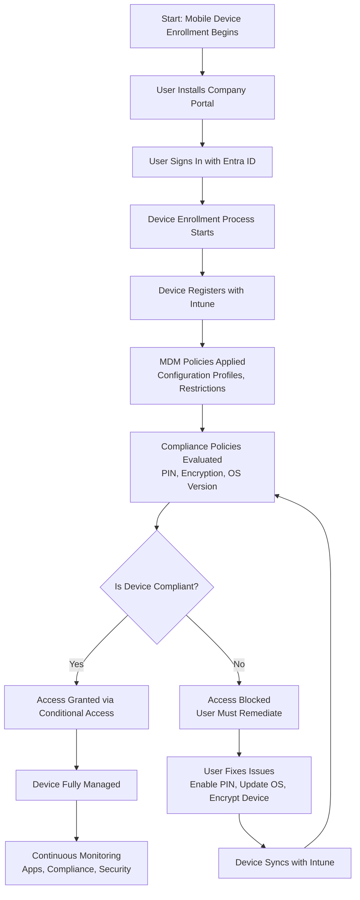

# Microsoft Intune Knowledge Base  
## 14 — Mobile Device Management (MDM)

---

## Overview

Mobile Device Management (MDM) in Microsoft Intune provides centralized control over mobile devices across iOS/iPadOS, Android, and macOS. MDM ensures devices meet security requirements, receive configuration profiles, install managed apps, and remain compliant with organizational policies.

This document covers:
- MDM concepts  
- Supported platforms  
- Enrollment methods  
- Device restrictions  
- Configuration profiles  
- Compliance policies  
- App deployment  
- Monitoring  
- Troubleshooting  
- Best practices  
- **Workflow diagram for MDM lifecycle**  

---

## 🧩 Workflow Diagram — Mobile Device Management Lifecycle (Intune)



---

# 1. MDM Concepts

## 1.1 What MDM Does

MDM provides:
- Device enrollment  
- Configuration profile deployment  
- Security policy enforcement  
- App installation  
- Compliance evaluation  
- Remote actions (wipe, lock, retire)  
- Inventory and monitoring  

---

## 1.2 Why MDM Matters

- Protects corporate data  
- Ensures device security  
- Enables Zero Trust access  
- Supports BYOD and corporate-owned devices  
- Provides full lifecycle management  

---

# 2. Supported Platforms

## 2.1 iOS/iPadOS
- Full MDM enrollment  
- App deployment  
- Device restrictions  
- Compliance policies  
- Managed app configurations  

## 2.2 Android
- Fully Managed  
- Work Profile (BYOD)  
- Dedicated devices (kiosk mode)  
- App deployment  
- Compliance policies  

## 2.3 macOS
- MDM enrollment  
- Configuration profiles  
- FileVault encryption  
- App deployment  

---

# 3. Enrollment Methods

## 3.1 iOS/iPadOS Enrollment

### Methods:
- Company Portal  
- Apple Automated Device Enrollment (ADE)  
- Apple Configurator  

### Requirements:
- Apple MDM Push Certificate  
- Apple Business Manager (for ADE)  

---

## 3.2 Android Enrollment

### Methods:
- Company Portal (Work Profile)  
- QR Code Enrollment (Fully Managed)  
- Zero-touch Enrollment  
- Samsung Knox Mobile Enrollment  

---

## 3.3 macOS Enrollment

### Methods:
- Company Portal  
- Automated Device Enrollment (ADE)  
- Apple Configurator  

---

# 4. Device Restrictions

MDM allows administrators to enforce restrictions such as:

### iOS/iPadOS
- Block app installation  
- Block Safari  
- Block screen capture  
- Enforce password requirements  

### Android
- Block unknown sources  
- Block developer options  
- Enforce work profile separation  
- Control app permissions  

### macOS
- Restrict system preferences  
- Enforce password policies  
- Control app installation  

---

# 5. Configuration Profiles

Configuration profiles apply settings such as:
- Wi‑Fi  
- VPN  
- Email  
- Certificates  
- Device restrictions  
- Custom settings (OMA‑URI for Android Enterprise)  

---

# 6. Compliance Policies

Compliance policies ensure mobile devices meet security requirements.

### Common Requirements:
- PIN/password  
- Encryption  
- OS version  
- Jailbreak/root detection  
- Device health  

---

# 7. App Deployment

## 7.1 iOS/iPadOS
- App Store apps  
- LOB apps (IPA)  
- Managed app configurations  

## 7.2 Android
- Managed Google Play apps  
- LOB apps (APK)  
- Work profile apps  

## 7.3 macOS
- PKG apps  
- LOB apps  
- Managed app configurations  

---

# 8. Monitoring Mobile Devices

### Device Overview
```
Intune Admin Center → Devices → All Devices
```

### Platform-specific monitoring
- Compliance  
- Configuration profiles  
- App installation  
- Security posture  

---

# 9. Troubleshooting MDM

## Issue 1 — Device not enrolling

### Causes
- Incorrect credentials  
- MDM push certificate expired  
- Device OS restrictions  

### Fix
- Renew Apple MDM certificate  
- Check enrollment method  
- Update OS  

---

## Issue 2 — Apps not installing

### Causes
- Device not syncing  
- App not assigned  
- Store restrictions  

### Fix
- Sync device  
- Check app assignment  
- Validate platform requirements  

---

## Issue 3 — Compliance not updating

### Causes
- Device not syncing  
- Policy conflict  

### Fix
- Force sync  
- Review compliance policies  

---

## Issue 4 — Work profile not creating (Android)

### Causes
- Device not compatible  
- Google Play services issue  

### Fix
- Update Google Play services  
- Use fully managed enrollment  

---

# 10. Verification Checklist

| Task | Completed |
|------|-----------|
| Device enrolled | ✔ |
| Configuration profiles applied | ✔ |
| Compliance evaluated | ✔ |
| Apps installed | ✔ |
| Restrictions applied | ✔ |
| Device monitored | ✔ |

---

# 11. Best Practices

- Use ADE and Zero-touch for corporate devices  
- Use Work Profile for BYOD Android  
- Enforce compliance via Conditional Access  
- Use managed apps for data protection  
- Document enrollment workflows  
- Monitor mobile compliance weekly  

---

# References

- Microsoft Learn — Intune MDM  
- Microsoft Learn — iOS/iPadOS Device Management  
- Microsoft Learn — Android Enterprise  
- Microsoft Learn — macOS Device Management  
```
