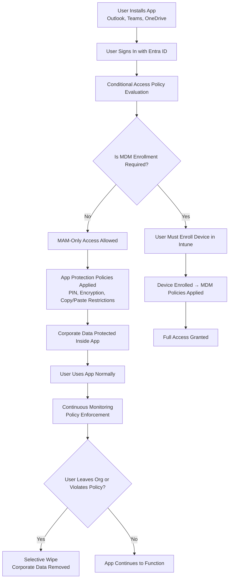

# Microsoft Intune Knowledge Base  
## 15 — Mobile Application Management (MAM)

---

## Overview

Mobile Application Management (MAM) in Microsoft Intune protects corporate data **inside applications**, without requiring full device enrollment. MAM is ideal for **BYOD (Bring Your Own Device)** scenarios where users do not want their personal devices fully managed.

MAM uses **App Protection Policies (APP)** to enforce:
- Data protection  
- Access controls  
- Conditional Access  
- Application-level restrictions  
- Selective wipe (corporate data only)  

This document covers:
- MAM vs. MDM  
- Supported platforms  
- App Protection Policies  
- Approved apps  
- Conditional Access integration  
- Selective wipe  
- Monitoring  
- Troubleshooting  
- Best practices  
- **Workflow diagram for MAM lifecycle**  

---

## 🧩 Workflow Diagram — Mobile Application Management (MAM) Lifecycle



---

# 1. MAM Concepts

## 1.1 What MAM Does

MAM protects **corporate data inside apps**, not the device itself.

It provides:
- App-level encryption  
- Copy/paste restrictions  
- Save-as restrictions  
- PIN requirements  
- Conditional Access enforcement  
- Selective wipe  

---

## 1.2 Why Use MAM

- Ideal for BYOD  
- No device enrollment required  
- Protects corporate data without managing personal data  
- Reduces user friction  
- Supports approved apps  

---

# 2. MAM vs. MDM

| Feature | MAM | MDM |
|--------|-----|-----|
| Device enrollment | ❌ Not required | ✔ Required |
| Protects apps | ✔ Yes | ✔ Yes |
| Protects device | ❌ No | ✔ Yes |
| Selective wipe | ✔ Yes | ✔ Yes |
| Full wipe | ❌ No | ✔ Yes |
| BYOD friendly | ✔ Excellent | ❌ Limited |
| Corporate-owned devices | ✔ Supported | ✔ Best option |

---

# 3. Supported Platforms

## 3.1 iOS/iPadOS
- Outlook  
- Teams  
- OneDrive  
- Edge  
- Managed apps via App Store  

## 3.2 Android
- Managed Google Play apps  
- Work Profile apps  
- Microsoft apps (Outlook, Teams, OneDrive)  

## 3.3 Windows (Limited)
- MAM for Windows apps (Edge, Office)  
- Requires Conditional Access + APP  

---

# 4. App Protection Policies (APP)

## 4.1 Create APP Policy

```
Intune Admin Center → Apps → App Protection Policies → Create Policy
```

Select:
- Platform  
- Target apps  
- Data protection settings  

---

## 4.2 Common APP Settings

### Data Protection
- Prevent copy/paste  
- Prevent save-as  
- Encrypt app data  
- Restrict web content to Edge  

### Access Requirements
- Require PIN  
- Require biometric  
- Require app restart after inactivity  

### Conditional Access
- Require approved apps  
- Block unmanaged apps  

---

# 5. Approved Apps

Microsoft-approved MAM apps include:
- Outlook  
- Teams  
- OneDrive  
- Word  
- Excel  
- PowerPoint  
- Edge  
- Power BI  

Third-party apps can also be approved if they support Intune SDK or App Wrapping.

---

# 6. Conditional Access Integration

Conditional Access can enforce:
- Require approved apps  
- Require app protection policies  
- Block unmanaged apps  
- Require MFA  

Example policy:
```
Users: All users
Apps: Office 365
Grant: Require approved client app
Session: Require app protection policy
```

---

# 7. Selective Wipe

Selective wipe removes **only corporate data**, leaving personal data untouched.

### Triggered When:
- User leaves organization  
- Device lost  
- Policy violation  
- Admin manually wipes app data  

### Location
```
Intune Admin Center → Users → Select User → Devices → Selective Wipe
```

---

# 8. Monitoring MAM Activity

## 8.1 App Protection Status

```
Intune Admin Center → Apps → Monitor → App Protection Status
```

Shows:
- Protected apps  
- Policy status  
- User activity  

---

## 8.2 App Usage Reports

```
Reports → App Protection Reports
```

---

# 9. Troubleshooting MAM

## Issue 1 — App not applying protection policies

### Causes
- App not approved  
- User not targeted  
- Policy conflict  

### Fix
- Add app to approved list  
- Check policy assignments  
- Review Conditional Access  

---

## Issue 2 — Selective wipe not working

### Causes
- App not managed  
- Device offline  

### Fix
- Ensure app is MAM-enabled  
- Wait for device to sync  

---

## Issue 3 — User blocked from app

### Causes
- CA requires MDM enrollment  
- App not approved  

### Fix
- Modify CA policy  
- Use approved apps  

---

## Issue 4 — Data leakage concerns

### Causes
- Copy/paste allowed  
- Save-as allowed  

### Fix
- Tighten APP data protection settings  

---

# 10. Verification Checklist

| Task | Completed |
|------|-----------|
| APP policy created | ✔ |
| Approved apps configured | ✔ |
| Conditional Access integrated | ✔ |
| Selective wipe tested | ✔ |
| BYOD workflow validated | ✔ |
| Monitoring enabled | ✔ |

---

# 11. Best Practices

- Use MAM for all BYOD scenarios  
- Require approved apps for corporate data  
- Use Conditional Access to enforce APP  
- Enable selective wipe for all users  
- Document BYOD onboarding/offboarding  
- Review app protection reports weekly  

---

# References

- Microsoft Learn — App Protection Policies  
- Microsoft Learn — Mobile Application Management  
- Microsoft Learn — Conditional Access  
```
