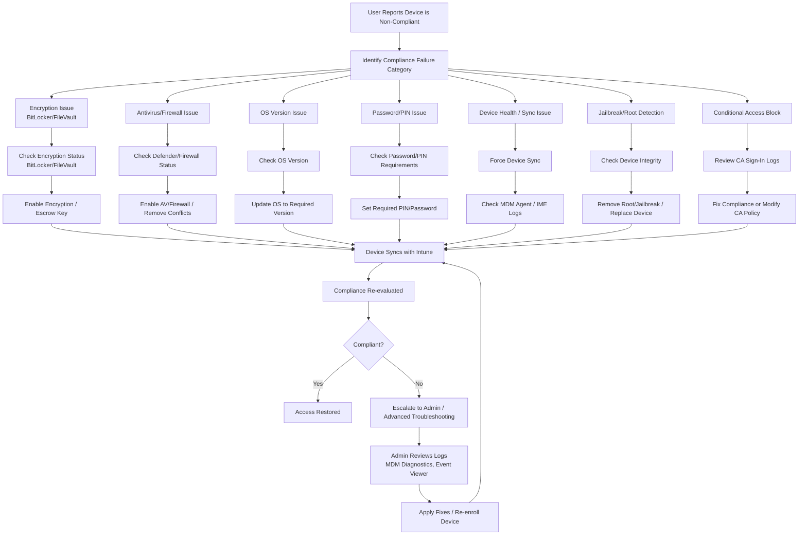

# Microsoft Intune Knowledge Base  
## 16 — Device Compliance Troubleshooting

---

## Overview

Device compliance is a core component of Microsoft Intune’s Zero Trust model. When compliance fails, users may lose access to corporate resources due to Conditional Access enforcement. This document provides a structured troubleshooting guide for resolving compliance issues across Windows, macOS, iOS/iPadOS, and Android devices.

This document covers:
- Compliance evaluation flow  
- Common compliance failures  
- Encryption troubleshooting  
- Antivirus & firewall issues  
- OS version issues  
- Device health & sync issues  
- Conditional Access blocks  
- Logs & diagnostics  
- Best practices  
- **Workflow diagram for compliance troubleshooting**  

---

## 🧩 Workflow Diagram — Device Compliance Troubleshooting Flow



---

# 1. Understanding Compliance Evaluation

Compliance is determined by:
- Compliance policies  
- Device configuration  
- Security posture  
- Conditional Access requirements  

A device must:
- Meet all compliance policy requirements  
- Successfully sync with Intune  
- Report accurate security status  

---

# 2. Common Compliance Failures

## 2.1 Encryption Not Enabled
- BitLocker off (Windows)  
- FileVault off (macOS)  
- Android/iOS encryption disabled  

## 2.2 Antivirus or Firewall Disabled
- Microsoft Defender disabled  
- Third-party AV conflicts  
- Firewall turned off  

## 2.3 OS Version Outdated
- Minimum OS version not met  
- Unsupported OS build  

## 2.4 Password/PIN Requirements Not Met
- Weak password  
- No PIN set  
- Biometric required  

## 2.5 Device Not Syncing
- MDM agent failure  
- Network restrictions  
- IME issues (Windows)  

## 2.6 Jailbreak/Root Detection
- Device compromised  
- Unsupported modifications  

## 2.7 Conditional Access Blocking
- Device not compliant  
- CA requires MDM enrollment  
- App not approved  

---

# 3. Encryption Troubleshooting

## 3.1 Windows (BitLocker)

### Check Status
```powershell
manage-bde -status
```

### Fixes
- Enable BitLocker  
- Ensure TPM is enabled  
- Ensure Secure Boot is enabled  
- Escrow recovery key to Entra ID  

---

## 3.2 macOS (FileVault)

### Check Status
```
System Settings → Privacy & Security → FileVault
```

### Fixes
- Enable FileVault  
- Escrow key to Intune  
- Ensure user is authorized  

---

## 3.3 iOS/Android

### Fixes
- Enable device encryption  
- Ensure passcode/PIN is set  

---

# 4. Antivirus & Firewall Troubleshooting

## 4.1 Windows Defender

### Check Status
```powershell
Get-MpComputerStatus
```

### Fixes
- Enable real-time protection  
- Remove third-party AV  
- Enable firewall  

---

## 4.2 macOS/iOS/Android

- Ensure OS-level firewall is enabled  
- Ensure no conflicting security apps  

---

# 5. OS Version Troubleshooting

### Check OS Version
- Windows: `winver`  
- macOS: About This Mac  
- iOS/Android: Settings → About  

### Fixes
- Update OS  
- Ensure device supports required version  

---

# 6. Password/PIN Troubleshooting

### Requirements
- Minimum length  
- Complexity  
- Biometric (optional)  

### Fixes
- Set required PIN/password  
- Remove weak passwords  

---

# 7. Device Sync Troubleshooting

## 7.1 Force Sync

### Windows
```
Settings → Accounts → Access work or school → Info → Sync
```

### Company Portal
```
Company Portal → Devices → Sync
```

---

## 7.2 Check IME Logs (Windows)

```
C:\ProgramData\Microsoft\IntuneManagementExtension\Logs
```

---

## 7.3 MDM Diagnostic Logs

```powershell
mdmdiagnosticstool.exe -area DeviceEnrollment -cab C:\MDMDiag.cab
```

---

# 8. Jailbreak/Root Troubleshooting

### Fixes
- Remove jailbreak/root  
- Reset device  
- Replace device if compromised  

---

# 9. Conditional Access Troubleshooting

## 9.1 Review Sign-In Logs

```
Entra Admin Center → Monitoring → Sign-in Logs
```

### Common CA Blocks
- Device not compliant  
- Unmanaged device  
- App not approved  
- MFA required  

---

# 10. Verification Checklist

| Task | Completed |
|------|-----------|
| Compliance failure identified | ✔ |
| Issue resolved (encryption/AV/OS/etc.) | ✔ |
| Device synced | ✔ |
| Compliance re-evaluated | ✔ |
| Conditional Access validated | ✔ |
| Access restored | ✔ |

---

# 11. Best Practices

- Enforce encryption on all devices  
- Require Defender AV on Windows  
- Use Conditional Access to enforce compliance  
- Monitor compliance weekly  
- Document remediation workflows  
- Train users on Company Portal sync  
- Use Endpoint Security policies for consistency  

---

# References

- Microsoft Learn — Intune Compliance Policies  
- Microsoft Learn — Conditional Access  
- Microsoft Learn — Device Security Requirements  
```
