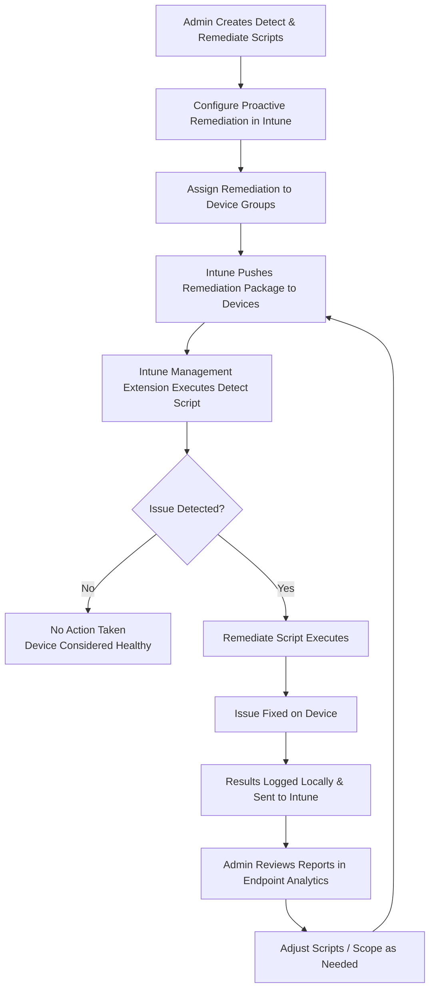

# Microsoft Intune Knowledge Base  
## 18 — PowerShell Scripts and Remediations

---

## Overview

PowerShell scripts and remediation policies in Microsoft Intune allow administrators to automate configuration, fix drift, and enforce desired state across managed Windows devices. Combined with **Proactive Remediations** (part of Endpoint Analytics), they provide a powerful mechanism for detecting issues and automatically correcting them at scale.

This document covers:
- Script deployment via Intune  
- Proactive Remediations (detect/fix)  
- Common remediation scenarios  
- Logging and monitoring  
- Security and execution context  
- Troubleshooting  
- Best practices  
- **Workflow diagram for Intune PowerShell remediations**

---

## 🧩 Workflow Diagram — PowerShell Proactive Remediation Flow



---

# 1. PowerShell Script Deployment in Intune

## 1.1 Standard PowerShell Scripts (Devices → Scripts)

Used for:
- One-time or recurring configuration  
- Simple automation tasks  
- Non–detect/remediate scenarios  

### Create Script

```
Intune Admin Center → Devices → Scripts → Add → Windows 10 and later
```

Configure:
- Script file (.ps1)  
- Run as user or system  
- Run frequency (once / every sign-in)  
- Assign to device or user groups  

---

## 1.2 Proactive Remediations (Endpoint Analytics)

Proactive Remediations use **two scripts**:
- **Detect script** → checks for a condition  
- **Remediate script** → fixes the condition  

### Create Remediation

```
Intune Admin Center → Reports → Endpoint Analytics → Proactive Remediations → Create Script Package
```

Configure:
- Detect script  
- Remediate script  
- Schedule (e.g., every 1 hour, daily)  
- Assign to device groups  

---

# 2. Common PowerShell Remediation Scenarios

## 2.1 Ensure BitLocker is Enabled

### Detect Script (Example)

```powershell
$bitlockerStatus = (Get-BitLockerVolume -MountPoint "C:").VolumeStatus
if ($bitlockerStatus -ne "FullyEncrypted") {
    Write-Output "NonCompliant"
    exit 1
}
Write-Output "Compliant"
exit 0
```

### Remediate Script (Example)

```powershell
Enable-BitLocker -MountPoint "C:" -EncryptionMethod XtsAes256 -UsedSpaceOnly
```

---

## 2.2 Ensure Windows Firewall is Enabled

### Detect Script

```powershell
$profiles = Get-NetFirewallProfile
$nonCompliant = $profiles | Where-Object { $_.Enabled -eq $false }

if ($nonCompliant) {
    Write-Output "NonCompliant"
    exit 1
}
Write-Output "Compliant"
exit 0
```

### Remediate Script

```powershell
Get-NetFirewallProfile | Set-NetFirewallProfile -Enabled True
```

---

## 2.3 Fix Broken Intune Management Extension (IME)

### Detect Script

```powershell
$service = Get-Service -Name "IntuneManagementExtension" -ErrorAction SilentlyContinue
if (-not $service -or $service.Status -ne "Running") {
    Write-Output "NonCompliant"
    exit 1
}
Write-Output "Compliant"
exit 0
```

### Remediate Script

```powershell
Restart-Service -Name "IntuneManagementExtension" -ErrorAction SilentlyContinue
```

---

## 2.4 Enforce Device Naming Convention

### Detect Script

```powershell
$desiredPrefix = "CORP-"
$currentName = $env:COMPUTERNAME

if (-not $currentName.StartsWith($desiredPrefix)) {
    Write-Output "NonCompliant"
    exit 1
}
Write-Output "Compliant"
exit 0
```

### Remediate Script

```powershell
$desiredPrefix = "CORP-"
$currentName = $env:COMPUTERNAME
$newName = $desiredPrefix + $currentName

Rename-Computer -NewName $newName -Force -Restart
```

---

# 3. Logging and Monitoring

## 3.1 Local Logs

Proactive Remediations log to:
```
C:\ProgramData\Microsoft\IntuneManagementExtension\Logs
```

Key logs:
- ScriptExecution.log  
- AgentExecutor.log  

---

## 3.2 Intune / Endpoint Analytics Reports

```
Intune Admin Center → Reports → Endpoint Analytics → Proactive Remediations
```

Shows:
- Success / failure per device  
- Last run time  
- Detection results  

---

# 4. Security and Execution Context

- **Run as system** for machine-level changes  
- **Run as user** for user profile changes  
- Scripts must be **signed** if your environment requires it  
- Avoid storing secrets in scripts; use managed identities or secure APIs  
- Ensure least privilege in remediation logic  

---

# 5. Troubleshooting PowerShell Scripts

## Issue 1 — Script not running

**Causes:**
- IME not installed or not running  
- Device not in assignment group  
- Script syntax error  

**Fix:**
- Check IME service  
- Validate group assignment  
- Test script locally  

---

## Issue 2 — Remediation not applying

**Causes:**
- Detect script not returning non‑zero exit code  
- Remediate script failing silently  

**Fix:**
- Ensure detect script uses `exit 1` for non‑compliance  
- Add verbose logging to remediate script  

---

## Issue 3 — Script causing ESP delays

**Causes:**
- Long-running scripts in ESP  
- Blocking logic in detect/remediate  

**Fix:**
- Keep ESP scripts lightweight  
- Move heavy logic to scheduled remediations  

---

## Issue 4 — Security concerns

**Causes:**
- Scripts running with too much privilege  
- Unsigned scripts in secure environments  

**Fix:**
- Review script permissions  
- Sign scripts where required  

---

# 6. Verification Checklist

| Task | Completed |
|------|-----------|
| Detect script tested locally | ✔ |
| Remediate script tested locally | ✔ |
| Script package created in Intune | ✔ |
| Assigned to correct device groups | ✔ |
| Logs reviewed after first run | ✔ |
| No negative impact on ESP | ✔ |

---

# 7. Best Practices

- Always test scripts on a pilot group first  
- Separate **detect** and **remediate** logic clearly  
- Use consistent exit codes (`0` = compliant, `1` = non‑compliant)  
- Add logging (`Write-Output`, `Write-EventLog`) for traceability  
- Avoid destructive actions in remediations  
- Document each remediation’s purpose, scope, and rollback plan  
- Regularly review Endpoint Analytics reports for remediation health  

---

# References

- Microsoft Learn — Intune PowerShell Scripts  
- Microsoft Learn — Endpoint Analytics Proactive Remediations  
- Microsoft Learn — Intune Management Extension  
```
