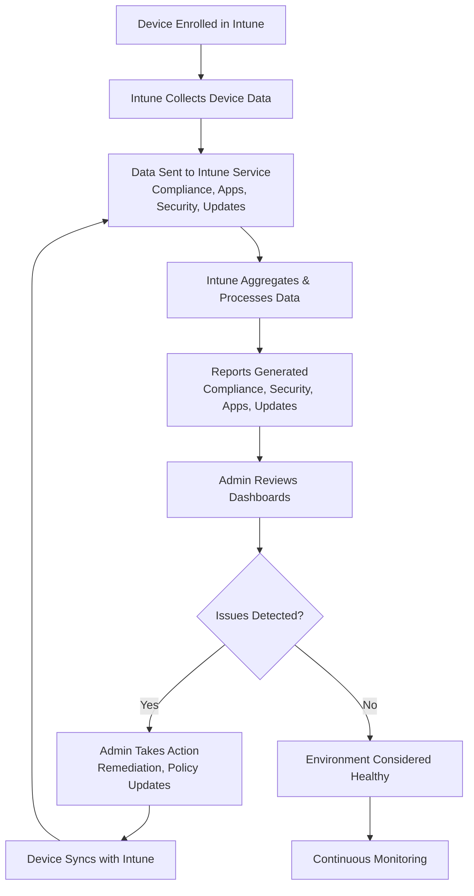

# Microsoft Intune Knowledge Base  
## 19 — Intune Reporting and Monitoring

---

## Overview

Intune provides a comprehensive reporting and monitoring framework that gives administrators visibility into device compliance, configuration, app deployment, security posture, update status, and operational health. These reports are essential for maintaining a secure, well‑managed environment and supporting Zero Trust operations.

This document covers:
- Intune reporting categories  
- Endpoint Analytics  
- Compliance reporting  
- App deployment reporting  
- Security reporting  
- Update reporting  
- Log collection  
- Alerting  
- Troubleshooting  
- Best practices  
- **Workflow diagram for Intune reporting lifecycle**

---

## 🧩 Workflow Diagram — Intune Reporting & Monitoring Lifecycle



---

# 1. Intune Reporting Categories

Intune provides multiple reporting types:

## 1.1 Device Compliance Reports
Shows:
- Compliant devices  
- Non‑compliant devices  
- Compliance reasons  
- Policy failures  

---

## 1.2 Configuration Profile Reports
Shows:
- Profile success/failure  
- Error codes  
- Per‑device status  

---

## 1.3 Application Deployment Reports
Shows:
- Installed apps  
- Failed installations  
- Pending installations  
- App version inventory  

---

## 1.4 Endpoint Security Reports
Shows:
- Antivirus status  
- Firewall status  
- Disk encryption  
- ASR rules  
- Security baselines  

---

## 1.5 Windows Update Reports
Shows:
- Update status  
- Missing updates  
- Failed updates  
- Feature update readiness  

---

## 1.6 Endpoint Analytics
Shows:
- Device performance  
- Boot time  
- App reliability  
- Work-from-anywhere score  
- Remediation insights  

---

# 2. Compliance Reporting

Location:
```
Intune Admin Center → Devices → Monitor → Device Compliance
```

Provides:
- Compliance overview  
- Per‑device compliance  
- Per‑policy compliance  
- Non‑compliance reasons  

---

# 3. Configuration Profile Reporting

Location:
```
Intune Admin Center → Devices → Configuration Profiles → Select Profile → Device Status
```

Shows:
- Success  
- Error  
- Conflict  
- Pending  

---

# 4. Application Deployment Reporting

Location:
```
Intune Admin Center → Apps → Monitor → App Install Status
```

Shows:
- Installed  
- Failed  
- Pending  
- Not applicable  

---

# 5. Endpoint Security Reporting

Location:
```
Intune Admin Center → Endpoint Security → Overview
```

Shows:
- Antivirus  
- Firewall  
- Disk encryption  
- Security baselines  

---

# 6. Windows Update Reporting

Location:
```
Intune Admin Center → Reports → Windows Updates
```

Shows:
- Quality update status  
- Feature update status  
- Safeguard holds  
- Update failures  

---

# 7. Endpoint Analytics

Endpoint Analytics provides deep insights into device performance.

## 7.1 Key Metrics
- Boot score  
- App reliability  
- Device performance score  
- Recommended optimizations  

## 7.2 Proactive Remediations
Used to:
- Detect issues  
- Automatically fix issues  
- Report remediation results  

---

# 8. Log Collection

## 8.1 Windows MDM Diagnostic Logs

```powershell
mdmdiagnosticstool.exe -area DeviceEnrollment -cab C:\MDMDiag.cab
```

## 8.2 Intune Management Extension Logs

```
C:\ProgramData\Microsoft\IntuneManagementExtension\Logs
```

## 8.3 Company Portal Logs

```
%localappdata%\Packages\Microsoft.CompanyPortal_8wekyb3d8bbwe\LocalState\Logs
```

---

# 9. Alerting & Notifications

Intune provides alerts for:
- Non‑compliant devices  
- App installation failures  
- Security baseline failures  
- Update failures  
- Remediation failures  

Admins can configure:
- Email alerts  
- Automated remediation  
- Conditional Access enforcement  

---

# 10. Troubleshooting Reporting Issues

## Issue 1 — Reports not updating

### Causes
- Device not syncing  
- IME not running  
- Network restrictions  

### Fix
- Force sync  
- Restart IME  
- Check network  

---

## Issue 2 — Missing device data

### Causes
- Device unenrolled  
- MDM agent failure  

### Fix
- Re-enroll device  
- Review logs  

---

## Issue 3 — Incorrect compliance status

### Causes
- Policy conflict  
- Device not reporting  

### Fix
- Review compliance policies  
- Sync device  

---

# 11. Verification Checklist

| Task | Completed |
|------|-----------|
| Reports reviewed | ✔ |
| Compliance validated | ✔ |
| App deployment monitored | ✔ |
| Security posture checked | ✔ |
| Update status verified | ✔ |
| Endpoint Analytics reviewed | ✔ |

---

# 12. Best Practices

- Review compliance reports weekly  
- Use Endpoint Analytics for performance insights  
- Monitor app deployment failures daily  
- Use proactive remediations for drift correction  
- Document reporting workflows  
- Use Conditional Access to enforce compliance  
- Monitor update compliance regularly  

---

# References

- Microsoft Learn — Intune Reporting  
- Microsoft Learn — Endpoint Analytics  
- Microsoft Learn — Device Compliance  
- Microsoft Learn — Windows Update Reporting  
```
