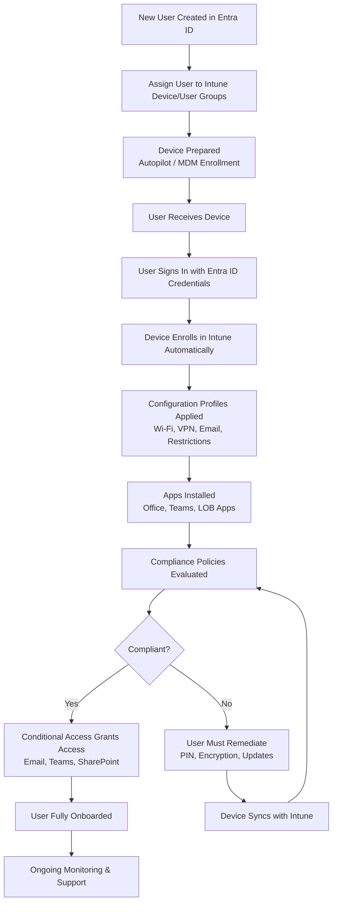

# Microsoft Intune Knowledge Base  
## 20 — User Onboarding with Intune

---

## Overview

User onboarding with Microsoft Intune ensures that new employees receive secure, compliant, and fully configured devices from day one. A well‑designed onboarding workflow reduces IT workload, improves user experience, and enforces Zero Trust principles.

This document covers:
- Onboarding workflow  
- Device assignment  
- Autopilot provisioning  
- Account setup  
- App deployment  
- Compliance enforcement  
- User training  
- Troubleshooting  
- Best practices  
- **Workflow diagram for Intune user onboarding lifecycle**

---

## 🧩 Workflow Diagram — Intune User Onboarding Lifecycle



---

# 1. Onboarding Workflow Overview

A complete onboarding workflow includes:
1. User identity creation  
2. Group assignment  
3. Device provisioning  
4. Enrollment  
5. Configuration  
6. App deployment  
7. Compliance enforcement  
8. Access enablement  
9. User training  

---

# 2. User Identity Creation

## 2.1 Create User in Entra ID

```
Entra Admin Center → Users → New User
```

Assign:
- Username  
- License (Microsoft 365 E3/E5)  
- Intune license  
- Security groups  

---

## 2.2 Assign User to Groups

Groups determine:
- Apps  
- Policies  
- Compliance  
- Autopilot profiles  
- Security baselines  

Use:
- Dynamic groups for automation  
- Static groups for exceptions  

---

# 3. Device Provisioning

## 3.1 Autopilot Provisioning (Recommended)

Autopilot provides:
- Zero‑touch deployment  
- Automatic enrollment  
- Standardized configuration  
- Consistent naming  

### Steps:
1. Register device hardware hash  
2. Assign Autopilot profile  
3. Assign device to user  
4. Ship device to user  

---

## 3.2 Manual Enrollment (Fallback)

Used when:
- Device not Autopilot‑ready  
- BYOD scenarios  

Enrollment via:
- Company Portal  
- MDM enrollment settings  

---

# 4. User Sign-In and Enrollment

## 4.1 First Sign-In

User signs in using:
- Entra ID credentials  
- MFA (if required)  

Device automatically:
- Joins Entra ID  
- Enrolls in Intune  
- Applies Autopilot profile  

---

## 4.2 Enrollment Status Page (ESP)

ESP ensures:
- Required apps installed  
- Required policies applied  
- Device compliant before use  

---

# 5. Configuration Profiles Applied

Profiles include:
- Wi‑Fi  
- VPN  
- Email  
- Certificates  
- Device restrictions  
- Security configurations  

---

# 6. Application Deployment

Apps deployed based on group membership:
- Microsoft 365 Apps  
- Teams  
- OneDrive  
- Edge  
- Line‑of‑Business apps  
- Win32 apps  
- Store apps  

---

# 7. Compliance Enforcement

Compliance policies check:
- Encryption  
- Antivirus  
- Firewall  
- OS version  
- Password/PIN  
- Jailbreak/root detection  

Non‑compliant devices:
- Lose access via Conditional Access  
- Must remediate issues  

---

# 8. Access Enablement

Once compliant, user gains access to:
- Email  
- Teams  
- SharePoint  
- OneDrive  
- Line‑of‑Business apps  
- Internal resources  

---

# 9. User Training

Provide:
- Company Portal usage guide  
- MFA setup instructions  
- Device security expectations  
- App installation instructions  
- Support contact details  

---

# 10. Troubleshooting Onboarding Issues

## Issue 1 — Device not enrolling

### Causes
- Autopilot profile missing  
- MDM authority misconfigured  

### Fix
- Assign profile  
- Check MDM authority  

---

## Issue 2 — Apps not installing

### Causes
- IME not running  
- App assignment missing  

### Fix
- Restart IME  
- Check group assignment  

---

## Issue 3 — Device not compliant

### Causes
- Encryption off  
- Antivirus disabled  

### Fix
- Enable BitLocker  
- Enable Defender  

---

## Issue 4 — Conditional Access blocking access

### Causes
- Device not compliant  
- App not approved  

### Fix
- Review CA logs  
- Use approved apps  

---

# 11. Verification Checklist

| Task | Completed |
|------|-----------|
| User created in Entra ID | ✔ |
| Licenses assigned | ✔ |
| Groups assigned | ✔ |
| Device provisioned | ✔ |
| Device enrolled | ✔ |
| Apps installed | ✔ |
| Compliance achieved | ✔ |
| Access granted | ✔ |
| User trained | ✔ |

---

# 12. Best Practices

- Use Autopilot for all corporate devices  
- Use dynamic groups for automation  
- Require compliant devices via Conditional Access  
- Provide onboarding documentation to users  
- Monitor onboarding success rates  
- Use ESP to enforce required apps  
- Keep onboarding workflow standardized  

---

# References

- Microsoft Learn — Intune Enrollment  
- Microsoft Learn — Windows Autopilot  
- Microsoft Learn — Conditional Access  
- Microsoft Learn — Endpoint Analytics  
```
