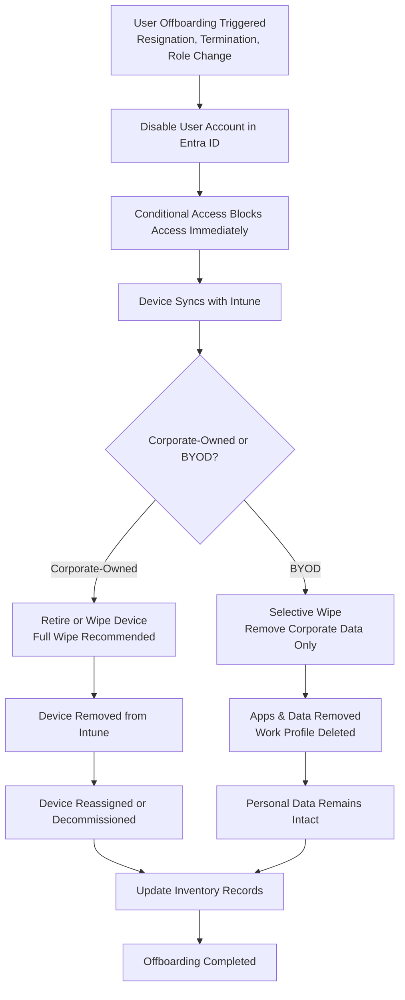

# Microsoft Intune Knowledge Base  
## 21 — User Offboarding and Device Retirement

---

## Overview

User offboarding and device retirement are critical processes in maintaining security, compliance, and operational hygiene within an Intune‑managed environment. Proper offboarding ensures that departing users lose access immediately, corporate data is wiped or retained appropriately, and devices are prepared for reuse or decommissioning.

This document covers:
- Offboarding workflow  
- Account disablement  
- Device retirement  
- Selective vs. full wipe  
- Data protection  
- App removal  
- Conditional Access enforcement  
- Device reassignment  
- Troubleshooting  
- Best practices  
- **Workflow diagram for Intune offboarding lifecycle**

---

## 🧩 Workflow Diagram — Intune User Offboarding & Device Retirement



---

# 1. Offboarding Workflow Overview

A complete offboarding workflow includes:
1. Offboarding trigger (HR, manager, IT)  
2. Disable user identity  
3. Block access via Conditional Access  
4. Remove corporate data  
5. Retire or wipe devices  
6. Update inventory  
7. Reassign or decommission hardware  

---

# 2. Disable User Account in Entra ID

Disabling the user account immediately blocks:
- Email  
- Teams  
- SharePoint  
- OneDrive  
- All cloud apps  
- Device sync  

### Location
```
Entra Admin Center → Users → Select User → Block Sign-In
```

---

# 3. Conditional Access Enforcement

Once the user is blocked:
- All sessions are terminated  
- All apps lose access  
- Devices cannot sync  
- BYOD apps lose access to corporate data  

Conditional Access ensures:
- No unmanaged access  
- No stale sessions  
- No data leakage  

---

# 4. Device Retirement

## 4.1 Corporate-Owned Devices

Options:
- **Retire** → Remove Intune management + corporate data  
- **Wipe** → Full factory reset  
- **Autopilot Reset** → Reset device but keep Autopilot enrollment  

### Recommended:
- **Full wipe** for departing employees  
- **Autopilot Reset** for device reassignment  

### Location
```
Intune Admin Center → Devices → Select Device → Wipe / Retire
```

---

## 4.2 BYOD Devices

Use **Selective Wipe**:
- Removes corporate apps  
- Removes corporate data  
- Removes work profile (Android)  
- Leaves personal data untouched  

### Location
```
Intune Admin Center → Users → Select User → Devices → Selective Wipe
```

---

# 5. Data Protection During Offboarding

## 5.1 Corporate Data Removed
- Email  
- OneDrive  
- SharePoint  
- Teams  
- Managed apps  
- Work profile (Android)  

## 5.2 Personal Data Preserved (BYOD)
- Photos  
- Personal apps  
- Personal files  
- Personal accounts  

---

# 6. App Removal

Intune automatically removes:
- Managed apps  
- Managed configurations  
- Managed certificates  
- Managed VPN/Wi‑Fi profiles  

For BYOD:
- App Protection Policies remove corporate data  
- Selective wipe removes managed apps  

---

# 7. Device Reassignment (Corporate Devices)

After wiping:
1. Device returns to inventory  
2. Autopilot profile reassigned  
3. Device shipped to new user  
4. New user signs in  
5. Device re-enrolls automatically  

---

# 8. Inventory Updates

Update:
- Asset management system  
- Device ownership  
- Device status  
- Assigned user  
- Warranty information  

---

# 9. Troubleshooting Offboarding Issues

## Issue 1 — Device not wiping

### Causes
- Device offline  
- MDM agent not running  

### Fix
- Wait for device to come online  
- Force sync  
- Use Autopilot Reset  

---

## Issue 2 — Corporate data still visible on BYOD

### Causes
- App not managed  
- User removed app manually  

### Fix
- Use selective wipe  
- Require approved apps  

---

## Issue 3 — User still accessing apps

### Causes
- Account not disabled  
- CA policy missing  

### Fix
- Block sign-in  
- Review CA assignments  

---

## Issue 4 — Device not removed from inventory

### Causes
- Retire action not completed  

### Fix
- Manually remove device from Intune  

---

# 10. Verification Checklist

| Task | Completed |
|------|-----------|
| User account disabled | ✔ |
| Conditional Access blocking access | ✔ |
| Corporate data removed | ✔ |
| Device wiped or retired | ✔ |
| Inventory updated | ✔ |
| Device reassigned or decommissioned | ✔ |
| Offboarding documented | ✔ |

---

# 11. Best Practices

- Disable user account before wiping devices  
- Use selective wipe for BYOD  
- Use Autopilot Reset for device reassignment  
- Document offboarding procedures  
- Maintain accurate inventory records  
- Use Conditional Access to enforce immediate access removal  
- Review offboarding logs regularly  

---

# References

- Microsoft Learn — Intune Device Retirement  
- Microsoft Learn — Conditional Access  
- Microsoft Learn — App Protection Policies  
- Microsoft Learn — Autopilot Reset  
```
