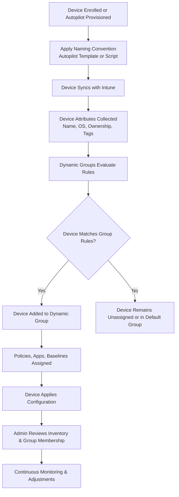

# Microsoft Intune Knowledge Base  
## 22 — Device Naming and Grouping

---

## Overview

Device naming and grouping are foundational elements of Intune device management. Consistent naming conventions improve inventory accuracy, simplify automation, and support lifecycle management. Grouping ensures that devices receive the correct apps, policies, configurations, and security baselines.

This document covers:
- Naming conventions  
- Autopilot naming templates  
- Dynamic device groups  
- User groups vs. device groups  
- Group-based targeting  
- Common grouping strategies  
- Troubleshooting  
- Best practices  
- **Workflow diagram for naming & grouping lifecycle**

---

## 🧩 Workflow Diagram — Device Naming & Grouping Lifecycle



---

# 1. Device Naming Conventions

A consistent naming convention:
- Improves inventory management  
- Supports automation  
- Helps identify device ownership  
- Simplifies troubleshooting  

## 1.1 Common Naming Patterns

### Corporate-owned devices
```
CORP-LAP-<SerialNumber>
CORP-DESK-<AssetTag>
CORP-USER-<Username>
```

### Autopilot devices
```
AP-{SERIAL}
AP-{DEVICEID}
AP-{USERNAME}
```

### BYOD devices
```
BYOD-<Username>-<OS>
```

---

# 2. Autopilot Naming Templates

Autopilot supports automated naming during provisioning.

### Configure Autopilot Naming Template
```
Intune Admin Center → Devices → Windows → Windows Enrollment → Deployment Profiles → Select Profile → Device Name Template
```

### Supported Variables
- `{SERIAL}`  
- `{DEVICEID}`  
- `{RAND:x}` (random number with x digits)  

### Example
```
CORP-{SERIAL}
CORP-{RAND:6}
```

---

# 3. PowerShell-Based Naming (Post‑Enrollment)

For environments requiring custom naming logic, use Intune PowerShell scripts or Proactive Remediations.

### Example Remediation Script

```powershell
$prefix = "CORP-"
$current = $env:COMPUTERNAME

if (-not $current.StartsWith($prefix)) {
    Rename-Computer -NewName "$prefix$current" -Force -Restart
}
```

---

# 4. Device Grouping in Intune

Grouping determines:
- Which apps are installed  
- Which policies apply  
- Which baselines are enforced  
- Which updates are deployed  

Intune supports:
- **Dynamic device groups**  
- **Dynamic user groups**  
- **Static groups**  

---

# 5. Dynamic Device Groups

Dynamic groups automatically add devices based on attributes.

### Example: Windows 11 Devices
```text
(device.deviceOSType -eq "Windows") and (device.deviceOSVersion -startsWith "10.0.22")
```

### Example: Autopilot Devices
```text
(device.devicePhysicalIds -any _ -contains "[ZTDId]")
```

### Example: Corporate-Owned Devices
```text
(device.enrollmentProfileName -eq "CorporateProfile")
```

---

# 6. Dynamic User Groups

Useful for:
- App assignments  
- Licensing  
- Policy targeting  

### Example: All Users in Department
```text
(user.department -eq "Finance")
```

---

# 7. Static Groups

Used for:
- Testing  
- Pilot deployments  
- Exceptions  
- Temporary assignments  

---

# 8. Group-Based Targeting

Groups are used to target:
- Configuration profiles  
- Compliance policies  
- Endpoint security policies  
- App deployments  
- Update rings  
- Autopilot profiles  

### Best Practice
Use **device groups** for device policies  
Use **user groups** for app assignments  

---

# 9. Common Grouping Strategies

## 9.1 By Device Type
- Laptops  
- Desktops  
- Mobile devices  
- Kiosk devices  

## 9.2 By Ownership
- Corporate-owned  
- BYOD  

## 9.3 By Department
- Finance  
- HR  
- IT  
- Sales  

## 9.4 By OS
- Windows  
- macOS  
- iOS  
- Android  

## 9.5 By Compliance State
- Compliant  
- Non‑compliant  

---

# 10. Troubleshooting Naming & Grouping

## Issue 1 — Device not added to dynamic group

### Causes
- Rule mismatch  
- Attribute not yet synced  

### Fix
- Validate rule syntax  
- Wait 5–30 minutes for evaluation  

---

## Issue 2 — Autopilot naming not applied

### Causes
- Profile not assigned  
- Device not in correct group  

### Fix
- Assign correct Autopilot profile  
- Reassign device to correct group  

---

## Issue 3 — Device name incorrect after enrollment

### Causes
- Script failure  
- IME not running  

### Fix
- Review IME logs  
- Re-run remediation script  

---

## Issue 4 — Policies not applying due to grouping

### Causes
- Wrong group targeting  
- Device not in group  

### Fix
- Review group membership  
- Adjust dynamic rules  

---

# 11. Verification Checklist

| Task | Completed |
|------|-----------|
| Naming convention defined | ✔ |
| Autopilot naming template configured | ✔ |
| Dynamic groups created | ✔ |
| Group membership validated | ✔ |
| Policies and apps assigned correctly | ✔ |
| Inventory reviewed | ✔ |

---

# 12. Best Practices

- Use Autopilot naming templates for consistency  
- Use dynamic groups for automation  
- Avoid overly complex dynamic rules  
- Use static groups for pilots only  
- Document naming conventions  
- Review group membership regularly  
- Use remediation scripts for post‑enrollment naming  

---

# References

- Microsoft Learn — Autopilot Deployment Profiles  
- Microsoft Learn — Dynamic Groups  
- Microsoft Learn — Intune Device Management  
```
