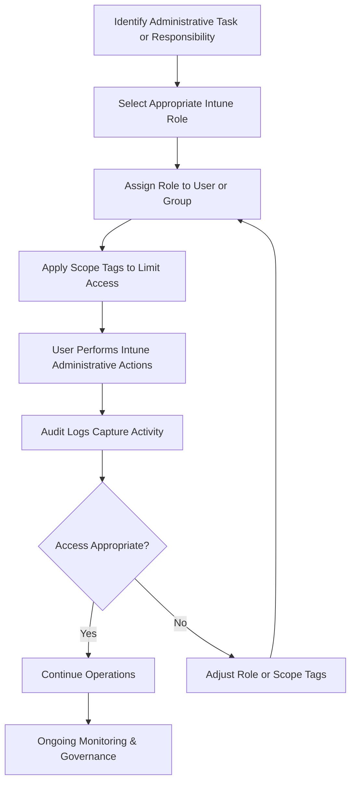

# Microsoft Intune Knowledge Base  
## 23 — Administrative Roles and RBAC

---

## Overview

Role-Based Access Control (RBAC) in Microsoft Intune ensures that administrators have the correct permissions to manage devices, apps, policies, and security configurations without over‑privileging. RBAC is essential for maintaining security, operational integrity, and compliance within an enterprise environment.

This document covers:
- RBAC concepts  
- Built‑in Intune roles  
- Custom roles  
- Scope tags  
- Least‑privilege access  
- Role assignment workflows  
- Troubleshooting  
- Best practices  
- **Workflow diagram for RBAC role assignment lifecycle**

---

## 🧩 Workflow Diagram — Intune RBAC Role Assignment Lifecycle



---

# 1. RBAC Concepts

RBAC ensures:
- Administrators only have the permissions they need  
- Sensitive operations are restricted  
- Delegated administration is possible  
- Compliance and auditability are maintained  

RBAC applies to:
- Intune  
- Microsoft Entra ID  
- Endpoint Security  
- Autopilot  
- Device management  
- App management  

---

# 2. Built‑In Intune Roles

Intune includes several predefined roles.

## 2.1 Intune Administrator
Full access to all Intune features.

## 2.2 Policy and Profile Manager
Can manage:
- Configuration profiles  
- Compliance policies  
- Security baselines  

## 2.3 Application Manager
Can manage:
- App deployment  
- App configuration  
- App protection policies  

## 2.4 Help Desk Operator
Can:
- View device details  
- Perform remote actions (restart, wipe, sync)  
- Cannot modify policies  

## 2.5 Read‑Only Operator
Can view all Intune objects but cannot modify anything.

## 2.6 School Administrator (Education)
Limited to education‑specific device management.

---

# 3. Custom Intune Roles

Custom roles allow granular control over permissions.

### Create Custom Role
```
Intune Admin Center → Tenant Administration → Roles → All Roles → Create
```

Configure:
- Permissions  
- Scope tags  
- Assignments  

### Example Custom Roles
- **Security Operator** → ASR, Defender, Firewall  
- **Autopilot Technician** → Enrollment profiles, device registration  
- **Compliance Auditor** → Read‑only compliance access  

---

# 4. Scope Tags

Scope tags limit what objects an administrator can see or manage.

Used for:
- Multi‑department environments  
- Multi‑tenant MSP environments  
- Delegated administration  

### Examples
- “Finance‑Devices”  
- “HR‑Apps”  
- “APAC‑Region”  

### Configure Scope Tags
```
Intune Admin Center → Tenant Administration → Roles → Scope Tags
```

---

# 5. Role Assignments

Roles can be assigned to:
- Users  
- Azure AD groups  
- Administrative units  

### Assignment Workflow
1. Select role  
2. Assign to user/group  
3. Apply scope tags  
4. Review permissions  
5. Monitor activity  

---

# 6. Least‑Privilege Access

Principles:
- Grant only required permissions  
- Avoid global admin unless necessary  
- Use custom roles for fine‑grained control  
- Review access regularly  
- Remove unused roles  

---

# 7. Administrative Units (Optional)

Administrative units allow:
- Regional administration  
- Department‑specific administration  
- Scoped access to users/devices  

Useful for:
- Large enterprises  
- MSPs  
- Multi‑region organizations  

---

# 8. Auditing and Monitoring

Audit logs track:
- Policy changes  
- App assignments  
- Device actions  
- Role assignments  

### Location
```
Intune Admin Center → Tenant Administration → Audit Logs
```

---

# 9. Troubleshooting RBAC Issues

## Issue 1 — Admin cannot see devices

### Causes
- Missing scope tags  
- Wrong role assignment  

### Fix
- Add correct scope tags  
- Assign correct role  

---

## Issue 2 — Admin cannot modify policies

### Causes
- Read‑only role  
- Insufficient permissions  

### Fix
- Assign Policy and Profile Manager  
- Review custom role permissions  

---

## Issue 3 — Help Desk cannot perform remote actions

### Causes
- Role missing remote action permissions  

### Fix
- Modify custom role  
- Assign Help Desk Operator  

---

## Issue 4 — Over‑privileged admin

### Causes
- Assigned Global Admin unnecessarily  

### Fix
- Replace with least‑privilege Intune role  

---

# 10. Verification Checklist

| Task | Completed |
|------|-----------|
| Roles defined | ✔ |
| Scope tags created | ✔ |
| Role assignments validated | ✔ |
| Least‑privilege enforced | ✔ |
| Audit logs reviewed | ✔ |
| Delegated administration documented | ✔ |

---

# 11. Best Practices

- Use least‑privilege roles  
- Avoid Global Admin for Intune tasks  
- Use scope tags for delegation  
- Review RBAC assignments quarterly  
- Document all role assignments  
- Use custom roles for granular control  
- Monitor audit logs regularly  

---

# References

- Microsoft Learn — Intune RBAC  
- Microsoft Learn — Scope Tags  
- Microsoft Learn — Administrative Units  
```
