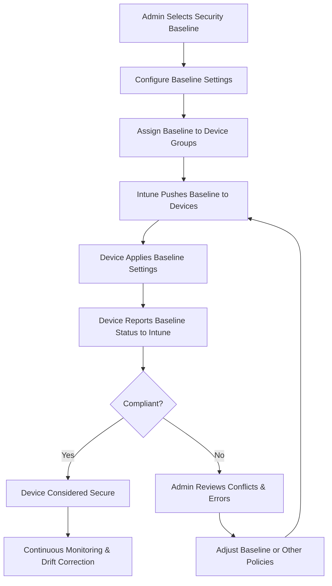

# Microsoft Intune Knowledge Base  
## 24 — Intune Security Baselines

---

## Overview

Intune Security Baselines provide pre‑configured, Microsoft‑recommended security settings for Windows devices, Microsoft Edge, and Microsoft Defender. They simplify security hardening by offering curated configurations aligned with industry best practices and Microsoft’s Zero Trust model.

Security baselines allow administrators to:
- Enforce consistent security posture  
- Reduce configuration complexity  
- Apply hardened settings at scale  
- Monitor baseline compliance  
- Remediate drift automatically  

This document covers:
- Security baseline concepts  
- Available baselines  
- Baseline configuration  
- Policy conflicts  
- Monitoring & reporting  
- Troubleshooting  
- Best practices  
- **Workflow diagram for baseline deployment lifecycle**

---

## 🧩 Workflow Diagram — Intune Security Baseline Deployment Lifecycle



---

# 1. Security Baseline Concepts

Security baselines are:
- Collections of recommended security settings  
- Maintained and updated by Microsoft  
- Designed to enforce secure configurations  
- Applied via Intune configuration profiles  

Baselines reduce:
- Misconfiguration  
- Policy drift  
- Security gaps  
- Administrative overhead  

---

# 2. Available Intune Security Baselines

## 2.1 Windows Security Baseline
Includes:
- Credential Guard  
- BitLocker  
- Firewall  
- Defender Antivirus  
- SmartScreen  
- Attack Surface Reduction (ASR)  
- Device control  

---

## 2.2 Microsoft Defender for Endpoint Baseline
Includes:
- Antivirus configuration  
- EDR settings  
- Cloud protection  
- Tamper protection  

---

## 2.3 Microsoft Edge Baseline
Includes:
- Browser security  
- SmartScreen  
- Password protection  
- Extension control  
- Tracking prevention  

---

## 2.4 Microsoft 365 Apps Baseline
Includes:
- Macro security  
- Protected view  
- Add‑in restrictions  
- Cloud policy enforcement  

---

# 3. Creating and Assigning Security Baselines

### Location
```
Intune Admin Center → Endpoint Security → Security Baselines
```

### Steps
1. Select baseline (Windows, Edge, Defender, M365 Apps)  
2. Create profile  
3. Configure settings  
4. Assign to device groups  
5. Monitor compliance  

---

# 4. Baseline Configuration

Baselines include hundreds of settings. Administrators can:
- Accept defaults  
- Modify individual settings  
- Disable settings that conflict with existing policies  

### Recommendation
Start with defaults → adjust only when necessary.

---

# 5. Policy Conflicts

Conflicts occur when:
- Baseline settings overlap with configuration profiles  
- Multiple baselines enforce different values  
- GPOs conflict with MDM settings (hybrid environments)  

### Conflict Resolution Strategy
1. Identify conflicting setting  
2. Determine authoritative policy  
3. Adjust baseline or remove conflicting profile  
4. Re‑evaluate device compliance  

---

# 6. Monitoring Baseline Compliance

### Location
```
Intune Admin Center → Endpoint Security → Security Baselines → Select Baseline → Reports
```

Reports show:
- Compliant devices  
- Non‑compliant devices  
- Error codes  
- Conflict details  

---

# 7. Troubleshooting Security Baselines

## Issue 1 — Baseline not applying

### Causes
- Device not syncing  
- Baseline not assigned  
- Policy conflict  

### Fix
- Force sync  
- Validate group assignment  
- Review conflict report  

---

## Issue 2 — Device shows “Error”

### Causes
- Unsupported OS version  
- Missing dependencies  
- Incorrect configuration  

### Fix
- Update OS  
- Review baseline documentation  
- Adjust settings  

---

## Issue 3 — Baseline conflicts with GPO

### Causes
- Hybrid environment  
- GPO overrides MDM  

### Fix
- Remove legacy GPO  
- Move device to cloud‑only management  

---

## Issue 4 — ASR rules breaking applications

### Causes
- ASR too restrictive  

### Fix
- Exclude specific ASR rules  
- Test in pilot group  

---

# 8. Verification Checklist

| Task | Completed |
|------|-----------|
| Baseline selected | ✔ |
| Profile created | ✔ |
| Settings configured | ✔ |
| Assigned to correct groups | ✔ |
| Compliance monitored | ✔ |
| Conflicts resolved | ✔ |
| Drift corrected | ✔ |

---

# 9. Best Practices

- Use pilot groups before full deployment  
- Avoid modifying too many baseline settings  
- Use baselines instead of custom profiles when possible  
- Review baseline updates quarterly  
- Document baseline changes  
- Monitor baseline compliance weekly  
- Remove legacy GPOs to avoid conflicts  

---

# References

- Microsoft Learn — Intune Security Baselines  
- Microsoft Learn — Windows Security Baseline  
- Microsoft Learn — Microsoft Edge Baseline  
- Microsoft Learn — Defender for Endpoint Baseline  
```
