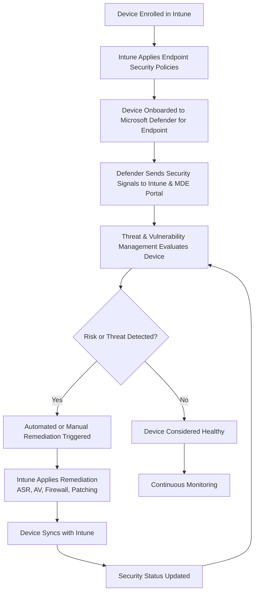

# Microsoft Intune Knowledge Base  
## 25 — Microsoft Defender and Intune Integration

---

## Overview

Microsoft Defender integrates deeply with Intune to provide unified endpoint security across Windows, macOS, iOS, Android, and Linux. This integration enables real‑time threat protection, vulnerability management, automated remediation, and policy enforcement through a single management plane.

This document covers:
- Defender + Intune integration architecture  
- Onboarding devices to Defender  
- Security policy management  
- Threat & vulnerability management  
- Compliance and Conditional Access  
- Automated remediation  
- Reporting  
- Troubleshooting  
- Best practices  
- **Workflow diagram for Defender + Intune integration lifecycle**

---

## 🧩 Workflow Diagram — Defender + Intune Integration Lifecycle



---

# 1. Defender + Intune Integration Architecture

Integration provides:
- Unified security policy management  
- Real‑time threat detection  
- Automated remediation  
- Device risk scoring  
- Conditional Access enforcement  
- Cross‑platform protection  

Components involved:
- Microsoft Intune  
- Microsoft Defender for Endpoint (MDE)  
- Entra ID  
- Endpoint Security policies  
- Threat & Vulnerability Management (TVM)  

---

# 2. Onboarding Devices to Microsoft Defender

## 2.1 Windows Devices

Onboard via:
- Intune Endpoint Security → Microsoft Defender for Endpoint  
- Security Baselines  
- Configuration Profiles  
- Group Policy (hybrid)  

## 2.2 macOS Devices

Onboard via:
- Intune MDE onboarding package  
- Mobile Device Management (MDM) profile  
- Defender for Endpoint agent  

## 2.3 iOS/Android Devices

Onboard via:
- Microsoft Defender app  
- App Protection Policies (MAM)  
- MDM enrollment (optional)  

## 2.4 Linux Devices

Onboard via:
- Defender agent  
- Manual or scripted deployment  

---

# 3. Security Policy Management via Intune

Intune manages Defender security settings through:

## 3.1 Antivirus Policies
- Real‑time protection  
- Cloud protection  
- Scan schedules  
- Exclusions  

## 3.2 Firewall Policies
- Enable/disable firewall  
- Inbound/outbound rules  
- Logging  

## 3.3 Attack Surface Reduction (ASR)
- Block executable content  
- Block credential theft  
- Block Office macro abuse  
- Controlled folder access  

## 3.4 Endpoint Detection & Response (EDR)
- Sensor configuration  
- Tamper protection  
- Automated investigation  

---

# 4. Threat & Vulnerability Management (TVM)

TVM provides:
- Software inventory  
- Vulnerability detection  
- Misconfiguration detection  
- Security recommendations  
- Exposure scoring  

Intune can automatically:
- Apply recommended security settings  
- Deploy patches  
- Trigger remediation scripts  

---

# 5. Device Compliance & Conditional Access

Defender integrates with Intune compliance policies to enforce Zero Trust.

## 5.1 Device Risk Score

Risk levels:
- **Low**  
- **Medium**  
- **High**  

Conditional Access can block access if:
- Device risk > allowed threshold  
- Device not onboarded to Defender  
- Device not compliant  

---

# 6. Automated Remediation

Defender + Intune can automatically remediate:
- Malware infections  
- Vulnerabilities  
- Misconfigurations  
- Outdated software  
- Disabled security controls  

Methods:
- Proactive Remediations  
- Endpoint Security policies  
- Defender automated investigation  
- App updates  
- OS updates  

---

# 7. Reporting & Monitoring

## 7.1 Defender Security Reports

Shows:
- Threat detections  
- Active incidents  
- Device risk levels  
- Exposure score  
- Vulnerability trends  

## 7.2 Intune Security Reports

Shows:
- Antivirus status  
- Firewall status  
- Disk encryption  
- ASR rule compliance  
- Security baseline compliance  

---

# 8. Troubleshooting Defender + Intune Integration

## Issue 1 — Device not showing in Defender portal

### Causes
- Onboarding failed  
- MDE agent not running  

### Fix
- Re-run onboarding package  
- Restart MDE services  

---

## Issue 2 — ASR rules breaking applications

### Causes
- ASR too restrictive  

### Fix
- Exclude specific ASR rules  
- Test in pilot group  

---

## Issue 3 — Device risk not updating

### Causes
- Device not syncing  
- Defender sensor disabled  

### Fix
- Force sync  
- Re-enable sensor  

---

## Issue 4 — Conditional Access blocking access unexpectedly

### Causes
- High device risk  
- Compliance failure  

### Fix
- Review Defender risk report  
- Remediate issues  

---

# 9. Verification Checklist

| Task | Completed |
|------|-----------|
| Devices onboarded to Defender | ✔ |
| Endpoint Security policies applied | ✔ |
| ASR rules configured | ✔ |
| Device risk integrated with CA | ✔ |
| TVM recommendations reviewed | ✔ |
| Automated remediation enabled | ✔ |
| Security reports monitored | ✔ |

---

# 10. Best Practices

- Onboard all devices to Defender  
- Use ASR rules to block common attack vectors  
- Enable tamper protection  
- Use Conditional Access to enforce device risk  
- Review TVM recommendations weekly  
- Use Proactive Remediations for drift correction  
- Deploy Defender via Autopilot for consistency  
- Monitor Defender incidents daily  

---

# References

- Microsoft Learn — Microsoft Defender for Endpoint  
- Microsoft Learn — Intune Endpoint Security  
- Microsoft Learn — Threat & Vulnerability Management  
- Microsoft Learn — Conditional Access  
```
