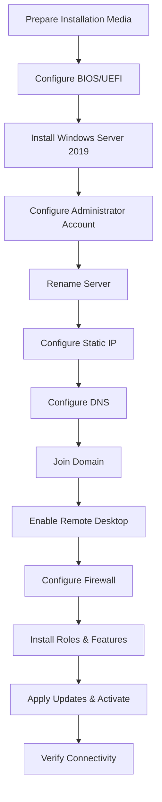

# Enterprise Windows Server Administration Knowledge Base  
## 01 — Server Installation and Initial Configuration (Windows Server 2019)

---

## Overview

Windows Server 2019 installation and initial configuration form the foundation of enterprise infrastructure. Proper setup ensures secure networking, domain integration, remote administration, and readiness for roles such as AD DS, DNS, DHCP, File Services, Hyper‑V, and WSUS.

This document provides a complete, step‑by‑step deployment workflow for a new Windows Server 2019 system.

---

## Objectives

By the end of this guide, the server will have:

- Windows Server 2019 installed  
- Correct hostname  
- Static IP address  
- DNS configured  
- Domain membership established  
- Remote Desktop enabled  
- Firewall configured  
- Required roles installed  
- Windows activated  
- Updates applied  
- Network connectivity verified  

---

## Environment Example

| Component | Value |
|----------|--------|
| OS | Windows Server 2019 Standard |
| Deployment | Physical / Virtual |
| Hypervisor | Hyper‑V / VMware |
| Domain | corp.local |
| Server IP | 192.168.10.20 |
| DNS Server | 192.168.10.10 |

---

## Prerequisites

- Windows Server 2019 ISO  
- Valid product key  
- Administrator credentials  
- Network information  
- Domain join account  
- DNS server address  
- Internet connectivity (optional)  

---

## 🧩 Installation Workflow Diagram



---

# Step 1 — Prepare Installation Media

Use tools such as:
- Rufus  
- Ventoy  
- Windows USB/DVD Tool  

Ensure ISO integrity before deployment.

---

# Step 2 — Configure BIOS/UEFI

Typical keys: **F2, F10, F12, DEL**

Configure:
- Boot Mode → UEFI  
- Secure Boot → Enabled  
- Boot Order → USB/DVD first  
- Virtualization → Enabled  

---

# Step 3 — Install Windows Server 2019

1. Boot from installation media  
2. Select language, time, keyboard  
3. Choose **Install Now**  
4. Select edition (Standard / Datacenter)  
5. Accept license  
6. Choose **Custom Install**  
7. Select disk  
8. Install  

---

# Step 4 — Configure Initial Settings

Set Administrator password.

Log in and review:
- Computer Name  
- Ethernet  
- Windows Update  
- Remote Desktop  

---

# Step 5 — Rename the Server

### GUI
```
Server Manager → Local Server → Computer Name → Change
```

### PowerShell
```powershell
Rename-Computer -NewName "SRV-DC01" -Restart
```

---

# Step 6 — Configure Static IP Address

### GUI
```
Network Connections → Ethernet → IPv4 Properties
```

### PowerShell
```powershell
New-NetIPAddress -InterfaceAlias "Ethernet" -IPAddress 192.168.10.20 -PrefixLength 24 -DefaultGateway 192.168.10.1
```

---

# Step 7 — Configure DNS

### PowerShell
```powershell
Set-DnsClientServerAddress -InterfaceAlias "Ethernet" -ServerAddresses 192.168.10.10,8.8.8.8
```

Verify:
```powershell
Get-DnsClientServerAddress
```

---

# Step 8 — Join Server to Domain

### GUI
```
System Properties → Change → Domain → corp.local
```

### PowerShell
```powershell
Add-Computer -DomainName "corp.local" -Credential corp\Administrator -Restart
```

---

# Step 9 — Enable Remote Desktop

### PowerShell
```powershell
Set-ItemProperty -Path 'HKLM:\System\CurrentControlSet\Control\Terminal Server' -Name 'fDenyTSConnections' -Value 0
Enable-NetFirewallRule -DisplayGroup "Remote Desktop"
```

---

# Step 10 — Configure Windows Firewall

Check profiles:
```powershell
Get-NetFirewallProfile
```

Check RDP rules:
```powershell
Get-NetFirewallRule -DisplayGroup "Remote Desktop"
```

---

# Step 11 — Install Roles and Features

### Server Manager
```
Manage → Add Roles and Features
```

### PowerShell Examples
```powershell
Install-WindowsFeature AD-Domain-Services -IncludeManagementTools
Install-WindowsFeature DNS -IncludeManagementTools
Install-WindowsFeature DHCP -IncludeManagementTools
```

---

# Step 12 — Configure Windows Updates

### PowerShell (PSWindowsUpdate)
```powershell
Install-WindowsUpdate -AcceptAll -AutoReboot
```

---

# Step 13 — Activate Windows Server

```cmd
slmgr /ipk XXXXX-XXXXX-XXXXX-XXXXX-XXXXX
slmgr /ato
slmgr /xpr
```

---

# Step 14 — Verify Network Connectivity

```cmd
ipconfig /all
ping 192.168.10.1
nslookup corp.local
ping 8.8.8.8
ping DC01.corp.local
```

---

# Step 15 — PowerShell Health Check

```powershell
Write-Host "=== Server Health Check ==="
hostname
Get-NetIPConfiguration
(Get-WmiObject Win32_ComputerSystem).Domain
cscript C:\Windows\System32\slmgr.vbs /xpr
Get-WindowsFeature | Where-Object {$_.InstallState -eq 'Installed'} | Select DisplayName
```

---

## Verification Checklist

- Server boots normally  
- Hostname correct  
- Static IP assigned  
- DNS resolves internal names  
- Domain join successful  
- RDP works  
- Roles installed  
- Windows activated  
- Updates applied  
- No critical errors in Event Viewer  

---

## Common Issues & Fixes

| Issue | Cause | Fix |
|-------|-------|-----|
| Cannot join domain | DNS wrong | Point DNS to DC |
| RDP fails | Firewall | Enable RDP rules |
| Activation fails | Invalid key | Verify licensing |
| No network | Wrong gateway | Reconfigure IPv4 |
| Role install fails | Missing prerequisites | Install required features |

---

## Security Best Practices

- Strong admin passwords  
- Enable Windows Defender  
- Restrict RDP access  
- Apply updates before production  
- Enable auditing  
- Use least privilege  
- Secure recovery info  
- Perform initial backup  

---

## Escalation Criteria

Escalate if:
- Hardware installation fails  
- RAID/storage errors  
- Domain join fails after DNS verification  
- Activation cannot complete  
- Hypervisor issues  
- Critical Event Viewer errors  
- Suspected network infrastructure issues  

---

## References

- Microsoft Learn — Install Windows Server  
- Microsoft Learn — Server Manager  
- Microsoft Learn — PowerShell Networking  
- Microsoft Learn — AD DS  
- Microsoft Learn — Windows Activation  
```
