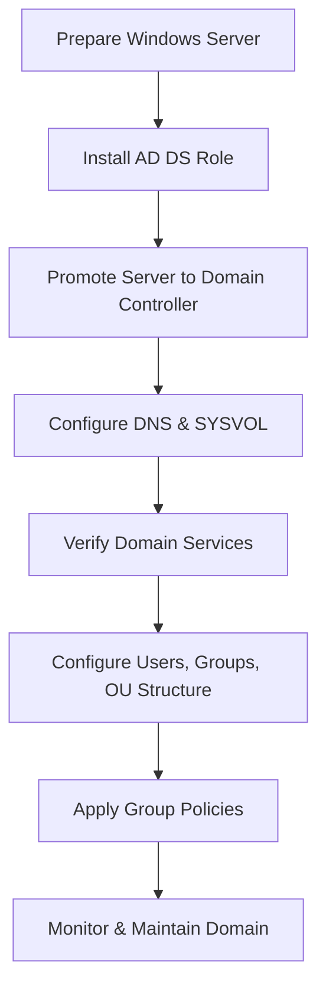

# Enterprise Windows Server Administration Knowledge Base  
## 02 — Active Directory Domain Services (AD DS)

---

## Overview

Active Directory Domain Services (AD DS) is the core identity and authentication service in Windows Server environments. It provides centralized management of users, computers, groups, policies, and security. Proper deployment of AD DS ensures secure authentication, authorization, and directory-based administration across the enterprise.

This document covers:
- AD DS concepts  
- Domain controller requirements  
- Forest and domain design  
- Installing AD DS  
- Promoting a server to a domain controller  
- DNS integration  
- SYSVOL replication  
- FSMO roles  
- Verification  
- Troubleshooting  
- Best practices  

---

## 🧩 Workflow Diagram — AD DS Deployment Lifecycle



---

# 1. AD DS Concepts

Active Directory provides:
- Centralized authentication  
- Directory-based identity management  
- Group Policy enforcement  
- Secure Kerberos-based authentication  
- DNS-integrated naming  

Key components:
- Domain  
- Forest  
- Organizational Units (OUs)  
- Domain Controllers (DCs)  
- Global Catalog  
- SYSVOL  
- FSMO roles  

---

# 2. Domain Controller Requirements

Minimum requirements:
- Windows Server 2019 or later  
- Static IP address  
- Correct DNS configuration  
- NTFS file system  
- Reliable network connectivity  
- Adequate CPU/RAM (4–8 GB minimum)  

Recommended:
- Two domain controllers for redundancy  
- Separate DCs for branch offices  
- Dedicated DC hardware (no additional roles)  

---

# 3. Forest & Domain Design

### Forest  
Top-level security boundary.

### Domain  
Administrative boundary inside the forest.

### OU Structure  
Recommended:
```
corp.local
 ├── Corp Users
 ├── Corp Computers
 ├── Servers
 ├── Workstations
 ├── Service Accounts
 └── Groups
```

Avoid:
- Nesting OUs too deeply  
- Placing GPOs at the domain root  

---

# 4. Install AD DS Role

## GUI Method

```
Server Manager → Manage → Add Roles and Features
→ Active Directory Domain Services
→ Include Management Tools
```

---

## PowerShell Method

```powershell
Install-WindowsFeature AD-Domain-Services -IncludeManagementTools
```

---

# 5. Promote Server to Domain Controller

## GUI Method

```
Server Manager → Notifications → Promote this server to a domain controller
```

Choose:
- Add a new forest  
- Add a new domain  
- Add a domain controller  

Configure:
- Domain name (corp.local)  
- Directory Services Restore Mode (DSRM) password  
- DNS options  
- NetBIOS name  
- Paths (NTDS, SYSVOL)  

---

## PowerShell Method

### New Forest

```powershell
Install-ADDSForest -DomainName "corp.local" -SafeModeAdministratorPassword (ConvertTo-SecureString "Password123!" -AsPlainText -Force)
```

### Add Domain Controller

```powershell
Install-ADDSDomainController -DomainName "corp.local" -Credential (Get-Credential)
```

---

# 6. DNS Integration

AD DS requires DNS.

Verify DNS installation:

```powershell
Get-WindowsFeature DNS
```

Check DNS records:

```powershell
nslookup corp.local
```

Ensure:
- SRV records exist  
- Forward lookup zone created  
- Reverse lookup zone configured  

---

# 7. SYSVOL Replication

Windows Server 2019 uses **DFS Replication**.

Check replication status:

```powershell
dfsrdiag ReplicationState
```

Common folders:
- `C:\Windows\SYSVOL\domain\Policies`
- `C:\Windows\SYSVOL\domain\Scripts`

---

# 8. FSMO Roles

Five FSMO roles:

| Role | Purpose |
|------|---------|
| Schema Master | Schema updates |
| Domain Naming Master | Domain additions/removals |
| RID Master | SID generation |
| PDC Emulator | Time sync, password changes |
| Infrastructure Master | Cross-domain references |

Check FSMO roles:

```powershell
netdom query fsmo
```

---

# 9. Verification

Confirm:
- Domain controller is reachable  
- DNS resolves correctly  
- SYSVOL is shared  
- Replication is healthy  
- Users can authenticate  
- Group Policy applies  

Commands:

```powershell
dcdiag /v
repadmin /replsummary
gpresult /r
```

---

# 10. Troubleshooting

| Issue | Cause | Fix |
|-------|-------|-----|
| Domain join fails | DNS misconfigured | Point DNS to DC |
| SYSVOL not replicating | DFSR error | Restart DFSR service |
| GPO not applying | OU misplacement | Move device to correct OU |
| Kerberos failures | Time skew | Sync time with PDC |
| DC promotion fails | Missing prerequisites | Install AD DS role |

---

# 11. Best Practices

- Deploy at least **two domain controllers**  
- Use **dedicated DCs** (no extra roles)  
- Enable **time synchronization**  
- Use **strong DSRM password**  
- Monitor replication regularly  
- Backup AD DS and SYSVOL  
- Use OU-based GPO targeting  
- Avoid placing GPOs at domain root  
- Document domain architecture  

---

# References

- Microsoft Learn — AD DS  
- Microsoft Learn — DNS Integration  
- Microsoft Learn — Group Policy  
- Microsoft Learn — DFS Replication  
```

