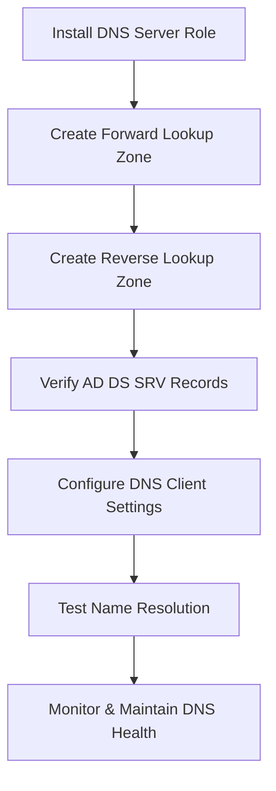

# Enterprise Windows Server Administration Knowledge Base  
## 03 — DNS Server Configuration (Windows Server 2019)

---

## Overview

The Domain Name System (DNS) is a core service in Windows Server environments and is tightly integrated with Active Directory Domain Services (AD DS). DNS provides name resolution for domain controllers, clients, servers, and applications. A properly configured DNS server ensures reliable authentication, domain joins, Group Policy processing, and service discovery.

This document covers:
- DNS concepts  
- Installing DNS Server  
- Forward lookup zones  
- Reverse lookup zones  
- SRV records for AD DS  
- DNS replication  
- DNS client configuration  
- Testing & verification  
- Troubleshooting  
- Best practices  

---

## 🧩 Workflow Diagram — DNS Server Deployment Lifecycle



---

# 1. DNS Concepts

DNS provides:
- Hostname → IP resolution  
- Service discovery (SRV records)  
- AD DS integration  
- Forward and reverse lookups  

Key components:
- Zones  
- Records  
- Replication  
- Forwarders  
- Root hints  

---

# 2. Install DNS Server Role

DNS is installed automatically when promoting a server to a domain controller.  
To install manually:

## GUI Method

```
Server Manager → Manage → Add Roles and Features
→ DNS Server → Include Management Tools
```

## PowerShell Method

```powershell
Install-WindowsFeature DNS -IncludeManagementTools
```

Verify installation:

```powershell
Get-WindowsFeature DNS
```

---

# 3. Create Forward Lookup Zone

Forward lookup zones resolve hostnames to IP addresses.

## GUI Method

```
DNS Manager → Server → Forward Lookup Zones → New Zone
```

Choose:
- Primary zone  
- Store in Active Directory  
- Replicate to all DNS servers in domain  
- Zone name: corp.local  

## PowerShell Method

```powershell
Add-DnsServerPrimaryZone -Name "corp.local" -ReplicationScope "Domain"
```

---

# 4. Create Reverse Lookup Zone

Reverse lookup zones resolve IP addresses to hostnames.

## GUI Method

```
DNS Manager → Reverse Lookup Zones → New Zone
```

Example:
- Network ID: 192.168.10  
- Zone name: 10.168.192.in-addr.arpa  

## PowerShell Method

```powershell
Add-DnsServerPrimaryZone -NetworkId "192.168.10.0/24" -ReplicationScope "Domain"
```

---

# 5. Verify AD DS SRV Records

Active Directory requires SRV records for:
- LDAP  
- Kerberos  
- Global Catalog  

Check SRV records:

```powershell
Get-DnsServerResourceRecord -ZoneName "corp.local" | Where-Object {$_.RecordType -eq "SRV"}
```

Expected folders:
```
_corp
  _tcp
  _udp
  _sites
  _msdcs
```

---

# 6. Configure DNS Client Settings

Clients must point to internal DNS servers.

### PowerShell

```powershell
Set-DnsClientServerAddress -InterfaceAlias "Ethernet" -ServerAddresses 192.168.10.10
```

Verify:

```powershell
Get-DnsClientServerAddress
```

---

# 7. Configure Forwarders

Forwarders improve external name resolution.

### GUI

```
DNS Manager → Server → Properties → Forwarders
```

Recommended forwarders:
- 8.8.8.8 (Google)
- 1.1.1.1 (Cloudflare)

### PowerShell

```powershell
Add-DnsServerForwarder -IPAddress 8.8.8.8
```

---

# 8. DNS Replication

DNS zones stored in AD replicate automatically.

Check replication:

```powershell
repadmin /replsummary
```

Check DNS zone replication:

```powershell
Get-DnsServerZone -ComputerName DC01
```

---

# 9. Testing & Verification

### Test hostname resolution

```powershell
Resolve-DnsName DC01.corp.local
```

### Test reverse lookup

```powershell
nslookup 192.168.10.10
```

### Test SRV records

```powershell
nslookup -type=SRV _ldap._tcp.corp.local
```

### Test AD DS functionality

```powershell
dcdiag /test:dns
```

---

# 10. Troubleshooting

| Issue | Cause | Fix |
|-------|-------|-----|
| Domain join fails | Wrong DNS server | Point DNS to domain controller |
| SRV records missing | AD DS not installed | Promote server to DC |
| Reverse lookup fails | Missing reverse zone | Create reverse lookup zone |
| Slow name resolution | No forwarders | Add forwarders |
| GPO not applying | DNS misconfigured | Verify SRV records |

---

# 11. Best Practices

- Use AD‑integrated zones  
- Deploy at least two DNS servers  
- Avoid using external DNS on domain clients  
- Create reverse lookup zones for all subnets  
- Monitor DNS replication  
- Use forwarders instead of root hints  
- Document DNS architecture  
- Backup DNS configuration regularly  

---

# References

- Microsoft Learn — DNS Server  
- Microsoft Learn — AD DS Integration  
- Microsoft Learn — DNS Troubleshooting  
```
