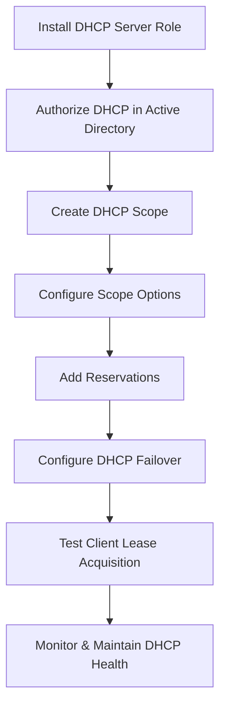

# Enterprise Windows Server Administration Knowledge Base  
## 04 — DHCP Server Configuration (Windows Server 2019)

---

## Overview

Dynamic Host Configuration Protocol (DHCP) automatically assigns IP addresses and network configuration settings to clients. A properly configured DHCP server ensures reliable network connectivity, reduces manual configuration errors, and supports scalable enterprise deployments.

This document covers:
- DHCP concepts  
- Installing DHCP Server  
- Creating scopes  
- Configuring options  
- Reservations  
- DHCP failover  
- Authorization in Active Directory  
- Testing & verification  
- Troubleshooting  
- Best practices  

---

## 🧩 Workflow Diagram — DHCP Deployment Lifecycle



---

# 1. DHCP Concepts

DHCP provides:
- Automatic IP address assignment  
- Subnet mask  
- Default gateway  
- DNS servers  
- Lease duration  
- Reservations for static devices  

Key components:
- DHCP Server  
- Scopes  
- Options  
- Reservations  
- Policies  
- Failover  

---

# 2. Install DHCP Server Role

## GUI Method

```
Server Manager → Manage → Add Roles and Features
→ DHCP Server → Include Management Tools
```

## PowerShell Method

```powershell
Install-WindowsFeature DHCP -IncludeManagementTools
```

Verify installation:

```powershell
Get-WindowsFeature DHCP
```

---

# 3. Authorize DHCP in Active Directory

Domain controllers require authorization before leasing IP addresses.

## GUI Method

```
DHCP Manager → Server → Right-click → Authorize
```

## PowerShell Method

```powershell
Add-DhcpServerInDC -DnsName "SRV-DC01.corp.local" -IpAddress 192.168.10.20
```

Verify:

```powershell
Get-DhcpServerInDC
```

---

# 4. Create DHCP Scope

A scope defines the IP range for clients.

## Example Scope

| Setting | Value |
|--------|--------|
| Scope Name | CorpLAN |
| Subnet | 192.168.10.0 |
| Range | 192.168.10.50 – 192.168.10.200 |
| Mask | 255.255.255.0 |
| Gateway | 192.168.10.1 |
| DNS | 192.168.10.10 |

## GUI Method

```
DHCP Manager → IPv4 → New Scope
```

## PowerShell Method

```powershell
Add-DhcpServerv4Scope -Name "CorpLAN" -StartRange 192.168.10.50 -EndRange 192.168.10.200 -SubnetMask 255.255.255.0
```

---

# 5. Configure DHCP Options

Common options:
- **003** — Router (Default Gateway)  
- **006** — DNS Servers  
- **015** — DNS Domain Name  
- **044/045** — WINS (legacy)  

## PowerShell Example

```powershell
Set-DhcpServerv4OptionValue -ScopeId 192.168.10.0 -Router 192.168.10.1 -DnsServer 192.168.10.10 -DnsDomain corp.local
```

---

# 6. Add DHCP Reservations

Reservations ensure specific devices always receive the same IP.

## GUI Method

```
DHCP Manager → Scope → Reservations → New Reservation
```

## PowerShell Method

```powershell
Add-DhcpServerv4Reservation -ScopeId 192.168.10.0 -IPAddress 192.168.10.25 -ClientId "00-11-22-33-44-55" -Description "File Server"
```

---

# 7. DHCP Policies (Optional)

Policies allow conditional assignment based on:
- MAC address  
- Vendor class  
- User class  
- Device type  

Example use cases:
- Assign different DNS servers to VoIP phones  
- Assign longer leases to servers  

---

# 8. Configure DHCP Failover

DHCP failover provides redundancy.

Modes:
- **Load Balance** (recommended)  
- **Hot Standby**  

## PowerShell Example

```powershell
Add-DhcpServerv4Failover -Name "CorpLAN-Failover" -ScopeId 192.168.10.0 -PartnerServer "SRV-DC02.corp.local" -Mode LoadBalance -LoadBalancePercent 50
```

Verify:

```powershell
Get-DhcpServerv4Failover
```

---

# 9. Testing & Verification

### Test client lease

```powershell
ipconfig /release
ipconfig /renew
```

### View active leases

```powershell
Get-DhcpServerv4Lease -ScopeId 192.168.10.0
```

### Test DNS resolution

```powershell
nslookup DC01.corp.local
```

### Validate DHCP health

```powershell
Get-DhcpServerv4Scope
Get-DhcpServerInDC
```

---

# 10. Troubleshooting

| Issue | Cause | Fix |
|-------|-------|-----|
| Clients not receiving IP | DHCP not authorized | Authorize DHCP in AD |
| Wrong IP range | Incorrect scope | Reconfigure scope |
| DNS issues | Wrong option 006 | Set correct DNS server |
| Duplicate IPs | No reservations | Add reservations |
| Failover not working | Partner unreachable | Check replication & network |

---

# 11. Best Practices

- Use AD‑integrated DHCP authorization  
- Create separate scopes for each subnet  
- Use reservations for servers and printers  
- Configure DHCP failover for redundancy  
- Avoid overlapping IP ranges  
- Document all scopes and reservations  
- Monitor DHCP logs regularly  
- Backup DHCP configuration  

---

# References

- Microsoft Learn — DHCP Server  
- Microsoft Learn — DHCP Failover  
- Microsoft Learn — IP Address Management  
```
