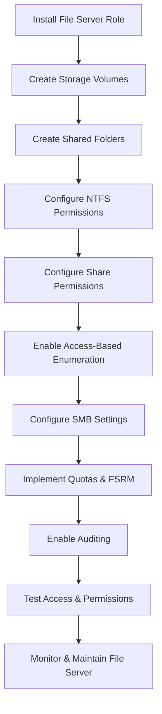

# Enterprise Windows Server Administration Knowledge Base  
## 05 — File Server Configuration (Windows Server 2019)

---

## Overview

Windows Server 2019 provides robust file services for storing, sharing, and securing enterprise data. A properly configured file server ensures reliable access, controlled permissions, auditing, and integration with Active Directory. This document covers the full lifecycle of deploying and managing a Windows file server.

This includes:
- Installing File Services  
- Creating shared folders  
- NTFS permissions  
- Share permissions  
- Access-based enumeration  
- SMB configuration  
- Quotas & FSRM  
- Offline files  
- Auditing  
- Verification  
- Troubleshooting  
- Best practices  

---

## 🧩 Workflow Diagram — File Server Deployment Lifecycle



---

# 1. Install File Server Role

## GUI Method

```
Server Manager → Manage → Add Roles and Features
→ File and Storage Services → File Server
```

## PowerShell Method

```powershell
Install-WindowsFeature FS-FileServer
```

Verify:

```powershell
Get-WindowsFeature FS-FileServer
```

---

# 2. Create Storage Volumes

Use **Disk Management** or **Storage Spaces**.

### PowerShell Example

```powershell
New-Volume -DiskNumber 1 -FriendlyName "Data" -FileSystem NTFS -DriveLetter D
```

---

# 3. Create Shared Folders

### Example Folder Structure

```
D:\Shares
 ├── Finance
 ├── HR
 ├── IT
 ├── Public
 └── Projects
```

### PowerShell

```powershell
New-Item -Path "D:\Shares\Finance" -ItemType Directory
```

---

# 4. Configure NTFS Permissions

NTFS controls local file system access.

### Recommended NTFS Model

| Folder | Group | Permission |
|--------|--------|------------|
| Finance | Finance-Users | Modify |
| HR | HR-Users | Modify |
| IT | IT-Admins | Full Control |
| Public | Domain Users | Read/Write |

### PowerShell Example

```powershell
icacls "D:\Shares\Finance" /grant "corp\Finance-Users:(M)"
```

---

# 5. Configure Share Permissions

Share permissions apply over the network.

### Recommended Model

- Share Permissions: **Everyone = Full Control**
- NTFS Permissions: **Restrict access**

This avoids double‑layer permission conflicts.

### PowerShell

```powershell
New-SmbShare -Name "Finance" -Path "D:\Shares\Finance" -FullAccess "Everyone"
```

---

# 6. Enable Access-Based Enumeration (ABE)

ABE hides folders users do not have permission to access.

### PowerShell

```powershell
Set-SmbShare -Name "Finance" -FolderEnumerationMode AccessBased
```

---

# 7. Configure SMB Settings

### Enable SMB Encryption (optional)

```powershell
Set-SmbShare -Name "Finance" -EncryptData $true
```

### Enable SMB Signing

```powershell
Set-SmbServerConfiguration -EnableSecuritySignature $true
```

### Disable SMBv1 (recommended)

```powershell
Disable-WindowsOptionalFeature -Online -FeatureName SMB1Protocol
```

---

# 8. Implement Quotas & FSRM (File Server Resource Manager)

FSRM provides:
- Quotas  
- File screening  
- Storage reports  

### Install FSRM

```powershell
Install-WindowsFeature FS-Resource-Manager
```

### Create Quota

```powershell
New-FsrmQuota -Path "D:\Shares\Projects" -Size 50GB
```

### Block file types (e.g., EXE)

```powershell
New-FsrmFileScreen -Path "D:\Shares\Public" -Template "Block Executables"
```

---

# 9. Enable Auditing

Auditing tracks access to sensitive folders.

### Enable Object Access Auditing

```powershell
auditpol /set /category:"Object Access" /success:enable /failure:enable
```

### Configure folder auditing

```powershell
icacls "D:\Shares\Finance" /setaudit "(corp\Finance-Admins:(OI)(CI)(F))"
```

Logs appear in:

```
Event Viewer → Security Logs
```

---

# 10. Testing & Verification

### Test share access

```powershell
Test-Path "\\SRV-FS01\Finance"
```

### Test permissions

Log in as a user from each department.

### Test SMB connectivity

```powershell
Get-SmbConnection
```

### Test auditing

Access a file → check Security logs.

---

# 11. Troubleshooting

| Issue | Cause | Fix |
|-------|-------|-----|
| Access denied | NTFS misconfigured | Review NTFS ACLs |
| Folder visible but inaccessible | ABE disabled | Enable ABE |
| Slow file access | SMB signing/encryption | Adjust SMB settings |
| Users see all folders | Incorrect NTFS | Apply least privilege |
| Quotas not applying | FSRM not installed | Install FS-Resource-Manager |

---

# 12. Best Practices

- Use NTFS for access control  
- Use ABE to hide unauthorized folders  
- Disable SMBv1  
- Use SMB encryption for sensitive data  
- Implement quotas for storage control  
- Use departmental security groups  
- Document share permissions  
- Monitor file server performance  
- Backup file server regularly  

---

# References

- Microsoft Learn — File Services  
- Microsoft Learn — SMB Configuration  
- Microsoft Learn — FSRM  
